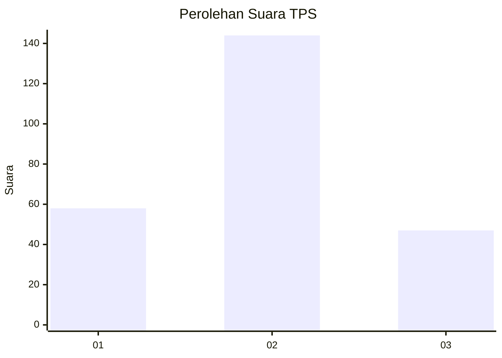
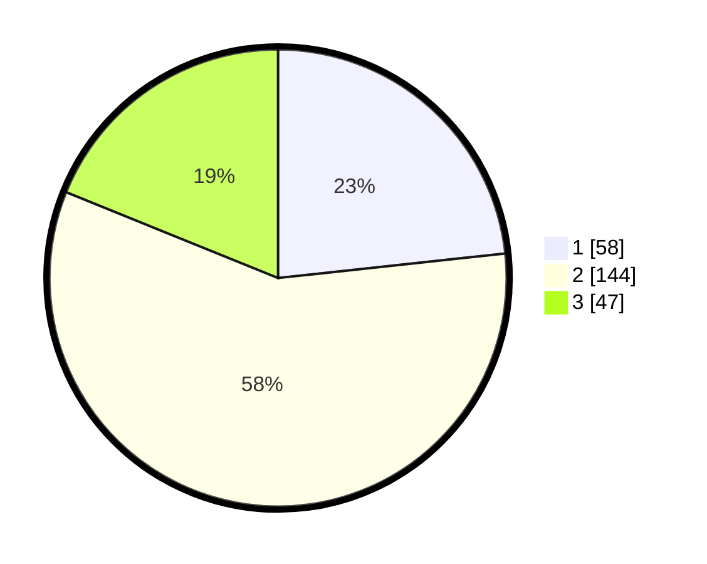

# Hasil

## Grafik

## Tabel

| No. | Nama Paslon    | Suara | Suara (raw) | Persentase |
|:--- |:-------------- | -----:| -----------:| ----------:|
| 1   | ANIES MUHAIMIN | 58    | [58][p-1]   | 23,29      |
| 2   | PRABOWO GIBRAN | 144   | [144][p-2]  | 57,83      |
| 3   | GANJAR MAHFUD  | 47    | [47][p-3]   | 18,88      |

[p-1]: https://github.com/gigit-pemilu/pemilu-2024-35-jawa-timur/blob/main/pilpres/hitung-suara/sub/35-jawa-timur/sub/78-kota-surabaya/sub/03-rungkut/sub/1006-medokan-ayu/sub/067-tps/sub/paslon-1.txt
[p-2]: https://github.com/gigit-pemilu/pemilu-2024-35-jawa-timur/blob/main/pilpres/hitung-suara/sub/35-jawa-timur/sub/78-kota-surabaya/sub/03-rungkut/sub/1006-medokan-ayu/sub/067-tps/sub/paslon-2.txt
[p-3]: https://github.com/gigit-pemilu/pemilu-2024-35-jawa-timur/blob/main/pilpres/hitung-suara/sub/35-jawa-timur/sub/78-kota-surabaya/sub/03-rungkut/sub/1006-medokan-ayu/sub/067-tps/sub/paslon-3.txt

## Foto C Plano

https://sirekap-obj-formc.kpu.go.id/9e7f/pemilu/ppwp/35/78/03/10/06/3578031006067-20240214-194958--8eabf35b-5851-4b31-8901-ce32c1d2a7b7.jpg

https://sirekap-obj-formc.kpu.go.id/9e7f/pemilu/ppwp/35/78/03/10/06/3578031006067-20240214-195215--d1f53847-785d-465e-8f3d-acbf9500bc70.jpg

https://sirekap-obj-formc.kpu.go.id/9e7f/pemilu/ppwp/35/78/03/10/06/3578031006067-20240214-195825--068438a4-cc09-4fc7-89e7-3ec8dd65a365.jpg

## Metadata

| Key        | Value               |
| ---------- | ------------------- |
| Time Stamp | 2024-02-16 13:30:32 |

