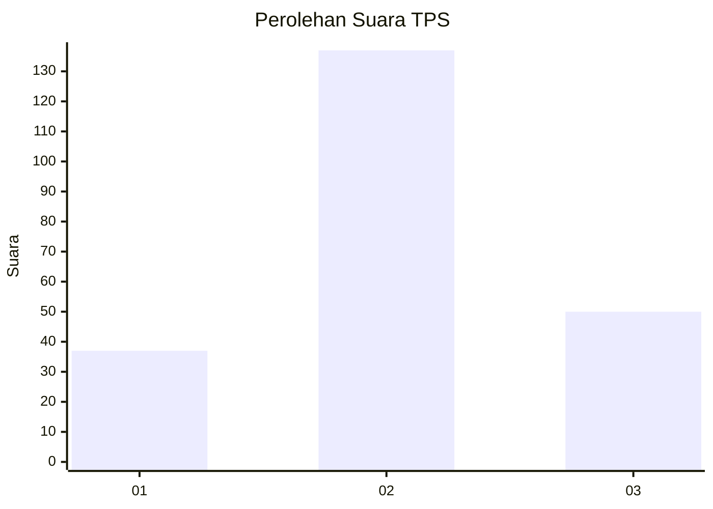
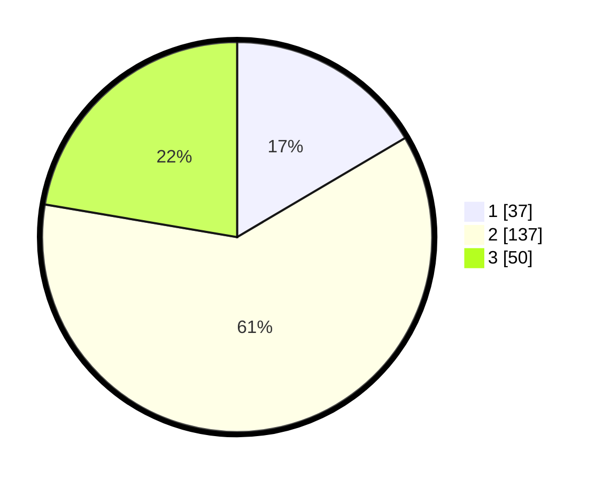

# Hasil

## Grafik

## Tabel

| No. | Nama Paslon    | Suara | Suara (raw) | Persentase |
|:--- |:-------------- | -----:| -----------:| ----------:|
| 1   | ANIES MUHAIMIN | 37    | [37][p-1]   | 16,52      |
| 2   | PRABOWO GIBRAN | 137   | [137][p-2]  | 61,16      |
| 3   | GANJAR MAHFUD  | 50    | [50][p-3]   | 22,32      |

[p-1]: https://github.com/gigit-pemilu/pemilu-2024/blob/main/pilpres/hitung-suara/sub/35-jawa-timur/sub/78-kota-surabaya/sub/04-wonokromo/sub/1001-wonokromo/sub/001-tps/sub/paslon-1.txt
[p-2]: https://github.com/gigit-pemilu/pemilu-2024/blob/main/pilpres/hitung-suara/sub/35-jawa-timur/sub/78-kota-surabaya/sub/04-wonokromo/sub/1001-wonokromo/sub/001-tps/sub/paslon-2.txt
[p-3]: https://github.com/gigit-pemilu/pemilu-2024/blob/main/pilpres/hitung-suara/sub/35-jawa-timur/sub/78-kota-surabaya/sub/04-wonokromo/sub/1001-wonokromo/sub/001-tps/sub/paslon-3.txt

## Foto C Plano

https://sirekap-obj-formc.kpu.go.id/3187/pemilu/ppwp/35/78/04/10/01/3578041001001-20240220-203117--2ca22810-376b-49d5-81bc-b071ff7ff22b.jpg

https://sirekap-obj-formc.kpu.go.id/3187/pemilu/ppwp/35/78/04/10/01/3578041001001-20240216-224212--7f5b1898-2f72-4d22-bfc3-957dcb1c8abe.jpg

https://sirekap-obj-formc.kpu.go.id/3187/pemilu/ppwp/35/78/04/10/01/3578041001001-20240220-203322--51760ba4-d505-4d29-8218-a454d0febe33.jpg

## Metadata

| Key        | Value               |
| ---------- | ------------------- |
| Time Stamp | 2024-02-21 16:00:00 |

