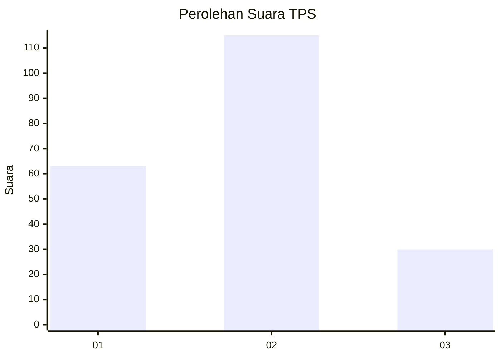
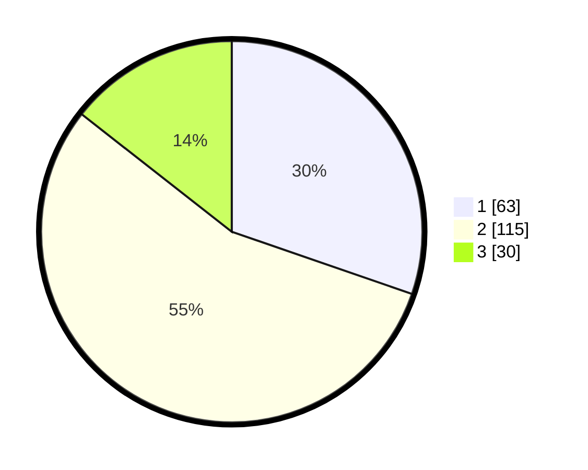

# Hasil

## Grafik

## Tabel

| No. | Nama Paslon    | Suara | Suara (raw) | Persentase |
|:--- |:-------------- | -----:| -----------:| ----------:|
| 1   | ANIES MUHAIMIN | 63    | [63][p-1]   | 30,29      |
| 2   | PRABOWO GIBRAN | 115   | [115][p-2]  | 55,29      |
| 3   | GANJAR MAHFUD  | 30    | [30][p-3]   | 14,42      |

[p-1]: https://github.com/gigit-pemilu/pemilu-2024-35-jawa-timur/blob/main/pilpres/hitung-suara/sub/35-jawa-timur/sub/78-kota-surabaya/sub/04-wonokromo/sub/1001-wonokromo/sub/006-tps/sub/paslon-1.txt
[p-2]: https://github.com/gigit-pemilu/pemilu-2024-35-jawa-timur/blob/main/pilpres/hitung-suara/sub/35-jawa-timur/sub/78-kota-surabaya/sub/04-wonokromo/sub/1001-wonokromo/sub/006-tps/sub/paslon-2.txt
[p-3]: https://github.com/gigit-pemilu/pemilu-2024-35-jawa-timur/blob/main/pilpres/hitung-suara/sub/35-jawa-timur/sub/78-kota-surabaya/sub/04-wonokromo/sub/1001-wonokromo/sub/006-tps/sub/paslon-3.txt

## Foto C Plano

https://sirekap-obj-formc.kpu.go.id/2f6d/pemilu/ppwp/35/78/04/10/01/3578041001006-20240215-043246--5fc85e88-e642-480a-873a-c3ee6c85e789.jpg

https://sirekap-obj-formc.kpu.go.id/2f6d/pemilu/ppwp/35/78/04/10/01/3578041001006-20240215-043335--6a1975ef-4311-4897-9b57-c3905a15c69a.jpg

https://sirekap-obj-formc.kpu.go.id/2f6d/pemilu/ppwp/35/78/04/10/01/3578041001006-20240215-043420--d5b6a15d-ae0d-4874-97a0-ba5de50e04a3.jpg

## Metadata

| Key        | Value               |
| ---------- | ------------------- |
| Time Stamp | 2024-02-16 14:00:34 |

