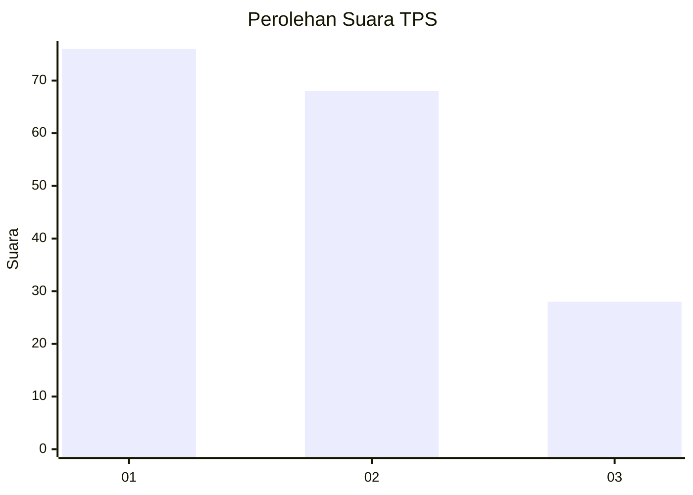
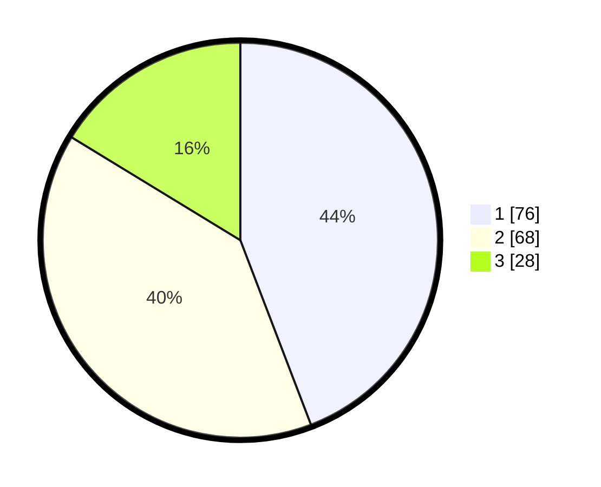

# Hasil

## Grafik

## Tabel

| No. | Nama Paslon    | Suara | Suara (raw) | Persentase |
|:--- |:-------------- | -----:| -----------:| ----------:|
| 1   | ANIES MUHAIMIN | 76    | [76][p-1]   | 44,19      |
| 2   | PRABOWO GIBRAN | 68    | [68][p-2]   | 39,53      |
| 3   | GANJAR MAHFUD  | 28    | [28][p-3]   | 16,28      |

[p-1]: https://github.com/gigit-pemilu/pemilu-2024-35-jawa-timur/blob/main/pilpres/hitung-suara/sub/35-jawa-timur/sub/78-kota-surabaya/sub/04-wonokromo/sub/1001-wonokromo/sub/008-tps/sub/paslon-1.txt
[p-2]: https://github.com/gigit-pemilu/pemilu-2024-35-jawa-timur/blob/main/pilpres/hitung-suara/sub/35-jawa-timur/sub/78-kota-surabaya/sub/04-wonokromo/sub/1001-wonokromo/sub/008-tps/sub/paslon-2.txt
[p-3]: https://github.com/gigit-pemilu/pemilu-2024-35-jawa-timur/blob/main/pilpres/hitung-suara/sub/35-jawa-timur/sub/78-kota-surabaya/sub/04-wonokromo/sub/1001-wonokromo/sub/008-tps/sub/paslon-3.txt

## Foto C Plano

https://sirekap-obj-formc.kpu.go.id/9a12/pemilu/ppwp/35/78/04/10/01/3578041001008-20240215-014916--31f69b68-9b49-4b23-8f8f-3cfddd83dc65.jpg

https://sirekap-obj-formc.kpu.go.id/9a12/pemilu/ppwp/35/78/04/10/01/3578041001008-20240215-015003--c56aec22-073b-415b-86e7-a4d745d98cb5.jpg

https://sirekap-obj-formc.kpu.go.id/9a12/pemilu/ppwp/35/78/04/10/01/3578041001008-20240215-015035--f51a7e0b-7eda-4726-b116-d881d79140eb.jpg

## Metadata

| Key        | Value               |
| ---------- | ------------------- |
| Time Stamp | 2024-02-16 14:00:34 |

