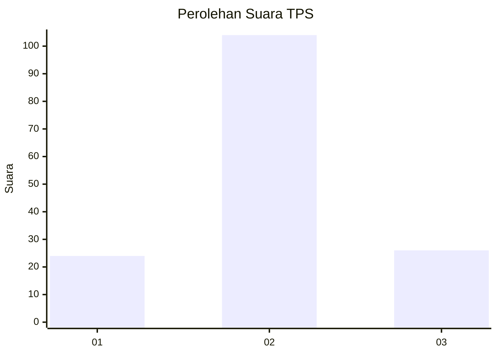
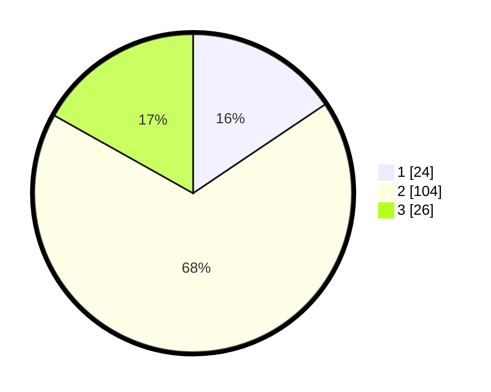

# Hasil

## Grafik

## Tabel

| No. | Nama Paslon    | Suara | Suara (raw) | Persentase |
|:--- |:-------------- | -----:| -----------:| ----------:|
| 1   | ANIES MUHAIMIN | 24    | [24][p-1]   | 15,58      |
| 2   | PRABOWO GIBRAN | 104   | [104][p-2]  | 67,53      |
| 3   | GANJAR MAHFUD  | 26    | [26][p-3]   | 16,88      |

[p-1]: https://github.com/gigit-pemilu/pemilu-2024-35-jawa-timur/blob/main/pilpres/hitung-suara/sub/35-jawa-timur/sub/78-kota-surabaya/sub/04-wonokromo/sub/1001-wonokromo/sub/067-tps/sub/paslon-1.txt
[p-2]: https://github.com/gigit-pemilu/pemilu-2024-35-jawa-timur/blob/main/pilpres/hitung-suara/sub/35-jawa-timur/sub/78-kota-surabaya/sub/04-wonokromo/sub/1001-wonokromo/sub/067-tps/sub/paslon-2.txt
[p-3]: https://github.com/gigit-pemilu/pemilu-2024-35-jawa-timur/blob/main/pilpres/hitung-suara/sub/35-jawa-timur/sub/78-kota-surabaya/sub/04-wonokromo/sub/1001-wonokromo/sub/067-tps/sub/paslon-3.txt

## Foto C Plano

https://sirekap-obj-formc.kpu.go.id/6f97/pemilu/ppwp/35/78/04/10/01/3578041001067-20240214-232230--6fb4bb81-6343-4980-ac3b-08f43aec1ff3.jpg

https://sirekap-obj-formc.kpu.go.id/6f97/pemilu/ppwp/35/78/04/10/01/3578041001067-20240214-232340--b6108546-3547-4834-ba0b-ff0414bf53cb.jpg

https://sirekap-obj-formc.kpu.go.id/6f97/pemilu/ppwp/35/78/04/10/01/3578041001067-20240214-232408--17f78b0c-d230-456b-a6a9-af31e5a0c103.jpg

## Metadata

| Key        | Value               |
| ---------- | ------------------- |
| Time Stamp | 2024-02-16 16:25:10 |

