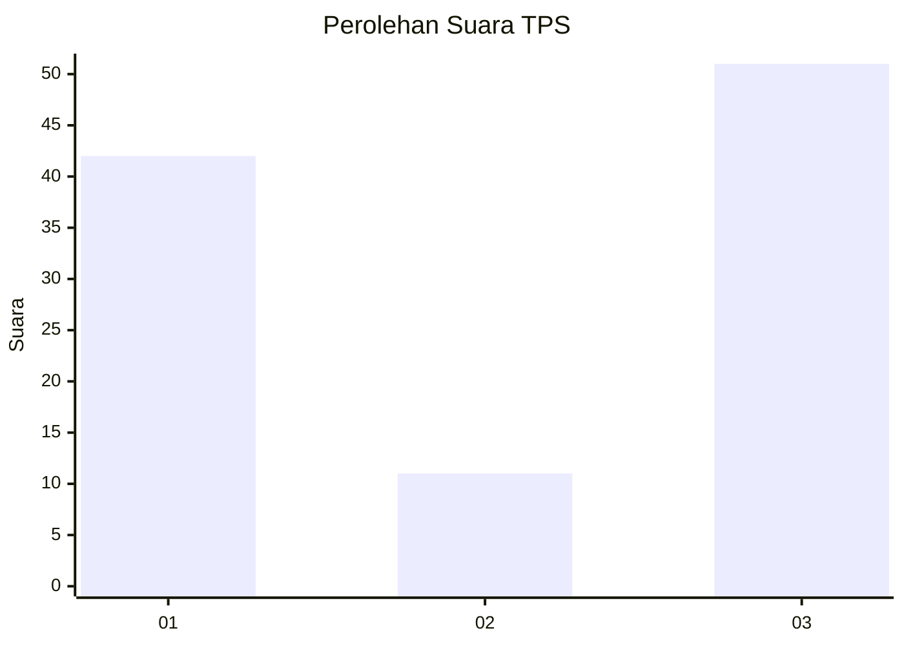
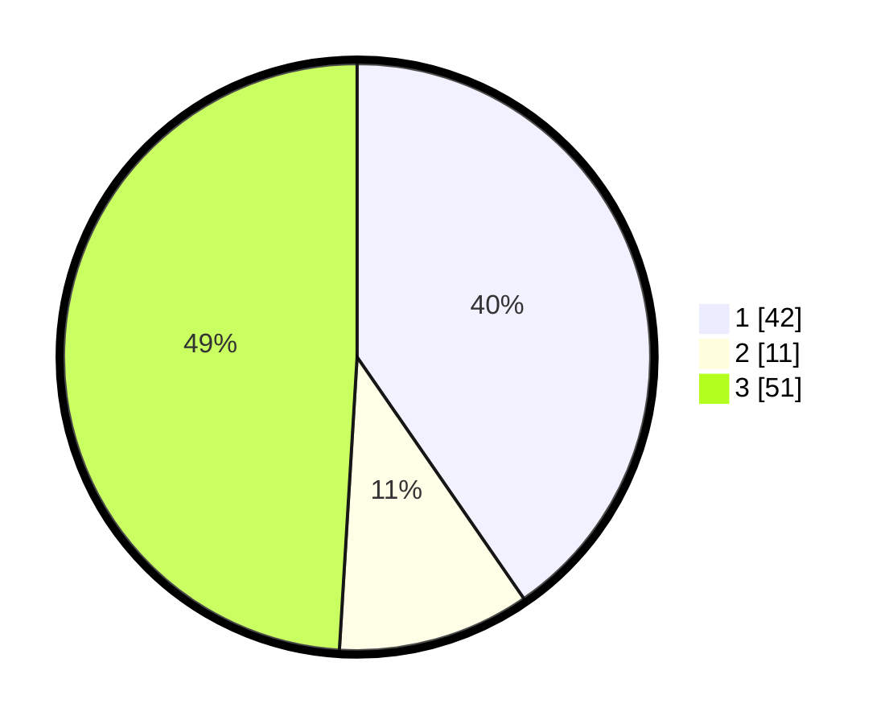

# Hasil

## Grafik

## Tabel

| No. | Nama Paslon    | Suara | Suara (raw) | Persentase |
|:--- |:-------------- | -----:| -----------:| ----------:|
| 1   | ANIES MUHAIMIN | 42    | [42][p-1]   | 40,38      |
| 2   | PRABOWO GIBRAN | 11    | [11][p-2]   | 10,58      |
| 3   | GANJAR MAHFUD  | 51    | [51][p-3]   | 49,04      |

[p-1]: https://github.com/gigit-pemilu/pemilu-2024-35-jawa-timur/blob/main/pilpres/hitung-suara/sub/35-jawa-timur/sub/78-kota-surabaya/sub/04-wonokromo/sub/1001-wonokromo/sub/096-tps/sub/paslon-1.txt
[p-2]: https://github.com/gigit-pemilu/pemilu-2024-35-jawa-timur/blob/main/pilpres/hitung-suara/sub/35-jawa-timur/sub/78-kota-surabaya/sub/04-wonokromo/sub/1001-wonokromo/sub/096-tps/sub/paslon-2.txt
[p-3]: https://github.com/gigit-pemilu/pemilu-2024-35-jawa-timur/blob/main/pilpres/hitung-suara/sub/35-jawa-timur/sub/78-kota-surabaya/sub/04-wonokromo/sub/1001-wonokromo/sub/096-tps/sub/paslon-3.txt

## Foto C Plano

https://sirekap-obj-formc.kpu.go.id/be95/pemilu/ppwp/35/78/04/10/01/3578041001096-20240215-003335--3982189d-caad-4c0a-9eec-a65dfcfa5acf.jpg

https://sirekap-obj-formc.kpu.go.id/be95/pemilu/ppwp/35/78/04/10/01/3578041001096-20240215-003340--01c6a417-ba3f-486e-9942-73faaf9218f0.jpg

https://sirekap-obj-formc.kpu.go.id/be95/pemilu/ppwp/35/78/04/10/01/3578041001096-20240215-003344--262a75b2-c457-4436-acaf-6404e59413ef.jpg

## Metadata

| Key        | Value               |
| ---------- | ------------------- |
| Time Stamp | 2024-02-16 16:25:10 |

