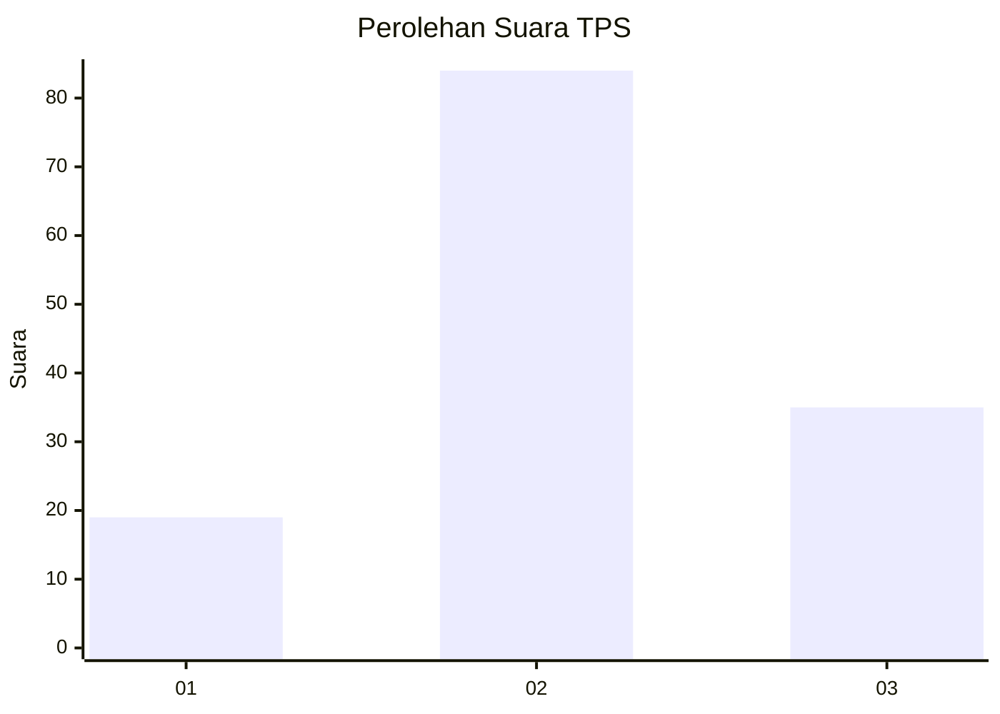
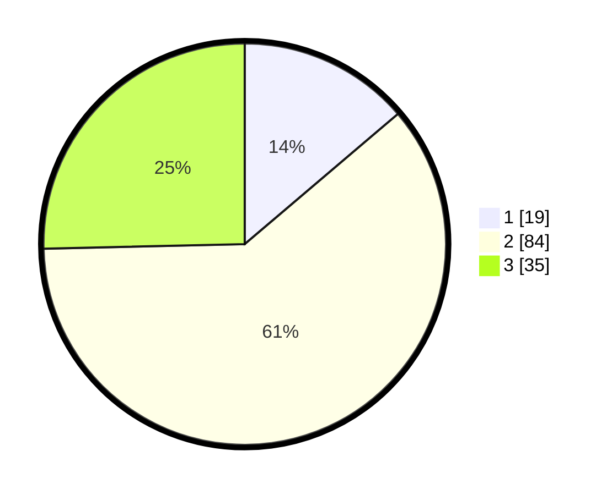

# Hasil

## Grafik

## Tabel

| No. | Nama Paslon    | Suara | Suara (raw) | Persentase |
|:--- |:-------------- | -----:| -----------:| ----------:|
| 1   | ANIES MUHAIMIN | 19    | [19][p-1]   | 13,77      |
| 2   | PRABOWO GIBRAN | 84    | [84][p-2]   | 60,87      |
| 3   | GANJAR MAHFUD  | 35    | [35][p-3]   | 25,36      |

[p-1]: https://github.com/gigit-pemilu/pemilu-2024/blob/main/pilpres/hitung-suara/sub/35-jawa-timur/sub/78-kota-surabaya/sub/04-wonokromo/sub/1001-wonokromo/sub/101-tps/sub/paslon-1.txt
[p-2]: https://github.com/gigit-pemilu/pemilu-2024/blob/main/pilpres/hitung-suara/sub/35-jawa-timur/sub/78-kota-surabaya/sub/04-wonokromo/sub/1001-wonokromo/sub/101-tps/sub/paslon-2.txt
[p-3]: https://github.com/gigit-pemilu/pemilu-2024/blob/main/pilpres/hitung-suara/sub/35-jawa-timur/sub/78-kota-surabaya/sub/04-wonokromo/sub/1001-wonokromo/sub/101-tps/sub/paslon-3.txt

## Foto C Plano

https://sirekap-obj-formc.kpu.go.id/a711/pemilu/ppwp/35/78/04/10/01/3578041001101-20240217-020611--47d1bf00-9f53-44cf-8353-32e84684a2cb.jpg

https://sirekap-obj-formc.kpu.go.id/a711/pemilu/ppwp/35/78/04/10/01/3578041001101-20240217-020703--253e67f5-c449-4d07-a00f-4606bfbe59d1.jpg

https://sirekap-obj-formc.kpu.go.id/a711/pemilu/ppwp/35/78/04/10/01/3578041001101-20240217-020754--a5f91ec4-163d-41f1-a8f2-9fe95674422b.jpg

## Metadata

| Key        | Value               |
| ---------- | ------------------- |
| Time Stamp | 2024-02-25 12:00:00 |

