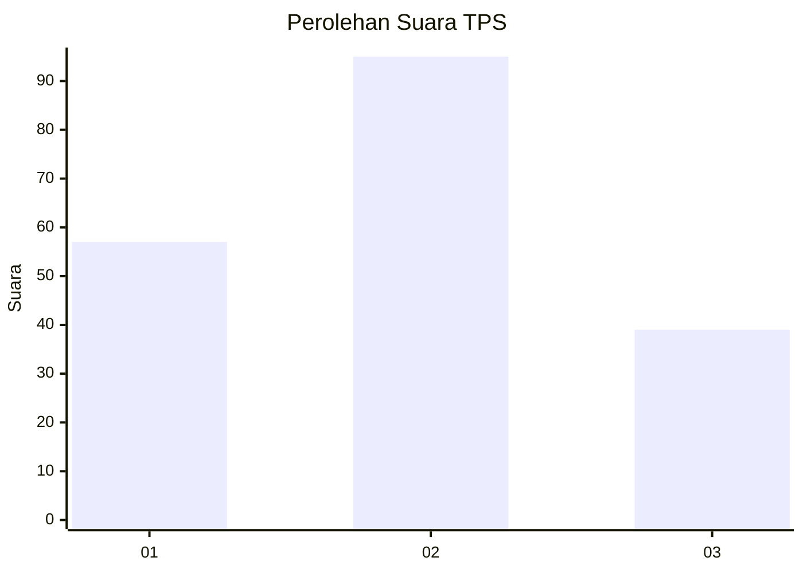
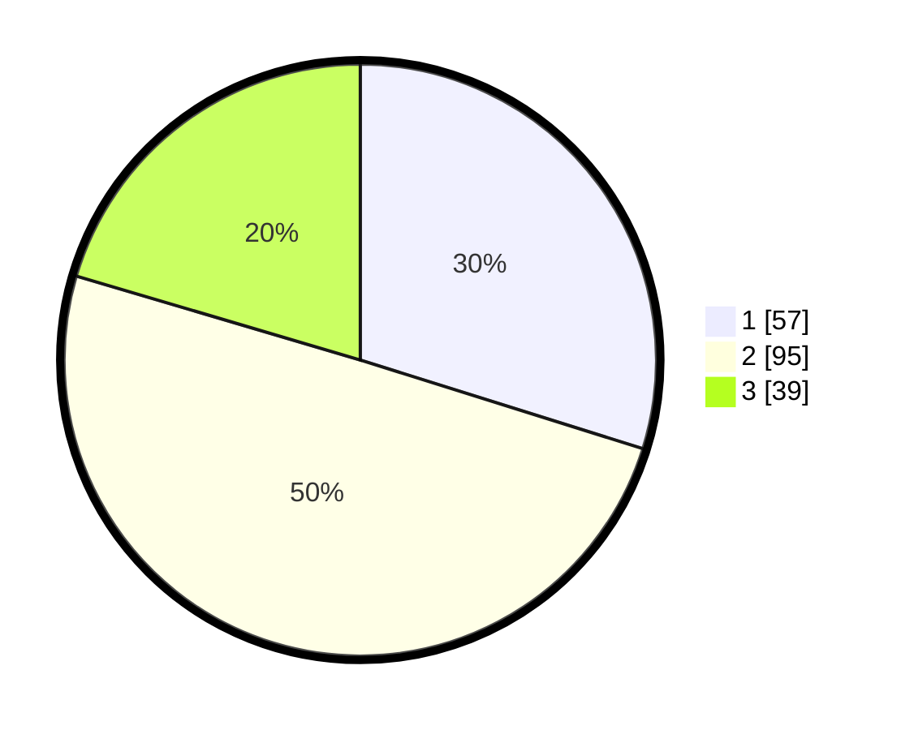

# Hasil

## Grafik

## Tabel

| No. | Nama Paslon    | Suara | Suara (raw) | Persentase |
|:--- |:-------------- | -----:| -----------:| ----------:|
| 1   | ANIES MUHAIMIN | 57    | [57][p-1]   | 29,84      |
| 2   | PRABOWO GIBRAN | 95    | [95][p-2]   | 49,74      |
| 3   | GANJAR MAHFUD  | 39    | [39][p-3]   | 20,42      |

[p-1]: https://github.com/gigit-pemilu/pemilu-2024/blob/main/pilpres/hitung-suara/sub/35-jawa-timur/sub/78-kota-surabaya/sub/04-wonokromo/sub/1002-jagir/sub/008-tps/sub/paslon-1.txt
[p-2]: https://github.com/gigit-pemilu/pemilu-2024/blob/main/pilpres/hitung-suara/sub/35-jawa-timur/sub/78-kota-surabaya/sub/04-wonokromo/sub/1002-jagir/sub/008-tps/sub/paslon-2.txt
[p-3]: https://github.com/gigit-pemilu/pemilu-2024/blob/main/pilpres/hitung-suara/sub/35-jawa-timur/sub/78-kota-surabaya/sub/04-wonokromo/sub/1002-jagir/sub/008-tps/sub/paslon-3.txt

## Foto C Plano

https://sirekap-obj-formc.kpu.go.id/485f/pemilu/ppwp/35/78/04/10/02/3578041002008-20240215-023041--8b68cc64-7802-4ceb-97c9-d84f7f98fbaa.jpg

https://sirekap-obj-formc.kpu.go.id/485f/pemilu/ppwp/35/78/04/10/02/3578041002008-20240215-021737--899da9c1-8349-4979-b050-6643e31d64d6.jpg

https://sirekap-obj-formc.kpu.go.id/485f/pemilu/ppwp/35/78/04/10/02/3578041002008-20240214-193257--e1e66241-b402-4518-a678-b4ce7b4f7c95.jpg

## Metadata

| Key        | Value               |
| ---------- | ------------------- |
| Time Stamp | 2024-02-16 16:25:10 |

