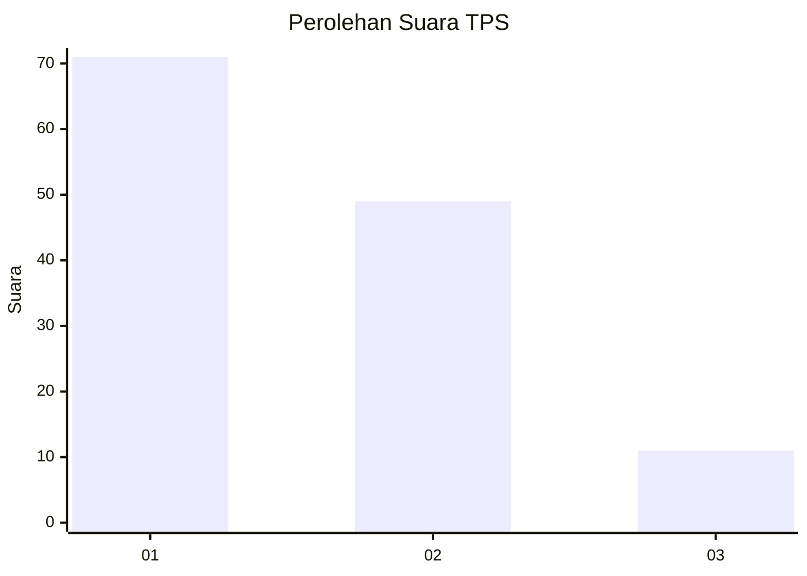
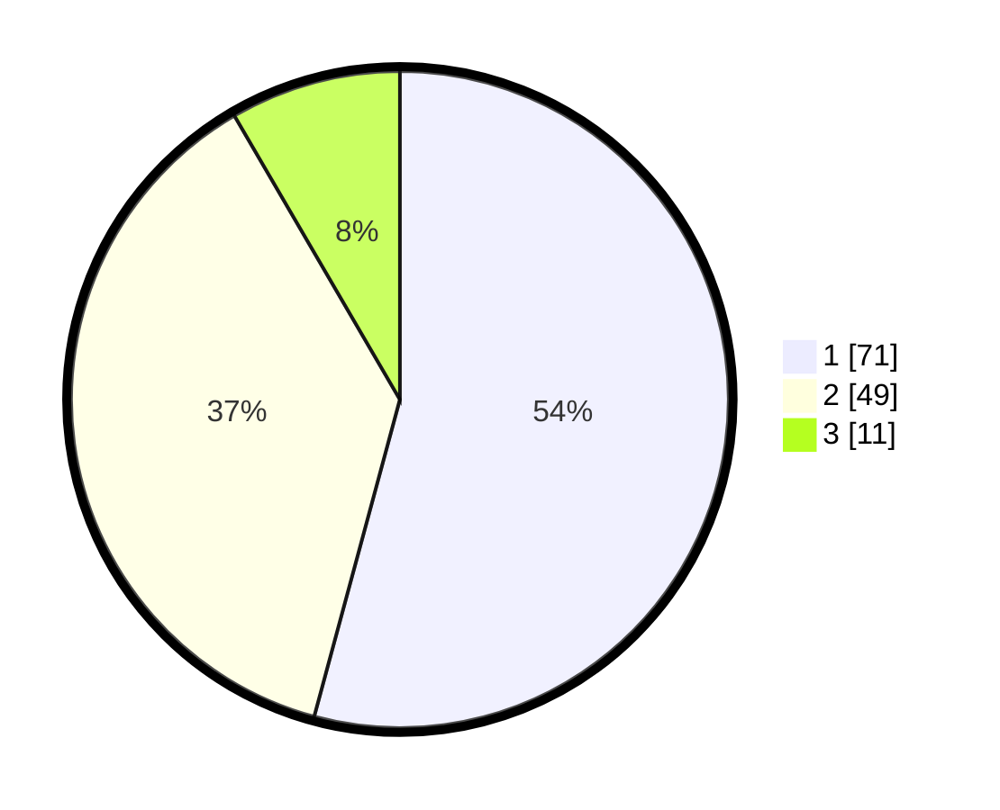

# Hasil

## Grafik

## Tabel

| No. | Nama Paslon    | Suara | Suara (raw) | Persentase |
|:--- |:-------------- | -----:| -----------:| ----------:|
| 1   | ANIES MUHAIMIN | 71    | [71][p-1]   | 54,20      |
| 2   | PRABOWO GIBRAN | 49    | [49][p-2]   | 37,40      |
| 3   | GANJAR MAHFUD  | 11    | [11][p-3]   | 8,40       |

[p-1]: https://github.com/gigit-pemilu/pemilu-2024/blob/main/pilpres/hitung-suara/sub/35-jawa-timur/sub/78-kota-surabaya/sub/04-wonokromo/sub/1002-jagir/sub/017-tps/sub/paslon-1.txt
[p-2]: https://github.com/gigit-pemilu/pemilu-2024/blob/main/pilpres/hitung-suara/sub/35-jawa-timur/sub/78-kota-surabaya/sub/04-wonokromo/sub/1002-jagir/sub/017-tps/sub/paslon-2.txt
[p-3]: https://github.com/gigit-pemilu/pemilu-2024/blob/main/pilpres/hitung-suara/sub/35-jawa-timur/sub/78-kota-surabaya/sub/04-wonokromo/sub/1002-jagir/sub/017-tps/sub/paslon-3.txt

## Foto C Plano

https://sirekap-obj-formc.kpu.go.id/6f69/pemilu/ppwp/35/78/04/10/02/3578041002017-20240214-233813--3ba79473-9b76-4e31-9321-b165ab6dce3c.jpg

https://sirekap-obj-formc.kpu.go.id/6f69/pemilu/ppwp/35/78/04/10/02/3578041002017-20240214-233801--78518745-ddcd-44a6-b558-704f0f7348e5.jpg

https://sirekap-obj-formc.kpu.go.id/6f69/pemilu/ppwp/35/78/04/10/02/3578041002017-20240214-233755--e8ec45cf-58e0-4fe4-8252-0bebf57d4922.jpg

## Metadata

| Key        | Value               |
| ---------- | ------------------- |
| Time Stamp | 2024-02-24 22:31:28 |

