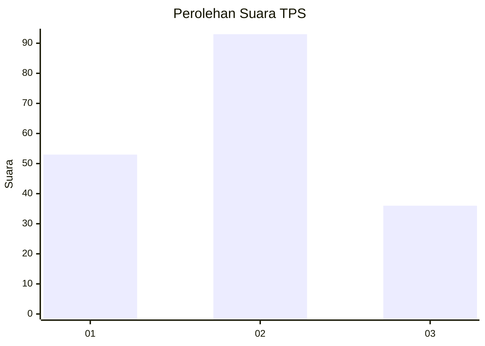
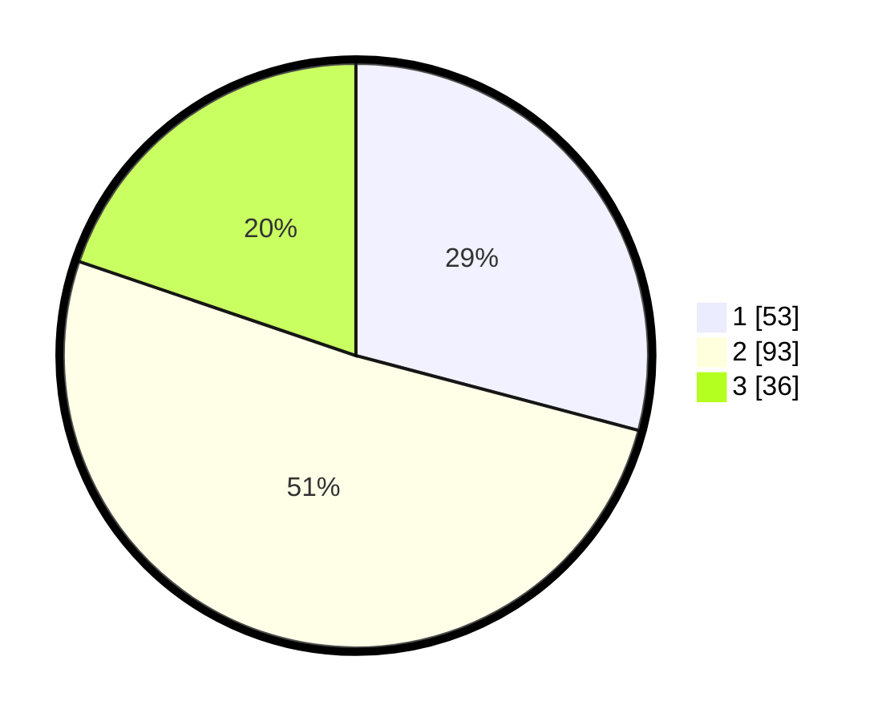

# Hasil

## Grafik

## Tabel

| No. | Nama Paslon    | Suara | Suara (raw) | Persentase |
|:--- |:-------------- | -----:| -----------:| ----------:|
| 1   | ANIES MUHAIMIN | 53    | [53][p-1]   | 29,12      |
| 2   | PRABOWO GIBRAN | 93    | [93][p-2]   | 51,10      |
| 3   | GANJAR MAHFUD  | 36    | [36][p-3]   | 19,78      |

[p-1]: https://github.com/gigit-pemilu/pemilu-2024-35-jawa-timur/blob/main/pilpres/hitung-suara/sub/35-jawa-timur/sub/78-kota-surabaya/sub/04-wonokromo/sub/1002-jagir/sub/026-tps/sub/paslon-1.txt
[p-2]: https://github.com/gigit-pemilu/pemilu-2024-35-jawa-timur/blob/main/pilpres/hitung-suara/sub/35-jawa-timur/sub/78-kota-surabaya/sub/04-wonokromo/sub/1002-jagir/sub/026-tps/sub/paslon-2.txt
[p-3]: https://github.com/gigit-pemilu/pemilu-2024-35-jawa-timur/blob/main/pilpres/hitung-suara/sub/35-jawa-timur/sub/78-kota-surabaya/sub/04-wonokromo/sub/1002-jagir/sub/026-tps/sub/paslon-3.txt

## Foto C Plano

https://sirekap-obj-formc.kpu.go.id/08b7/pemilu/ppwp/35/78/04/10/02/3578041002026-20240214-214557--2582e28c-c74c-4a80-942b-78cfc7276a46.jpg

https://sirekap-obj-formc.kpu.go.id/08b7/pemilu/ppwp/35/78/04/10/02/3578041002026-20240214-231445--7f60a2ba-08a5-42db-910d-d4369b51b3c2.jpg

https://sirekap-obj-formc.kpu.go.id/08b7/pemilu/ppwp/35/78/04/10/02/3578041002026-20240214-231608--29e36c51-580b-4144-b2e5-4ad86ff7d939.jpg

## Metadata

| Key        | Value               |
| ---------- | ------------------- |
| Time Stamp | 2024-02-16 16:25:10 |

