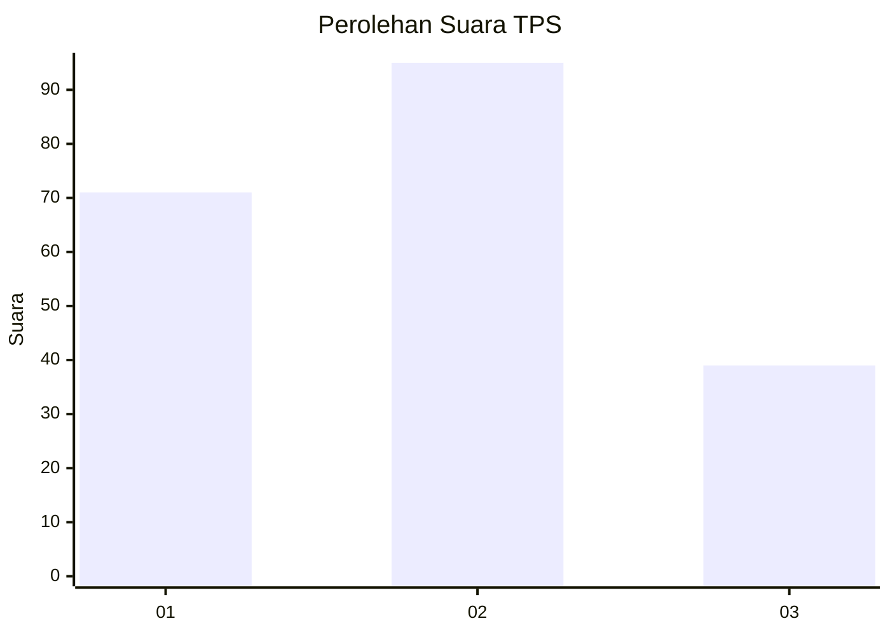
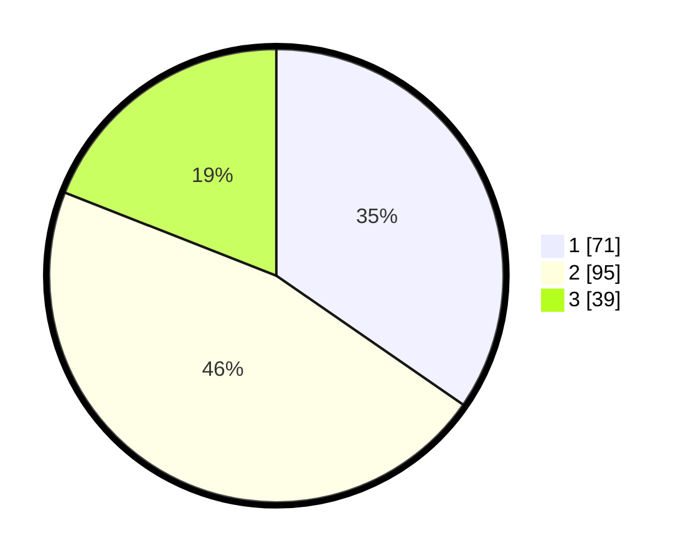

# Hasil

## Grafik

## Tabel

| No. | Nama Paslon    | Suara | Suara (raw) | Persentase |
|:--- |:-------------- | -----:| -----------:| ----------:|
| 1   | ANIES MUHAIMIN | 71    | [71][p-1]   | 34,63      |
| 2   | PRABOWO GIBRAN | 95    | [95][p-2]   | 46,34      |
| 3   | GANJAR MAHFUD  | 39    | [39][p-3]   | 19,02      |

[p-1]: https://github.com/gigit-pemilu/pemilu-2024-35-jawa-timur/blob/main/pilpres/hitung-suara/sub/35-jawa-timur/sub/78-kota-surabaya/sub/04-wonokromo/sub/1002-jagir/sub/039-tps/sub/paslon-1.txt
[p-2]: https://github.com/gigit-pemilu/pemilu-2024-35-jawa-timur/blob/main/pilpres/hitung-suara/sub/35-jawa-timur/sub/78-kota-surabaya/sub/04-wonokromo/sub/1002-jagir/sub/039-tps/sub/paslon-2.txt
[p-3]: https://github.com/gigit-pemilu/pemilu-2024-35-jawa-timur/blob/main/pilpres/hitung-suara/sub/35-jawa-timur/sub/78-kota-surabaya/sub/04-wonokromo/sub/1002-jagir/sub/039-tps/sub/paslon-3.txt

## Foto C Plano

https://sirekap-obj-formc.kpu.go.id/8b08/pemilu/ppwp/35/78/04/10/02/3578041002039-20240215-000244--6c06e508-66c7-4bac-be96-e21a3a77cda9.jpg

https://sirekap-obj-formc.kpu.go.id/8b08/pemilu/ppwp/35/78/04/10/02/3578041002039-20240215-000413--db11538d-db6c-41d2-8874-442f5c388d62.jpg

https://sirekap-obj-formc.kpu.go.id/8b08/pemilu/ppwp/35/78/04/10/02/3578041002039-20240215-000509--f142c706-da5e-4da4-bd3f-5e13194d2a11.jpg

## Metadata

| Key        | Value               |
| ---------- | ------------------- |
| Time Stamp | 2024-02-25 18:00:00 |

