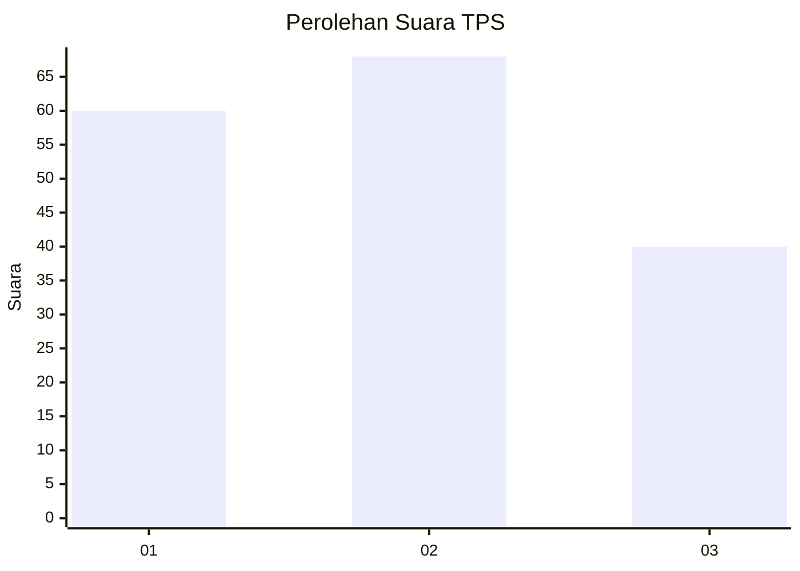
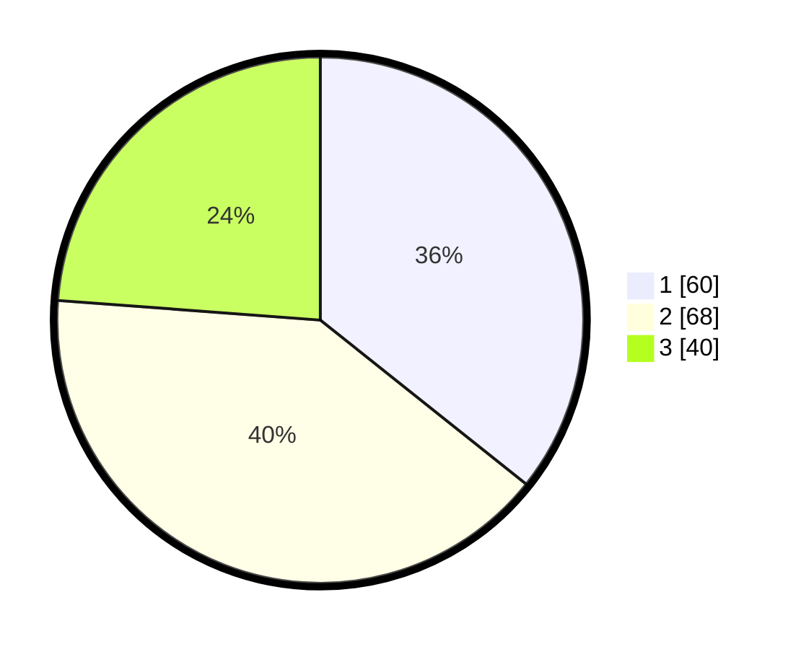

# Hasil

## Grafik

## Tabel

| No. | Nama Paslon    | Suara | Suara (raw) | Persentase |
|:--- |:-------------- | -----:| -----------:| ----------:|
| 1   | ANIES MUHAIMIN | 60    | [60][p-1]   | 35,71      |
| 2   | PRABOWO GIBRAN | 68    | [68][p-2]   | 40,48      |
| 3   | GANJAR MAHFUD  | 40    | [40][p-3]   | 23,81      |

[p-1]: https://github.com/gigit-pemilu/pemilu-2024-35-jawa-timur/blob/main/pilpres/hitung-suara/sub/35-jawa-timur/sub/78-kota-surabaya/sub/04-wonokromo/sub/1002-jagir/sub/047-tps/sub/paslon-1.txt
[p-2]: https://github.com/gigit-pemilu/pemilu-2024-35-jawa-timur/blob/main/pilpres/hitung-suara/sub/35-jawa-timur/sub/78-kota-surabaya/sub/04-wonokromo/sub/1002-jagir/sub/047-tps/sub/paslon-2.txt
[p-3]: https://github.com/gigit-pemilu/pemilu-2024-35-jawa-timur/blob/main/pilpres/hitung-suara/sub/35-jawa-timur/sub/78-kota-surabaya/sub/04-wonokromo/sub/1002-jagir/sub/047-tps/sub/paslon-3.txt

## Foto C Plano

https://sirekap-obj-formc.kpu.go.id/367e/pemilu/ppwp/35/78/04/10/02/3578041002047-20240215-003232--5204ca54-0765-4aff-b050-837c5b182099.jpg

https://sirekap-obj-formc.kpu.go.id/367e/pemilu/ppwp/35/78/04/10/02/3578041002047-20240215-003249--96fad7bd-88e9-4a9e-b1a9-7203bcae28f2.jpg

https://sirekap-obj-formc.kpu.go.id/367e/pemilu/ppwp/35/78/04/10/02/3578041002047-20240215-003304--584b61c8-b00d-49df-9492-847ae8132e12.jpg

## Metadata

| Key        | Value               |
| ---------- | ------------------- |
| Time Stamp | 2024-02-16 16:25:10 |

