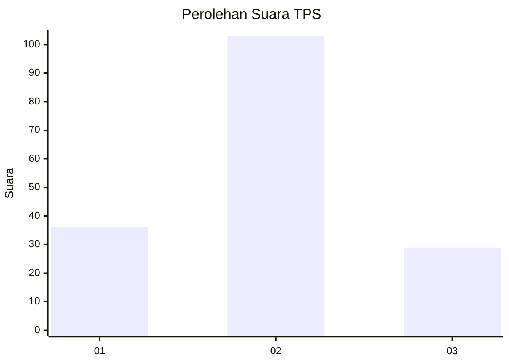

# Hasil

## Grafik

## Tabel

| No. | Nama Paslon    | Suara | Suara (raw) | Persentase |
|:--- |:-------------- | -----:| -----------:| ----------:|
| 1   | ANIES MUHAIMIN | 36    | [36][p-1]   | 21,43      |
| 2   | PRABOWO GIBRAN | 103   | [103][p-2]  | 61,31      |
| 3   | GANJAR MAHFUD  | 29    | [29][p-3]   | 17,26      |

[p-1]: https://github.com/gigit-pemilu/pemilu-2024-35-jawa-timur/blob/main/pilpres/hitung-suara/sub/35-jawa-timur/sub/78-kota-surabaya/sub/04-wonokromo/sub/1003-ngagel/sub/024-tps/sub/paslon-1.txt
[p-2]: https://github.com/gigit-pemilu/pemilu-2024-35-jawa-timur/blob/main/pilpres/hitung-suara/sub/35-jawa-timur/sub/78-kota-surabaya/sub/04-wonokromo/sub/1003-ngagel/sub/024-tps/sub/paslon-2.txt
[p-3]: https://github.com/gigit-pemilu/pemilu-2024-35-jawa-timur/blob/main/pilpres/hitung-suara/sub/35-jawa-timur/sub/78-kota-surabaya/sub/04-wonokromo/sub/1003-ngagel/sub/024-tps/sub/paslon-3.txt

## Foto C Plano

https://sirekap-obj-formc.kpu.go.id/77ff/pemilu/ppwp/35/78/04/10/03/3578041003024-20240214-234735--e8fdac8f-4cb5-4b2e-b8af-0e53442e501c.jpg

https://sirekap-obj-formc.kpu.go.id/77ff/pemilu/ppwp/35/78/04/10/03/3578041003024-20240214-224351--64c85789-85e2-421d-a9d5-6c6d1caa6485.jpg

https://sirekap-obj-formc.kpu.go.id/77ff/pemilu/ppwp/35/78/04/10/03/3578041003024-20240214-224442--bd7ee026-960a-4fdd-9322-9f5247490ea6.jpg

## Metadata

| Key        | Value               |
| ---------- | ------------------- |
| Time Stamp | 2024-02-24 22:31:28 |

