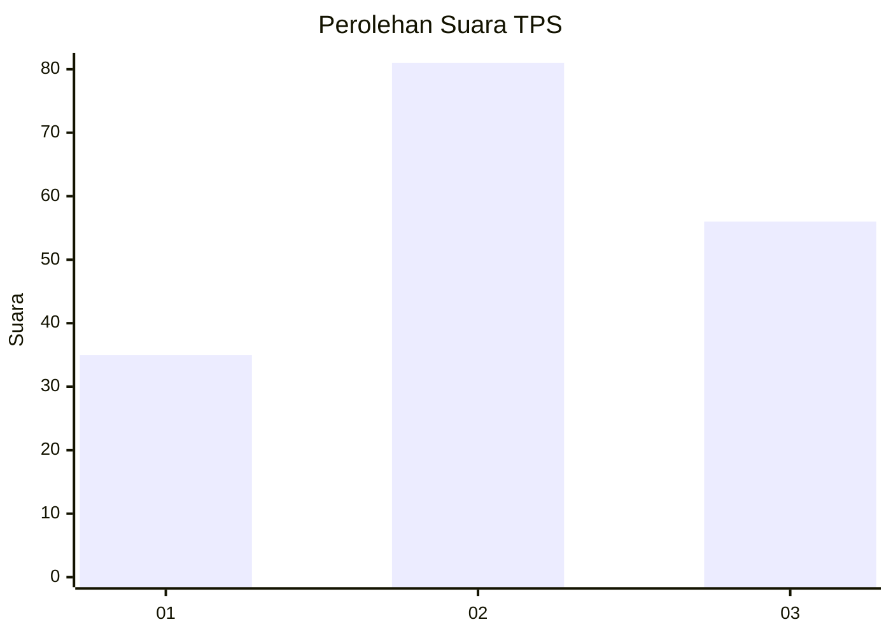
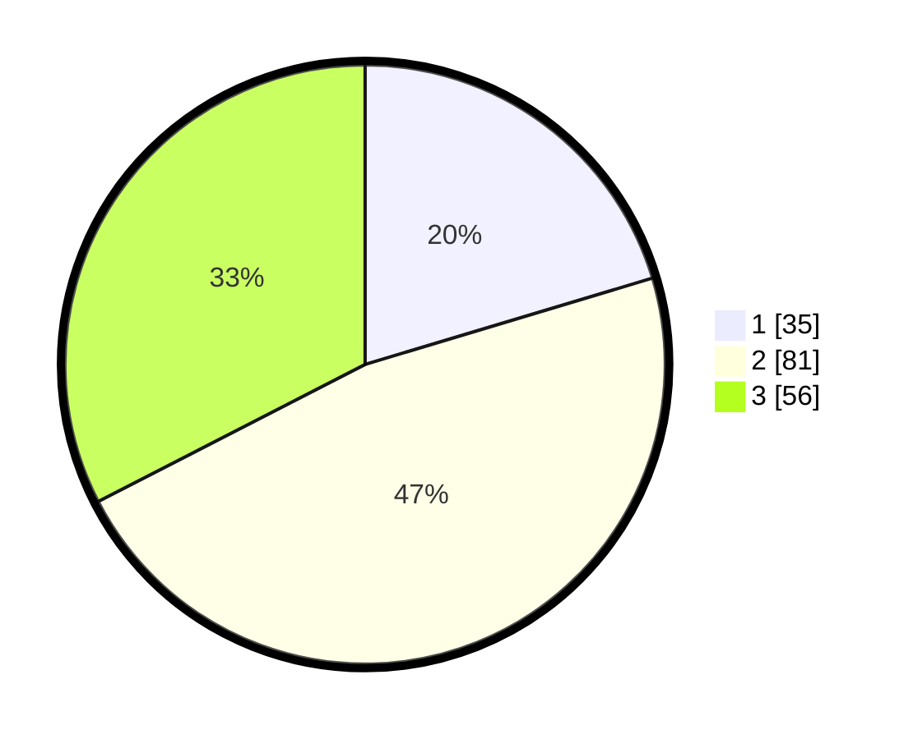

# Hasil

## Grafik

## Tabel

| No. | Nama Paslon    | Suara | Suara (raw) | Persentase |
|:--- |:-------------- | -----:| -----------:| ----------:|
| 1   | ANIES MUHAIMIN | 35    | [35][p-1]   | 20,35      |
| 2   | PRABOWO GIBRAN | 81    | [81][p-2]   | 47,09      |
| 3   | GANJAR MAHFUD  | 56    | [56][p-3]   | 32,56      |

[p-1]: https://github.com/gigit-pemilu/pemilu-2024-35-jawa-timur/blob/main/pilpres/hitung-suara/sub/35-jawa-timur/sub/78-kota-surabaya/sub/04-wonokromo/sub/1004-ngagel-rejo/sub/083-tps/sub/paslon-1.txt
[p-2]: https://github.com/gigit-pemilu/pemilu-2024-35-jawa-timur/blob/main/pilpres/hitung-suara/sub/35-jawa-timur/sub/78-kota-surabaya/sub/04-wonokromo/sub/1004-ngagel-rejo/sub/083-tps/sub/paslon-2.txt
[p-3]: https://github.com/gigit-pemilu/pemilu-2024-35-jawa-timur/blob/main/pilpres/hitung-suara/sub/35-jawa-timur/sub/78-kota-surabaya/sub/04-wonokromo/sub/1004-ngagel-rejo/sub/083-tps/sub/paslon-3.txt

## Foto C Plano

https://sirekap-obj-formc.kpu.go.id/d012/pemilu/ppwp/35/78/04/10/04/3578041004083-20240214-220214--b73fd537-21af-499a-9d21-7aedb20b7930.jpg

https://sirekap-obj-formc.kpu.go.id/d012/pemilu/ppwp/35/78/04/10/04/3578041004083-20240215-004958--b34c8c19-e740-4a9b-8fa4-15667f4a703a.jpg

https://sirekap-obj-formc.kpu.go.id/d012/pemilu/ppwp/35/78/04/10/04/3578041004083-20240215-005103--c5f51a35-3b14-43e0-b970-bcdf0f7e9fc9.jpg

## Metadata

| Key        | Value               |
| ---------- | ------------------- |
| Time Stamp | 2024-02-25 18:00:00 |

