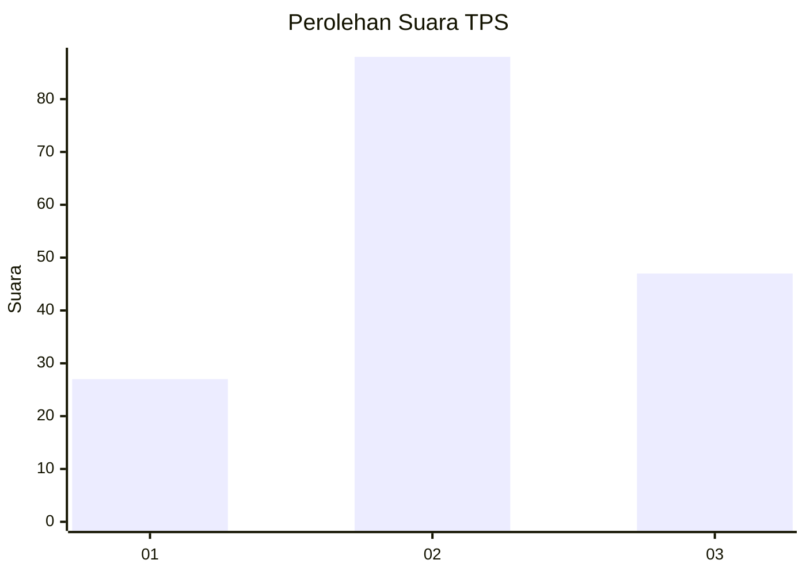
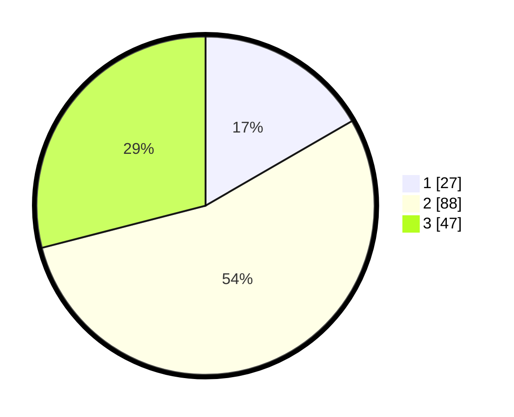

# Hasil

## Grafik

## Tabel

| No. | Nama Paslon    | Suara | Suara (raw) | Persentase |
|:--- |:-------------- | -----:| -----------:| ----------:|
| 1   | ANIES MUHAIMIN | 27    | [27][p-1]   | 16,67      |
| 2   | PRABOWO GIBRAN | 88    | [88][p-2]   | 54,32      |
| 3   | GANJAR MAHFUD  | 47    | [47][p-3]   | 29,01      |

[p-1]: https://github.com/gigit-pemilu/pemilu-2024/blob/main/pilpres/hitung-suara/sub/35-jawa-timur/sub/78-kota-surabaya/sub/04-wonokromo/sub/1004-ngagel-rejo/sub/087-tps/sub/paslon-1.txt
[p-2]: https://github.com/gigit-pemilu/pemilu-2024/blob/main/pilpres/hitung-suara/sub/35-jawa-timur/sub/78-kota-surabaya/sub/04-wonokromo/sub/1004-ngagel-rejo/sub/087-tps/sub/paslon-2.txt
[p-3]: https://github.com/gigit-pemilu/pemilu-2024/blob/main/pilpres/hitung-suara/sub/35-jawa-timur/sub/78-kota-surabaya/sub/04-wonokromo/sub/1004-ngagel-rejo/sub/087-tps/sub/paslon-3.txt

## Foto C Plano

https://sirekap-obj-formc.kpu.go.id/790a/pemilu/ppwp/35/78/04/10/04/3578041004087-20240215-014953--c268b76b-0f51-4303-832b-cda5999e9680.jpg

https://sirekap-obj-formc.kpu.go.id/790a/pemilu/ppwp/35/78/04/10/04/3578041004087-20240215-015028--b934b57d-0229-48b0-9ee8-e76b9f03902e.jpg

https://sirekap-obj-formc.kpu.go.id/790a/pemilu/ppwp/35/78/04/10/04/3578041004087-20240215-015106--494d72ce-10fe-4d7b-a3ad-d29f91421376.jpg

## Metadata

| Key        | Value               |
| ---------- | ------------------- |
| Time Stamp | 2024-02-16 21:01:00 |

