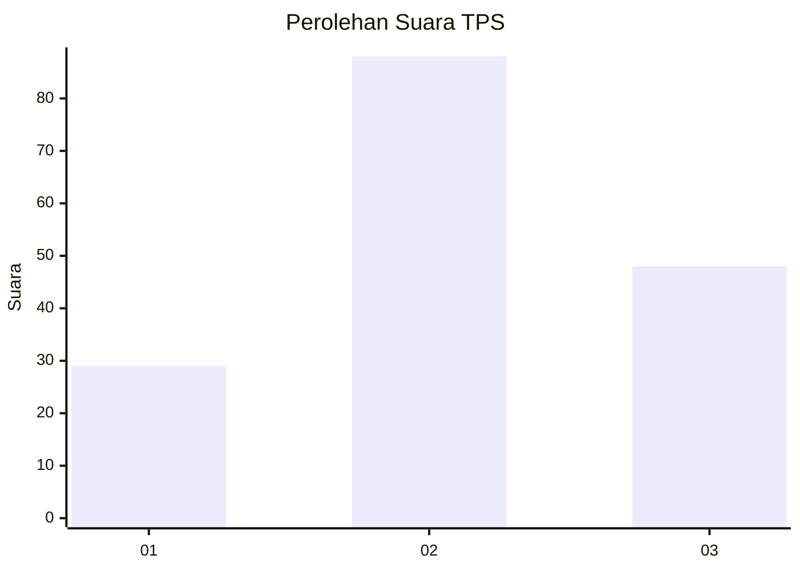
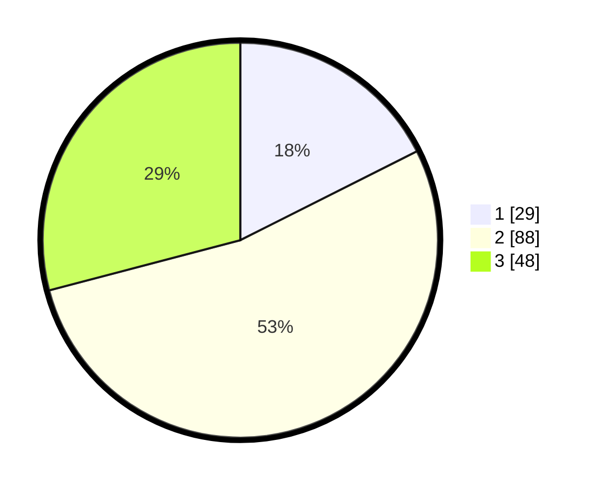

# Hasil

## Grafik

## Tabel

| No. | Nama Paslon    | Suara | Suara (raw) | Persentase |
|:--- |:-------------- | -----:| -----------:| ----------:|
| 1   | ANIES MUHAIMIN | 29    | [29][p-1]   | 17,58      |
| 2   | PRABOWO GIBRAN | 88    | [88][p-2]   | 53,33      |
| 3   | GANJAR MAHFUD  | 48    | [48][p-3]   | 29,09      |

[p-1]: https://github.com/gigit-pemilu/pemilu-2024-35-jawa-timur/blob/main/pilpres/hitung-suara/sub/35-jawa-timur/sub/78-kota-surabaya/sub/04-wonokromo/sub/1004-ngagel-rejo/sub/118-tps/sub/paslon-1.txt
[p-2]: https://github.com/gigit-pemilu/pemilu-2024-35-jawa-timur/blob/main/pilpres/hitung-suara/sub/35-jawa-timur/sub/78-kota-surabaya/sub/04-wonokromo/sub/1004-ngagel-rejo/sub/118-tps/sub/paslon-2.txt
[p-3]: https://github.com/gigit-pemilu/pemilu-2024-35-jawa-timur/blob/main/pilpres/hitung-suara/sub/35-jawa-timur/sub/78-kota-surabaya/sub/04-wonokromo/sub/1004-ngagel-rejo/sub/118-tps/sub/paslon-3.txt

## Foto C Plano

https://sirekap-obj-formc.kpu.go.id/5246/pemilu/ppwp/35/78/04/10/04/3578041004118-20240214-160108--30863dda-c2ea-4e5c-89f9-2b6ef84ed862.jpg

https://sirekap-obj-formc.kpu.go.id/5246/pemilu/ppwp/35/78/04/10/04/3578041004118-20240214-160131--282d5899-5350-4e9c-a538-350398ad3162.jpg

https://sirekap-obj-formc.kpu.go.id/5246/pemilu/ppwp/35/78/04/10/04/3578041004118-20240214-185603--294ee5f0-c769-4199-999c-02b6ef6b7a5f.jpg

## Metadata

| Key        | Value               |
| ---------- | ------------------- |
| Time Stamp | 2024-02-16 21:01:00 |

