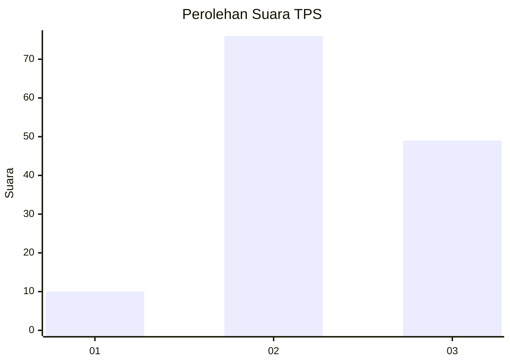
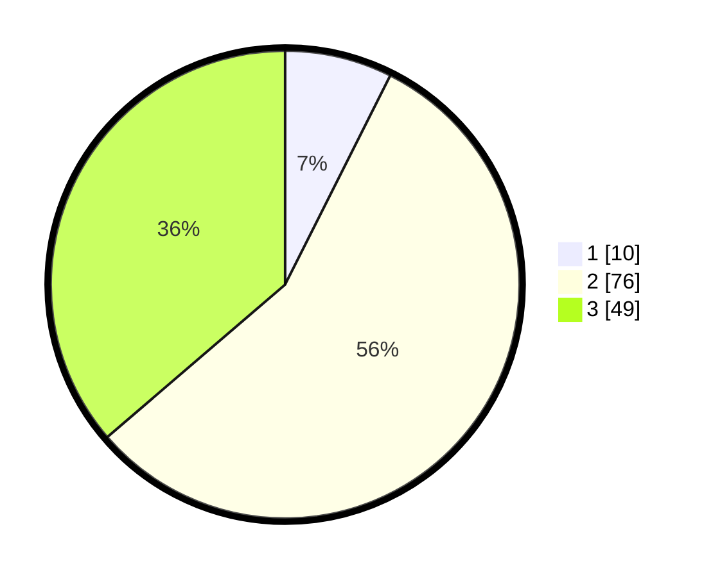

# Hasil

## Grafik

## Tabel

| No. | Nama Paslon    | Suara | Suara (raw) | Persentase |
|:--- |:-------------- | -----:| -----------:| ----------:|
| 1   | ANIES MUHAIMIN | 10    | [10][p-1]   | 7,41       |
| 2   | PRABOWO GIBRAN | 76    | [76][p-2]   | 56,30      |
| 3   | GANJAR MAHFUD  | 49    | [49][p-3]   | 36,30      |

[p-1]: https://github.com/gigit-pemilu/pemilu-2024-35-jawa-timur/blob/main/pilpres/hitung-suara/sub/35-jawa-timur/sub/78-kota-surabaya/sub/04-wonokromo/sub/1005-darmo/sub/003-tps/sub/paslon-1.txt
[p-2]: https://github.com/gigit-pemilu/pemilu-2024-35-jawa-timur/blob/main/pilpres/hitung-suara/sub/35-jawa-timur/sub/78-kota-surabaya/sub/04-wonokromo/sub/1005-darmo/sub/003-tps/sub/paslon-2.txt
[p-3]: https://github.com/gigit-pemilu/pemilu-2024-35-jawa-timur/blob/main/pilpres/hitung-suara/sub/35-jawa-timur/sub/78-kota-surabaya/sub/04-wonokromo/sub/1005-darmo/sub/003-tps/sub/paslon-3.txt

## Foto C Plano

https://sirekap-obj-formc.kpu.go.id/6c8b/pemilu/ppwp/35/78/04/10/05/3578041005003-20240215-054653--f4e2ea71-3599-4732-8bdb-ee83993672ae.jpg

https://sirekap-obj-formc.kpu.go.id/6c8b/pemilu/ppwp/35/78/04/10/05/3578041005003-20240218-213438--cf1e1403-8e7d-4e00-935e-9ab560e8c1a8.jpg

https://sirekap-obj-formc.kpu.go.id/6c8b/pemilu/ppwp/35/78/04/10/05/3578041005003-20240218-213356--2dd79046-56ab-4b53-8e8f-bfd6e3140cd5.jpg

## Metadata

| Key        | Value               |
| ---------- | ------------------- |
| Time Stamp | 2024-02-25 22:00:00 |

