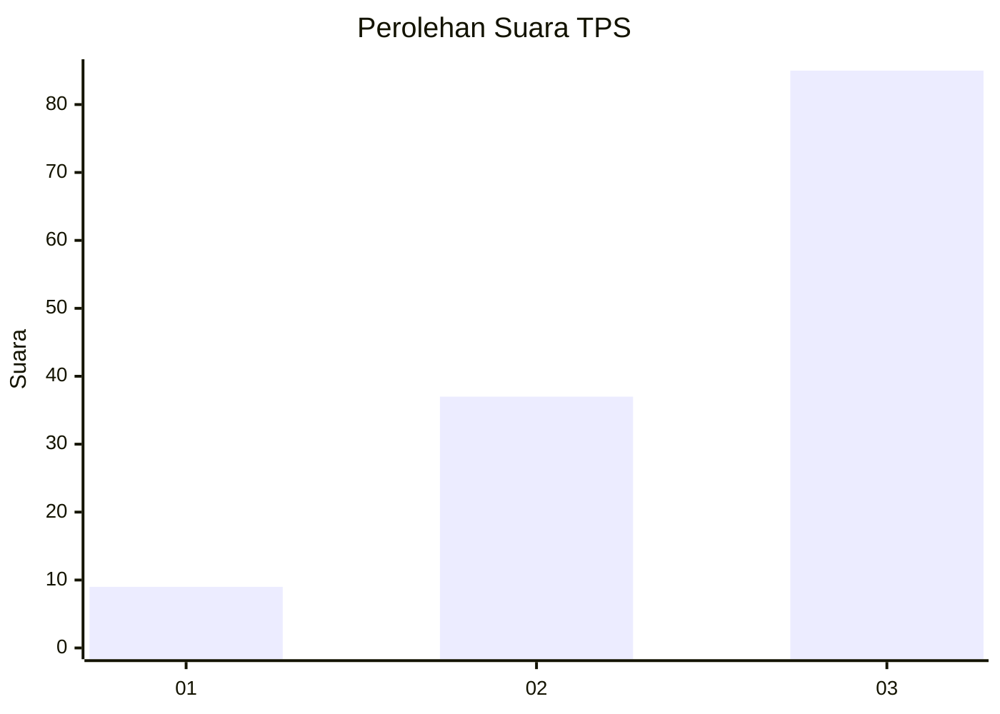
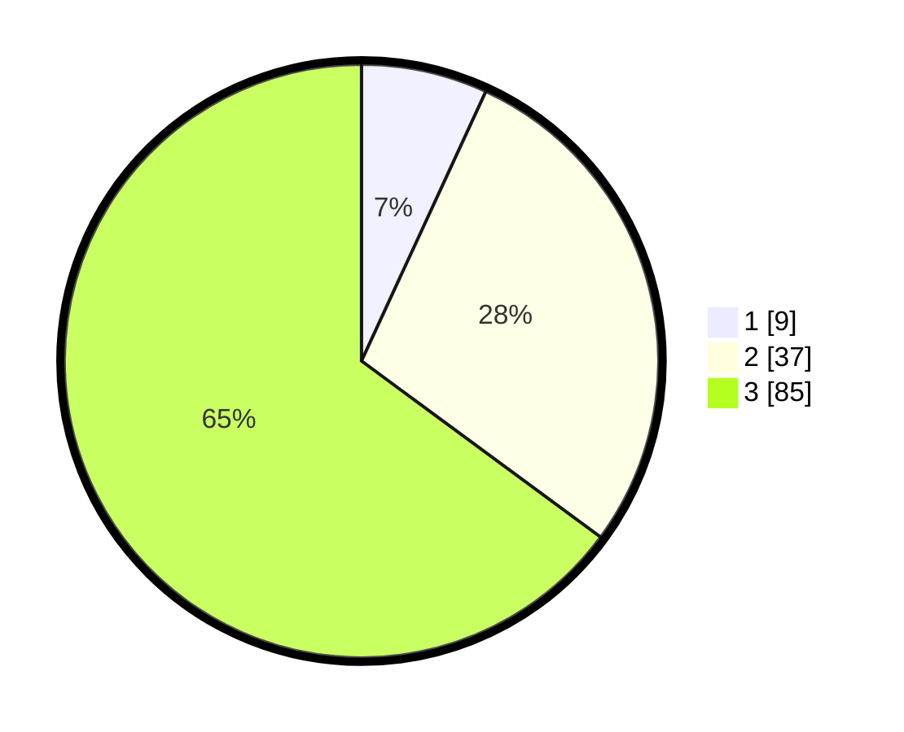

# Hasil

## Grafik

## Tabel

| No. | Nama Paslon    | Suara | Suara (raw) | Persentase |
|:--- |:-------------- | -----:| -----------:| ----------:|
| 1   | ANIES MUHAIMIN | 9     | [9][p-1]    | 6,87       |
| 2   | PRABOWO GIBRAN | 37    | [37][p-2]   | 28,24      |
| 3   | GANJAR MAHFUD  | 85    | [85][p-3]   | 64,89      |

[p-1]: https://github.com/gigit-pemilu/pemilu-2024/blob/main/pilpres/hitung-suara/sub/35-jawa-timur/sub/78-kota-surabaya/sub/04-wonokromo/sub/1005-darmo/sub/004-tps/sub/paslon-1.txt
[p-2]: https://github.com/gigit-pemilu/pemilu-2024/blob/main/pilpres/hitung-suara/sub/35-jawa-timur/sub/78-kota-surabaya/sub/04-wonokromo/sub/1005-darmo/sub/004-tps/sub/paslon-2.txt
[p-3]: https://github.com/gigit-pemilu/pemilu-2024/blob/main/pilpres/hitung-suara/sub/35-jawa-timur/sub/78-kota-surabaya/sub/04-wonokromo/sub/1005-darmo/sub/004-tps/sub/paslon-3.txt

## Foto C Plano

https://sirekap-obj-formc.kpu.go.id/3d6c/pemilu/ppwp/35/78/04/10/05/3578041005004-20240221-124900--36fd68b3-993a-458c-907a-48534b8b6f14.jpg

https://sirekap-obj-formc.kpu.go.id/3d6c/pemilu/ppwp/35/78/04/10/05/3578041005004-20240221-130005--65854cb5-321c-4744-8373-44c3d8a82c35.jpg

https://sirekap-obj-formc.kpu.go.id/3d6c/pemilu/ppwp/35/78/04/10/05/3578041005004-20240221-135334--7af0e384-915c-415f-9dbd-49e7eb6540fe.jpg

## Metadata

| Key        | Value               |
| ---------- | ------------------- |
| Time Stamp | 2024-02-25 08:00:00 |

