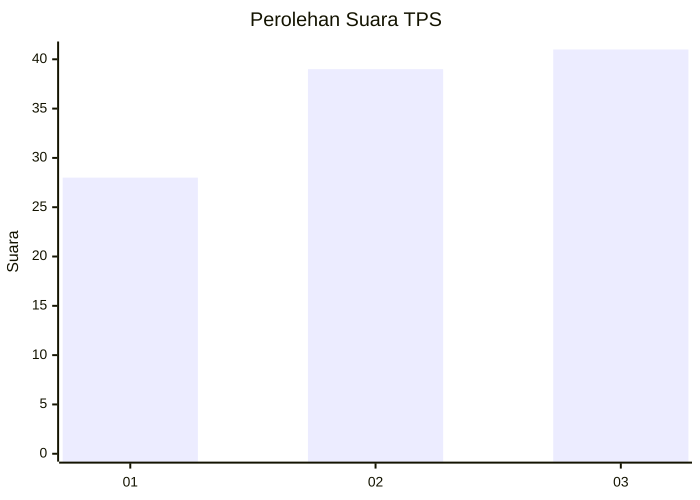
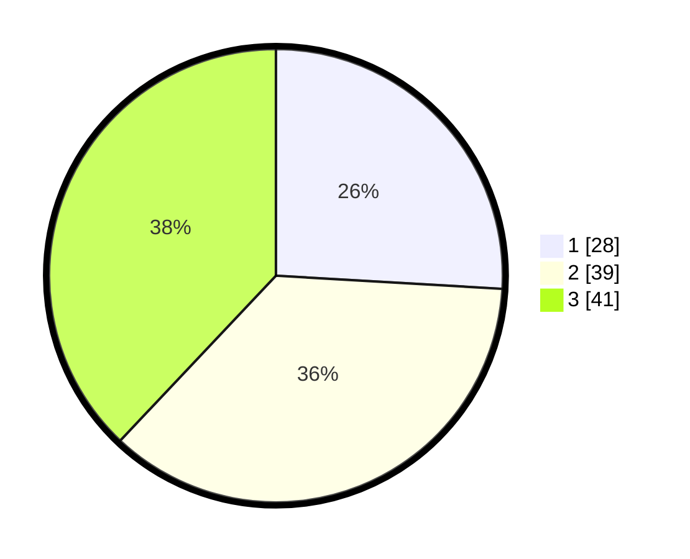

# Hasil

## Grafik

## Tabel

| No. | Nama Paslon    | Suara | Suara (raw) | Persentase |
|:--- |:-------------- | -----:| -----------:| ----------:|
| 1   | ANIES MUHAIMIN | 28    | [28][p-1]   | 25,93      |
| 2   | PRABOWO GIBRAN | 39    | [39][p-2]   | 36,11      |
| 3   | GANJAR MAHFUD  | 41    | [41][p-3]   | 37,96      |

[p-1]: https://github.com/gigit-pemilu/pemilu-2024/blob/main/pilpres/hitung-suara/sub/35-jawa-timur/sub/78-kota-surabaya/sub/04-wonokromo/sub/1005-darmo/sub/005-tps/sub/paslon-1.txt
[p-2]: https://github.com/gigit-pemilu/pemilu-2024/blob/main/pilpres/hitung-suara/sub/35-jawa-timur/sub/78-kota-surabaya/sub/04-wonokromo/sub/1005-darmo/sub/005-tps/sub/paslon-2.txt
[p-3]: https://github.com/gigit-pemilu/pemilu-2024/blob/main/pilpres/hitung-suara/sub/35-jawa-timur/sub/78-kota-surabaya/sub/04-wonokromo/sub/1005-darmo/sub/005-tps/sub/paslon-3.txt

## Foto C Plano

https://sirekap-obj-formc.kpu.go.id/e8df/pemilu/ppwp/35/78/04/10/05/3578041005005-20240221-183128--fa9d6c28-870e-4687-88e1-f8000748182c.jpg

https://sirekap-obj-formc.kpu.go.id/e8df/pemilu/ppwp/35/78/04/10/05/3578041005005-20240221-183839--045a76dc-0912-4a54-8332-4b0f7147cc82.jpg

https://sirekap-obj-formc.kpu.go.id/e8df/pemilu/ppwp/35/78/04/10/05/3578041005005-20240221-184037--deadafe1-7a0e-45e8-b173-2b6cda141683.jpg

## Metadata

| Key        | Value               |
| ---------- | ------------------- |
| Time Stamp | 2024-02-25 16:00:00 |

