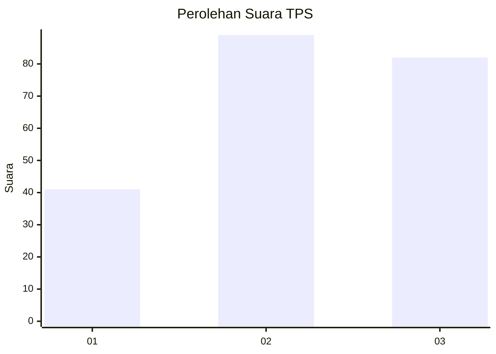
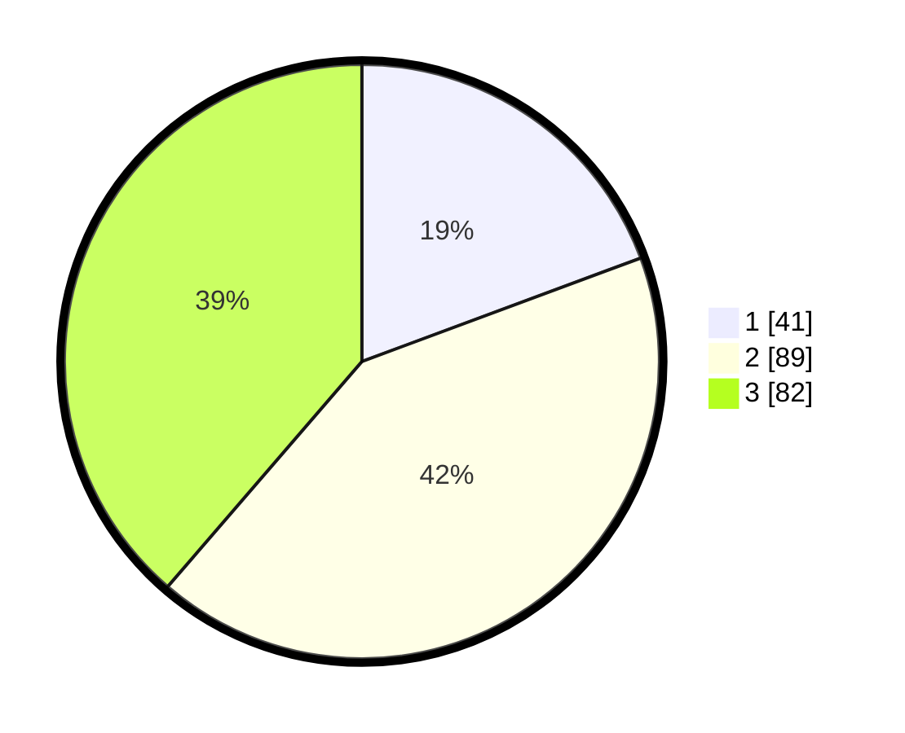

# Hasil

## Grafik

## Tabel

| No. | Nama Paslon    | Suara | Suara (raw) | Persentase |
|:--- |:-------------- | -----:| -----------:| ----------:|
| 1   | ANIES MUHAIMIN | 41    | [41][p-1]   | 19,34      |
| 2   | PRABOWO GIBRAN | 89    | [89][p-2]   | 41,98      |
| 3   | GANJAR MAHFUD  | 82    | [82][p-3]   | 38,68      |

[p-1]: https://github.com/gigit-pemilu/pemilu-2024-35-jawa-timur/blob/main/pilpres/hitung-suara/sub/35-jawa-timur/sub/78-kota-surabaya/sub/04-wonokromo/sub/1005-darmo/sub/010-tps/sub/paslon-1.txt
[p-2]: https://github.com/gigit-pemilu/pemilu-2024-35-jawa-timur/blob/main/pilpres/hitung-suara/sub/35-jawa-timur/sub/78-kota-surabaya/sub/04-wonokromo/sub/1005-darmo/sub/010-tps/sub/paslon-2.txt
[p-3]: https://github.com/gigit-pemilu/pemilu-2024-35-jawa-timur/blob/main/pilpres/hitung-suara/sub/35-jawa-timur/sub/78-kota-surabaya/sub/04-wonokromo/sub/1005-darmo/sub/010-tps/sub/paslon-3.txt

## Foto C Plano

https://sirekap-obj-formc.kpu.go.id/15e4/pemilu/ppwp/35/78/04/10/05/3578041005010-20240214-204550--0c0efcf3-664e-4a27-8e4d-36b519e20704.jpg

https://sirekap-obj-formc.kpu.go.id/15e4/pemilu/ppwp/35/78/04/10/05/3578041005010-20240214-204636--5d022904-6f72-4131-b3d2-7bd9b05375c9.jpg

https://sirekap-obj-formc.kpu.go.id/15e4/pemilu/ppwp/35/78/04/10/05/3578041005010-20240214-204709--dcdbe379-c45e-4cf2-9373-4fd6e1075f66.jpg

## Metadata

| Key        | Value               |
| ---------- | ------------------- |
| Time Stamp | 2024-02-16 21:01:00 |

