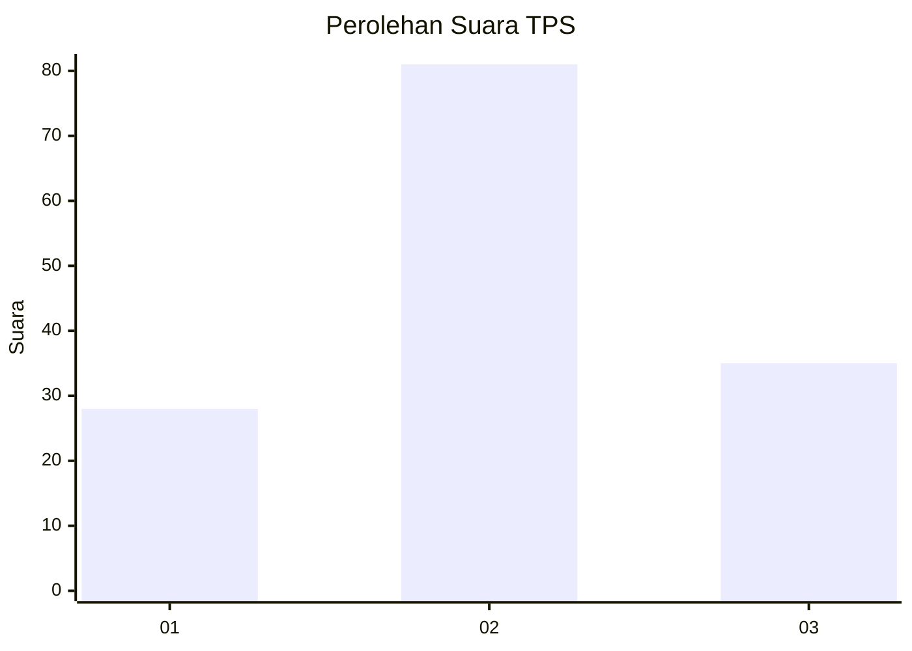
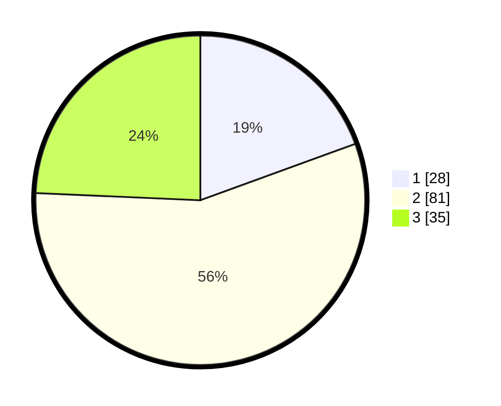

# Hasil

## Grafik

## Tabel

| No. | Nama Paslon    | Suara | Suara (raw) | Persentase |
|:--- |:-------------- | -----:| -----------:| ----------:|
| 1   | ANIES MUHAIMIN | 28    | [28][p-1]   | 19,44      |
| 2   | PRABOWO GIBRAN | 81    | [81][p-2]   | 56,25      |
| 3   | GANJAR MAHFUD  | 35    | [35][p-3]   | 24,31      |

[p-1]: https://github.com/gigit-pemilu/pemilu-2024/blob/main/pilpres/hitung-suara/sub/35-jawa-timur/sub/78-kota-surabaya/sub/04-wonokromo/sub/1005-darmo/sub/022-tps/sub/paslon-1.txt
[p-2]: https://github.com/gigit-pemilu/pemilu-2024/blob/main/pilpres/hitung-suara/sub/35-jawa-timur/sub/78-kota-surabaya/sub/04-wonokromo/sub/1005-darmo/sub/022-tps/sub/paslon-2.txt
[p-3]: https://github.com/gigit-pemilu/pemilu-2024/blob/main/pilpres/hitung-suara/sub/35-jawa-timur/sub/78-kota-surabaya/sub/04-wonokromo/sub/1005-darmo/sub/022-tps/sub/paslon-3.txt

## Foto C Plano

https://sirekap-obj-formc.kpu.go.id/2c76/pemilu/ppwp/35/78/04/10/05/3578041005022-20240220-224241--f78f1d90-1014-4f4b-8e23-1e3e9168a52b.jpg

https://sirekap-obj-formc.kpu.go.id/2c76/pemilu/ppwp/35/78/04/10/05/3578041005022-20240220-224327--3e72d98a-7b89-4703-a1b7-e3080936a0ff.jpg

https://sirekap-obj-formc.kpu.go.id/2c76/pemilu/ppwp/35/78/04/10/05/3578041005022-20240220-213721--1ebb3d47-1722-4e46-ba16-61e5dab357fb.jpg

## Metadata

| Key        | Value               |
| ---------- | ------------------- |
| Time Stamp | 2024-02-24 22:31:28 |

