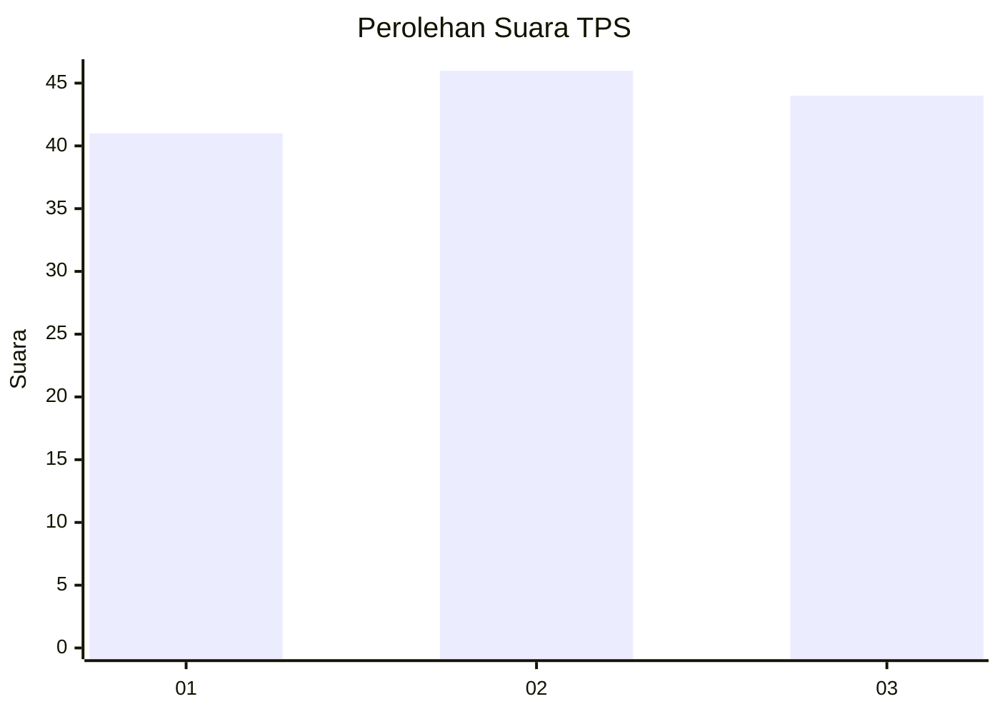
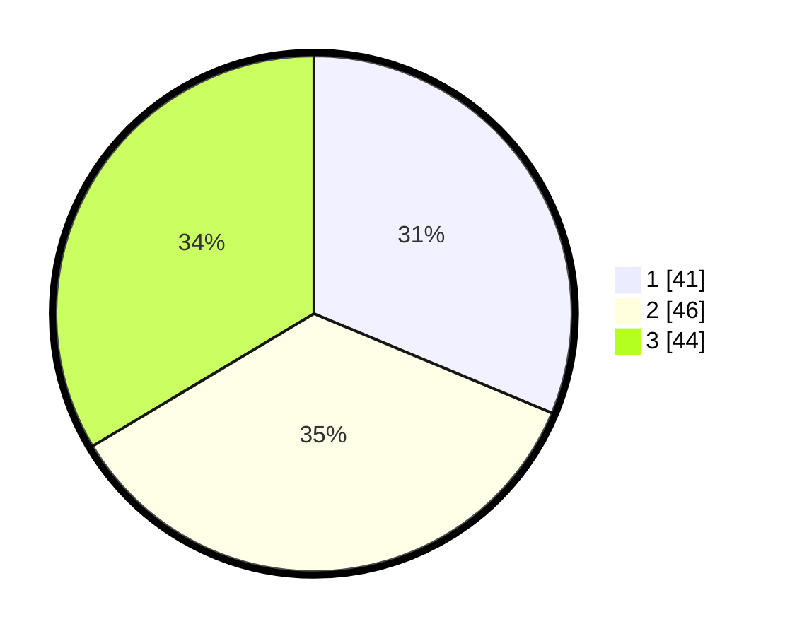

# Hasil

## Grafik

## Tabel

| No. | Nama Paslon    | Suara | Suara (raw) | Persentase |
|:--- |:-------------- | -----:| -----------:| ----------:|
| 1   | ANIES MUHAIMIN | 41    | [41][p-1]   | 31,30      |
| 2   | PRABOWO GIBRAN | 46    | [46][p-2]   | 35,11      |
| 3   | GANJAR MAHFUD  | 44    | [44][p-3]   | 33,59      |

[p-1]: https://github.com/gigit-pemilu/pemilu-2024-35-jawa-timur/blob/main/pilpres/hitung-suara/sub/35-jawa-timur/sub/78-kota-surabaya/sub/04-wonokromo/sub/1006-sawunggaling/sub/013-tps/sub/paslon-1.txt
[p-2]: https://github.com/gigit-pemilu/pemilu-2024-35-jawa-timur/blob/main/pilpres/hitung-suara/sub/35-jawa-timur/sub/78-kota-surabaya/sub/04-wonokromo/sub/1006-sawunggaling/sub/013-tps/sub/paslon-2.txt
[p-3]: https://github.com/gigit-pemilu/pemilu-2024-35-jawa-timur/blob/main/pilpres/hitung-suara/sub/35-jawa-timur/sub/78-kota-surabaya/sub/04-wonokromo/sub/1006-sawunggaling/sub/013-tps/sub/paslon-3.txt

## Foto C Plano

https://sirekap-obj-formc.kpu.go.id/15af/pemilu/ppwp/35/78/04/10/06/3578041006013-20240214-160105--03b84067-bddf-453f-8ef2-29b61010810e.jpg

https://sirekap-obj-formc.kpu.go.id/15af/pemilu/ppwp/35/78/04/10/06/3578041006013-20240214-155748--bcf7914e-0ca4-48d7-bdfa-44204f09f604.jpg

https://sirekap-obj-formc.kpu.go.id/15af/pemilu/ppwp/35/78/04/10/06/3578041006013-20240214-155837--9ebfeda3-4986-452a-9350-f60480314d9c.jpg

## Metadata

| Key        | Value               |
| ---------- | ------------------- |
| Time Stamp | 2024-02-16 21:01:00 |

