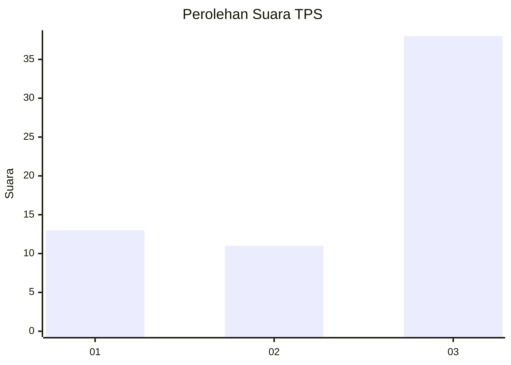
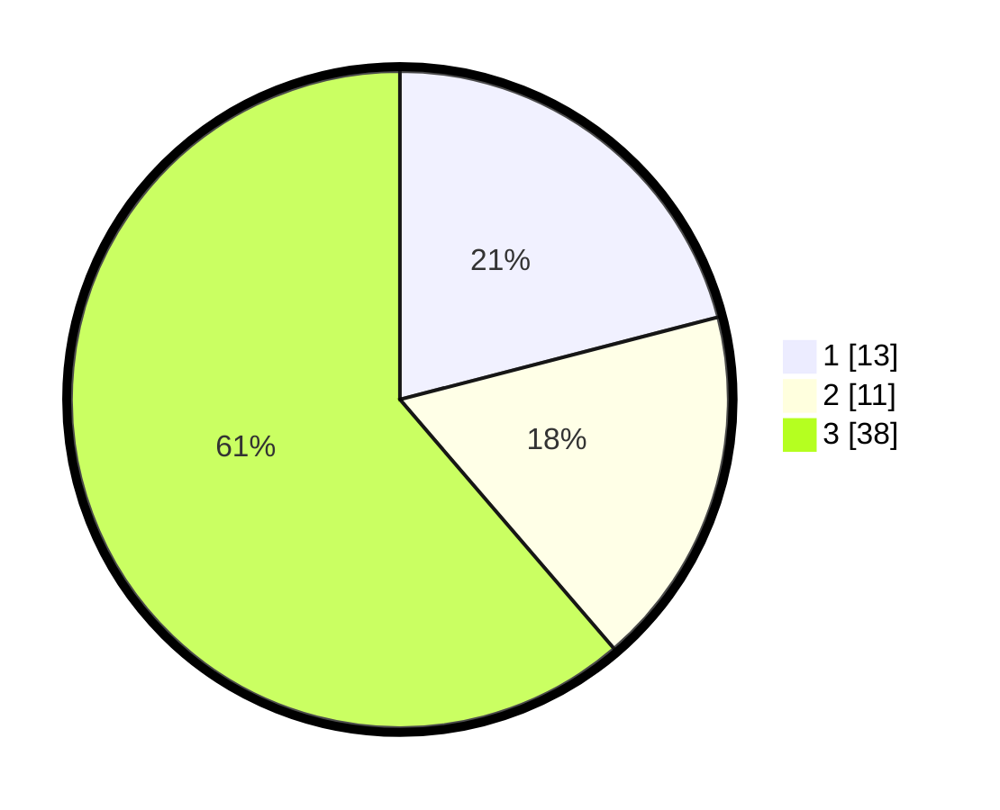

# Hasil

## Grafik

## Tabel

| No. | Nama Paslon    | Suara | Suara (raw) | Persentase |
|:--- |:-------------- | -----:| -----------:| ----------:|
| 1   | ANIES MUHAIMIN | 13    | [13][p-1]   | 20,97      |
| 2   | PRABOWO GIBRAN | 11    | [11][p-2]   | 17,74      |
| 3   | GANJAR MAHFUD  | 38    | [38][p-3]   | 61,29      |

[p-1]: https://github.com/gigit-pemilu/pemilu-2024/blob/main/pilpres/hitung-suara/sub/35-jawa-timur/sub/78-kota-surabaya/sub/04-wonokromo/sub/1006-sawunggaling/sub/024-tps/sub/paslon-1.txt
[p-2]: https://github.com/gigit-pemilu/pemilu-2024/blob/main/pilpres/hitung-suara/sub/35-jawa-timur/sub/78-kota-surabaya/sub/04-wonokromo/sub/1006-sawunggaling/sub/024-tps/sub/paslon-2.txt
[p-3]: https://github.com/gigit-pemilu/pemilu-2024/blob/main/pilpres/hitung-suara/sub/35-jawa-timur/sub/78-kota-surabaya/sub/04-wonokromo/sub/1006-sawunggaling/sub/024-tps/sub/paslon-3.txt

## Foto C Plano

https://sirekap-obj-formc.kpu.go.id/27fd/pemilu/ppwp/35/78/04/10/06/3578041006024-20240215-223923--97be91f0-7cc4-40db-a173-aa0cbad214f9.jpg

https://sirekap-obj-formc.kpu.go.id/27fd/pemilu/ppwp/35/78/04/10/06/3578041006024-20240215-005000--244b5543-b213-4ee4-ae55-eef91ebd292b.jpg

https://sirekap-obj-formc.kpu.go.id/27fd/pemilu/ppwp/35/78/04/10/06/3578041006024-20240215-005107--6d60164d-f188-4b77-b07a-983a880407db.jpg

## Metadata

| Key        | Value               |
| ---------- | ------------------- |
| Time Stamp | 2024-02-25 16:00:00 |

