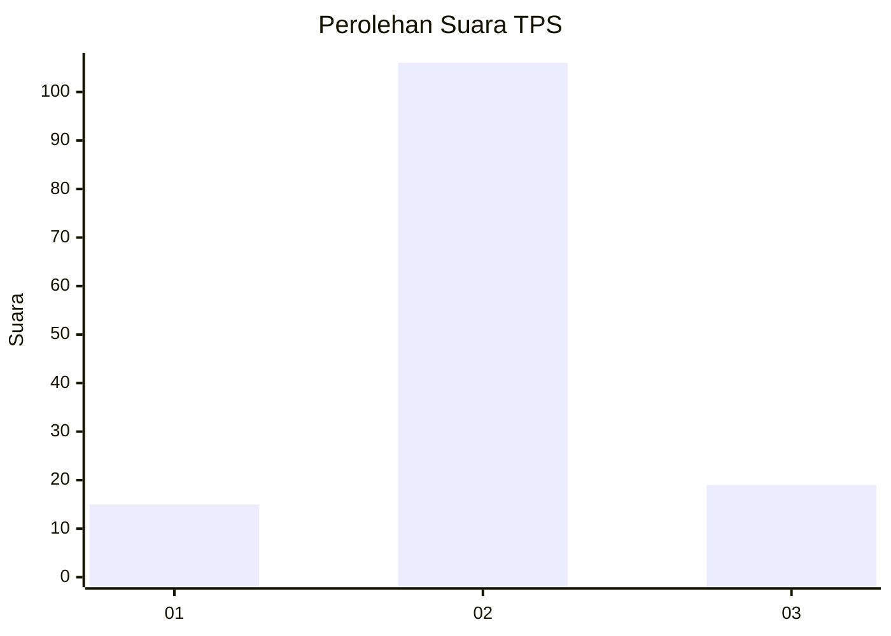
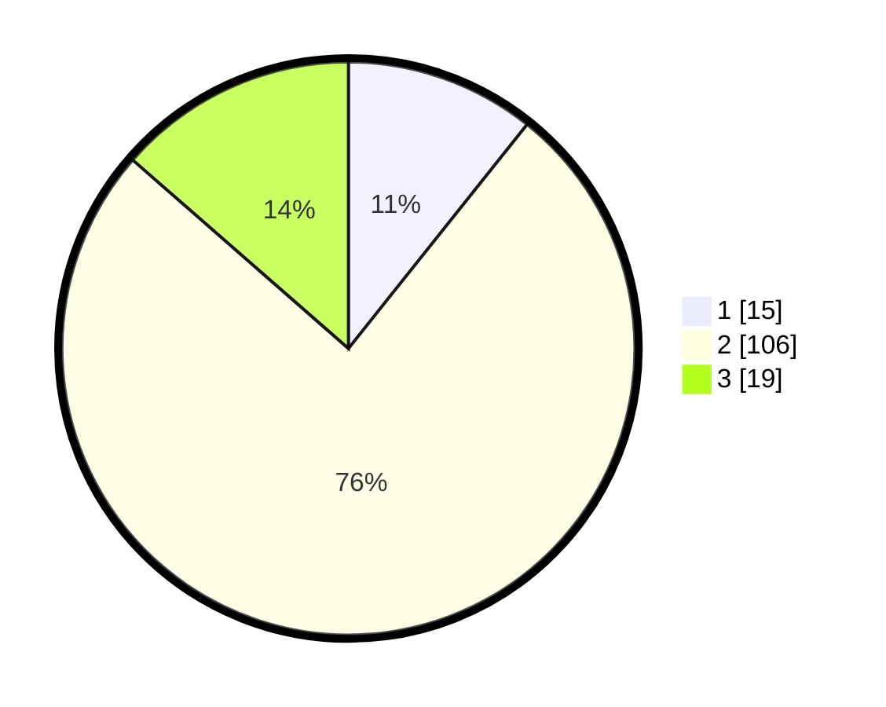

# Hasil

## Grafik

## Tabel

| No. | Nama Paslon    | Suara | Suara (raw) | Persentase |
|:--- |:-------------- | -----:| -----------:| ----------:|
| 1   | ANIES MUHAIMIN | 15    | [15][p-1]   | 10,71      |
| 2   | PRABOWO GIBRAN | 106   | [106][p-2]  | 75,71      |
| 3   | GANJAR MAHFUD  | 19    | [19][p-3]   | 13,57      |

[p-1]: https://github.com/gigit-pemilu/pemilu-2024/blob/main/pilpres/hitung-suara/sub/35-jawa-timur/sub/78-kota-surabaya/sub/04-wonokromo/sub/1006-sawunggaling/sub/037-tps/sub/paslon-1.txt
[p-2]: https://github.com/gigit-pemilu/pemilu-2024/blob/main/pilpres/hitung-suara/sub/35-jawa-timur/sub/78-kota-surabaya/sub/04-wonokromo/sub/1006-sawunggaling/sub/037-tps/sub/paslon-2.txt
[p-3]: https://github.com/gigit-pemilu/pemilu-2024/blob/main/pilpres/hitung-suara/sub/35-jawa-timur/sub/78-kota-surabaya/sub/04-wonokromo/sub/1006-sawunggaling/sub/037-tps/sub/paslon-3.txt

## Foto C Plano

https://sirekap-obj-formc.kpu.go.id/2901/pemilu/ppwp/35/78/04/10/06/3578041006037-20240214-195336--7ccf6307-130a-4bbc-a167-bda208ddd8fd.jpg

https://sirekap-obj-formc.kpu.go.id/2901/pemilu/ppwp/35/78/04/10/06/3578041006037-20240214-200201--793eda1d-6e32-4873-bdc2-058af7761aab.jpg

https://sirekap-obj-formc.kpu.go.id/2901/pemilu/ppwp/35/78/04/10/06/3578041006037-20240214-200709--eafa75c1-c2ee-4c01-9d37-e861f90f3e09.jpg

## Metadata

| Key        | Value               |
| ---------- | ------------------- |
| Time Stamp | 2024-02-24 22:31:28 |

