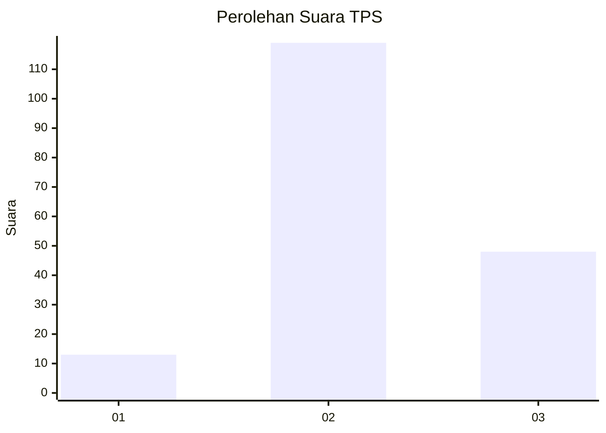

# Hasil

## Grafik

## Tabel

| No. | Nama Paslon    | Suara | Suara (raw) | Persentase |
|:--- |:-------------- | -----:| -----------:| ----------:|
| 1   | ANIES MUHAIMIN | 13    | [13][p-1]   | 7,22       |
| 2   | PRABOWO GIBRAN | 119   | [119][p-2]  | 66,11      |
| 3   | GANJAR MAHFUD  | 48    | [48][p-3]   | 26,67      |

[p-1]: https://github.com/gigit-pemilu/pemilu-2024-35-jawa-timur/blob/main/pilpres/hitung-suara/sub/35-jawa-timur/sub/78-kota-surabaya/sub/05-tegalsari/sub/1001-tegalsari/sub/007-tps/sub/paslon-1.txt
[p-2]: https://github.com/gigit-pemilu/pemilu-2024-35-jawa-timur/blob/main/pilpres/hitung-suara/sub/35-jawa-timur/sub/78-kota-surabaya/sub/05-tegalsari/sub/1001-tegalsari/sub/007-tps/sub/paslon-2.txt
[p-3]: https://github.com/gigit-pemilu/pemilu-2024-35-jawa-timur/blob/main/pilpres/hitung-suara/sub/35-jawa-timur/sub/78-kota-surabaya/sub/05-tegalsari/sub/1001-tegalsari/sub/007-tps/sub/paslon-3.txt

## Foto C Plano

https://sirekap-obj-formc.kpu.go.id/7b05/pemilu/ppwp/35/78/05/10/01/3578051001007-20240221-132856--8776a785-c86e-4c95-af2a-9e29d9ade325.jpg

https://sirekap-obj-formc.kpu.go.id/7b05/pemilu/ppwp/35/78/05/10/01/3578051001007-20240214-160119--8272bcee-43ba-45ba-99fb-bd13c66cb0cd.jpg

https://sirekap-obj-formc.kpu.go.id/7b05/pemilu/ppwp/35/78/05/10/01/3578051001007-20240214-160113--16e1bd50-7e7b-4387-89c6-fa1839cbe0fc.jpg

## Metadata

| Key        | Value               |
| ---------- | ------------------- |
| Time Stamp | 2024-02-25 14:00:00 |

