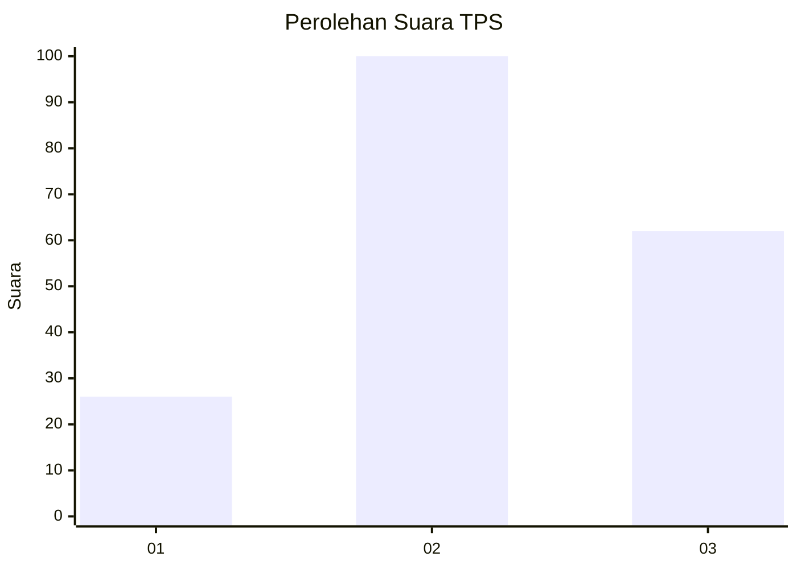
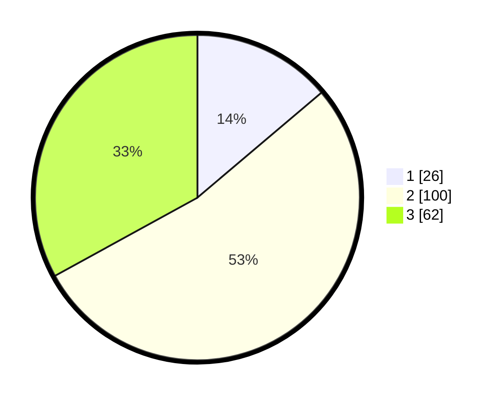

# Hasil

## Grafik

## Tabel

| No. | Nama Paslon    | Suara | Suara (raw) | Persentase |
|:--- |:-------------- | -----:| -----------:| ----------:|
| 1   | ANIES MUHAIMIN | 26    | [26][p-1]   | 13,83      |
| 2   | PRABOWO GIBRAN | 100   | [100][p-2]  | 53,19      |
| 3   | GANJAR MAHFUD  | 62    | [62][p-3]   | 32,98      |

[p-1]: https://github.com/gigit-pemilu/pemilu-2024/blob/main/pilpres/hitung-suara/sub/35-jawa-timur/sub/78-kota-surabaya/sub/05-tegalsari/sub/1001-tegalsari/sub/010-tps/sub/paslon-1.txt
[p-2]: https://github.com/gigit-pemilu/pemilu-2024/blob/main/pilpres/hitung-suara/sub/35-jawa-timur/sub/78-kota-surabaya/sub/05-tegalsari/sub/1001-tegalsari/sub/010-tps/sub/paslon-2.txt
[p-3]: https://github.com/gigit-pemilu/pemilu-2024/blob/main/pilpres/hitung-suara/sub/35-jawa-timur/sub/78-kota-surabaya/sub/05-tegalsari/sub/1001-tegalsari/sub/010-tps/sub/paslon-3.txt

## Foto C Plano

https://sirekap-obj-formc.kpu.go.id/f1a0/pemilu/ppwp/35/78/05/10/01/3578051001010-20240214-214321--b59e43b1-f45e-4cc7-9dbd-023715a6b7cc.jpg

https://sirekap-obj-formc.kpu.go.id/f1a0/pemilu/ppwp/35/78/05/10/01/3578051001010-20240214-214557--64fab1f5-3ffb-45dc-89f8-96aeaf0aa8b1.jpg

https://sirekap-obj-formc.kpu.go.id/f1a0/pemilu/ppwp/35/78/05/10/01/3578051001010-20240214-214842--2093107d-ac59-4f5f-bce2-b3d1aa8814f4.jpg

## Metadata

| Key        | Value               |
| ---------- | ------------------- |
| Time Stamp | 2024-02-24 23:00:00 |

