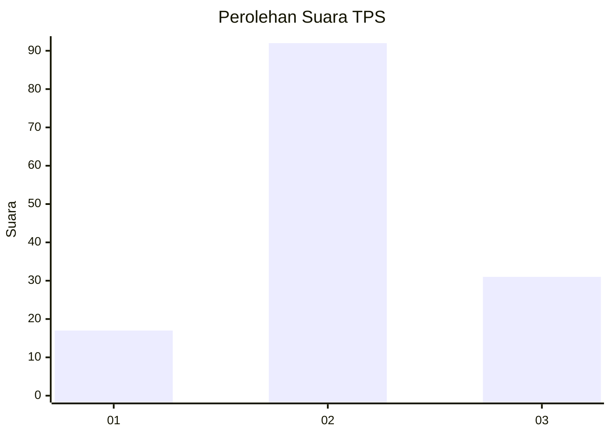
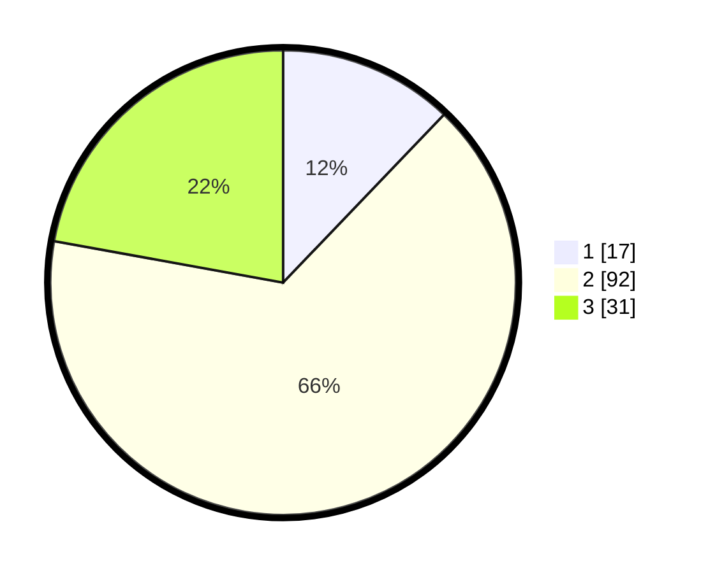

# Hasil

## Grafik

## Tabel

| No. | Nama Paslon    | Suara | Suara (raw) | Persentase |
|:--- |:-------------- | -----:| -----------:| ----------:|
| 1   | ANIES MUHAIMIN | 17    | [17][p-1]   | 12,14      |
| 2   | PRABOWO GIBRAN | 92    | [92][p-2]   | 65,71      |
| 3   | GANJAR MAHFUD  | 31    | [31][p-3]   | 22,14      |

[p-1]: https://github.com/gigit-pemilu/pemilu-2024-35-jawa-timur/blob/main/pilpres/hitung-suara/sub/35-jawa-timur/sub/78-kota-surabaya/sub/05-tegalsari/sub/1002-dr-soetomo/sub/007-tps/sub/paslon-1.txt
[p-2]: https://github.com/gigit-pemilu/pemilu-2024-35-jawa-timur/blob/main/pilpres/hitung-suara/sub/35-jawa-timur/sub/78-kota-surabaya/sub/05-tegalsari/sub/1002-dr-soetomo/sub/007-tps/sub/paslon-2.txt
[p-3]: https://github.com/gigit-pemilu/pemilu-2024-35-jawa-timur/blob/main/pilpres/hitung-suara/sub/35-jawa-timur/sub/78-kota-surabaya/sub/05-tegalsari/sub/1002-dr-soetomo/sub/007-tps/sub/paslon-3.txt

## Foto C Plano

https://sirekap-obj-formc.kpu.go.id/8cb6/pemilu/ppwp/35/78/05/10/02/3578051002007-20240220-182356--40a7d41b-f3fc-470f-b35a-75fb292eb148.jpg

https://sirekap-obj-formc.kpu.go.id/8cb6/pemilu/ppwp/35/78/05/10/02/3578051002007-20240220-182523--aa980031-a3cf-42ee-8dab-6348bd8d4d9d.jpg

https://sirekap-obj-formc.kpu.go.id/8cb6/pemilu/ppwp/35/78/05/10/02/3578051002007-20240220-182459--b215f4d9-6c5e-44dc-a25f-f50dfcd06f97.jpg

## Metadata

| Key        | Value               |
| ---------- | ------------------- |
| Time Stamp | 2024-02-25 16:00:00 |

