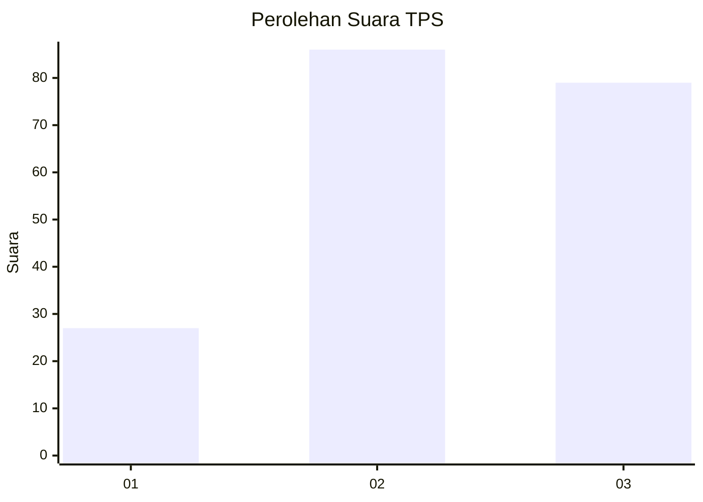
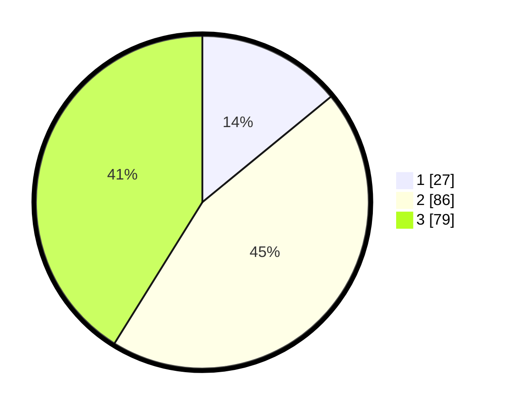

# Hasil

## Grafik

## Tabel

| No. | Nama Paslon    | Suara | Suara (raw) | Persentase |
|:--- |:-------------- | -----:| -----------:| ----------:|
| 1   | ANIES MUHAIMIN | 27    | [27][p-1]   | 14,06      |
| 2   | PRABOWO GIBRAN | 86    | [86][p-2]   | 44,79      |
| 3   | GANJAR MAHFUD  | 79    | [79][p-3]   | 41,15      |

[p-1]: https://github.com/gigit-pemilu/pemilu-2024-35-jawa-timur/blob/main/pilpres/hitung-suara/sub/35-jawa-timur/sub/78-kota-surabaya/sub/05-tegalsari/sub/1002-dr-soetomo/sub/029-tps/sub/paslon-1.txt
[p-2]: https://github.com/gigit-pemilu/pemilu-2024-35-jawa-timur/blob/main/pilpres/hitung-suara/sub/35-jawa-timur/sub/78-kota-surabaya/sub/05-tegalsari/sub/1002-dr-soetomo/sub/029-tps/sub/paslon-2.txt
[p-3]: https://github.com/gigit-pemilu/pemilu-2024-35-jawa-timur/blob/main/pilpres/hitung-suara/sub/35-jawa-timur/sub/78-kota-surabaya/sub/05-tegalsari/sub/1002-dr-soetomo/sub/029-tps/sub/paslon-3.txt

## Foto C Plano

https://sirekap-obj-formc.kpu.go.id/d133/pemilu/ppwp/35/78/05/10/02/3578051002029-20240215-005158--41588013-ba1f-4e8a-b84b-2ab233489d32.jpg

https://sirekap-obj-formc.kpu.go.id/d133/pemilu/ppwp/35/78/05/10/02/3578051002029-20240215-005349--8a4f4e6d-ee7e-4221-a266-317e2b4b33ad.jpg

https://sirekap-obj-formc.kpu.go.id/d133/pemilu/ppwp/35/78/05/10/02/3578051002029-20240215-005453--7c9da5e3-a648-4ae3-bb9f-2957e7ec2ad6.jpg

## Metadata

| Key        | Value               |
| ---------- | ------------------- |
| Time Stamp | 2024-02-16 21:01:00 |

