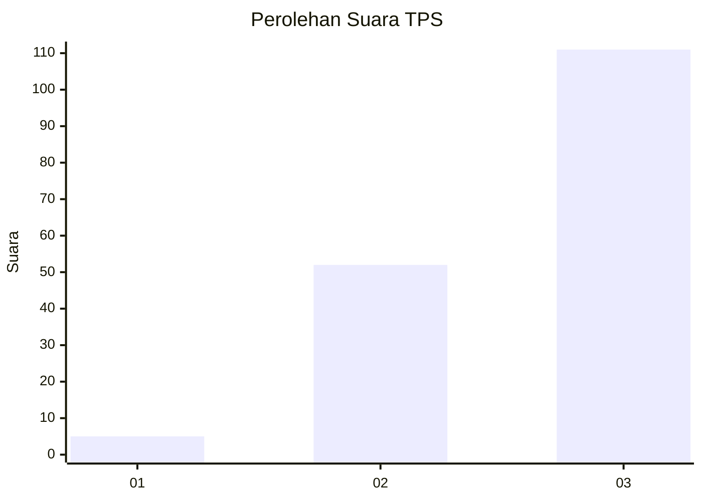
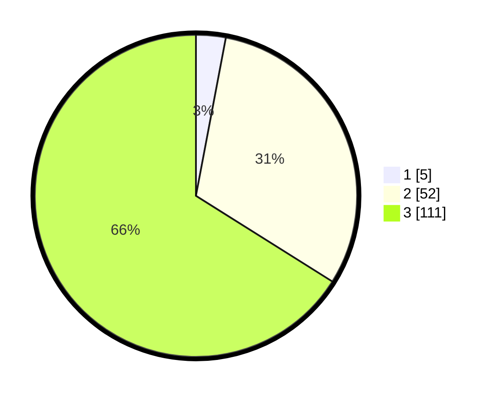

# Hasil

## Grafik

## Tabel

| No. | Nama Paslon    | Suara | Suara (raw) | Persentase |
|:--- |:-------------- | -----:| -----------:| ----------:|
| 1   | ANIES MUHAIMIN | 5     | [5][p-1]    | 2,98       |
| 2   | PRABOWO GIBRAN | 52    | [52][p-2]   | 30,95      |
| 3   | GANJAR MAHFUD  | 111   | [111][p-3]  | 66,07      |

[p-1]: https://github.com/gigit-pemilu/pemilu-2024-35-jawa-timur/blob/main/pilpres/hitung-suara/sub/35-jawa-timur/sub/78-kota-surabaya/sub/05-tegalsari/sub/1002-dr-soetomo/sub/037-tps/sub/paslon-1.txt
[p-2]: https://github.com/gigit-pemilu/pemilu-2024-35-jawa-timur/blob/main/pilpres/hitung-suara/sub/35-jawa-timur/sub/78-kota-surabaya/sub/05-tegalsari/sub/1002-dr-soetomo/sub/037-tps/sub/paslon-2.txt
[p-3]: https://github.com/gigit-pemilu/pemilu-2024-35-jawa-timur/blob/main/pilpres/hitung-suara/sub/35-jawa-timur/sub/78-kota-surabaya/sub/05-tegalsari/sub/1002-dr-soetomo/sub/037-tps/sub/paslon-3.txt

## Foto C Plano

https://sirekap-obj-formc.kpu.go.id/8fc9/pemilu/ppwp/35/78/05/10/02/3578051002037-20240215-011649--7cf1af7f-2202-445e-8e13-f8025ff107b9.jpg

https://sirekap-obj-formc.kpu.go.id/8fc9/pemilu/ppwp/35/78/05/10/02/3578051002037-20240215-011826--42d8f219-96c4-426d-aabf-6637ac402026.jpg

https://sirekap-obj-formc.kpu.go.id/8fc9/pemilu/ppwp/35/78/05/10/02/3578051002037-20240215-012403--f112c3d5-b981-48bb-a686-4ba9483ae9a7.jpg

## Metadata

| Key        | Value               |
| ---------- | ------------------- |
| Time Stamp | 2024-02-25 16:00:00 |

