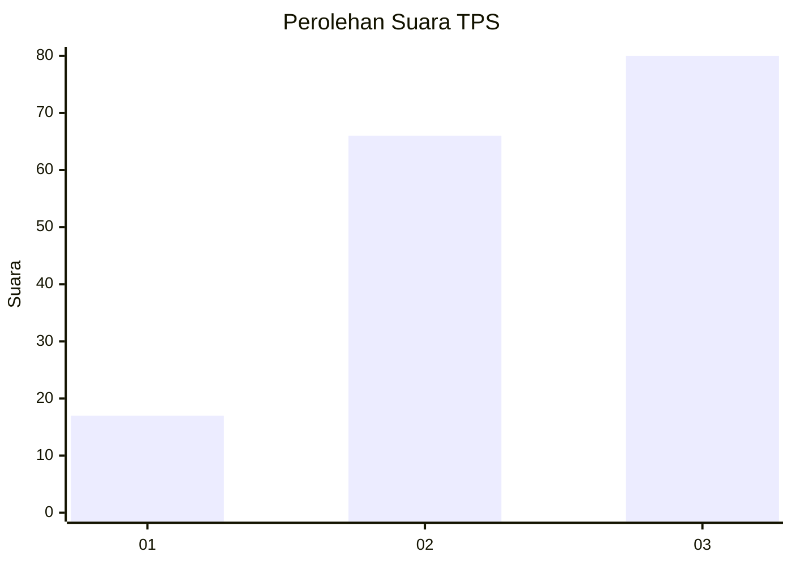
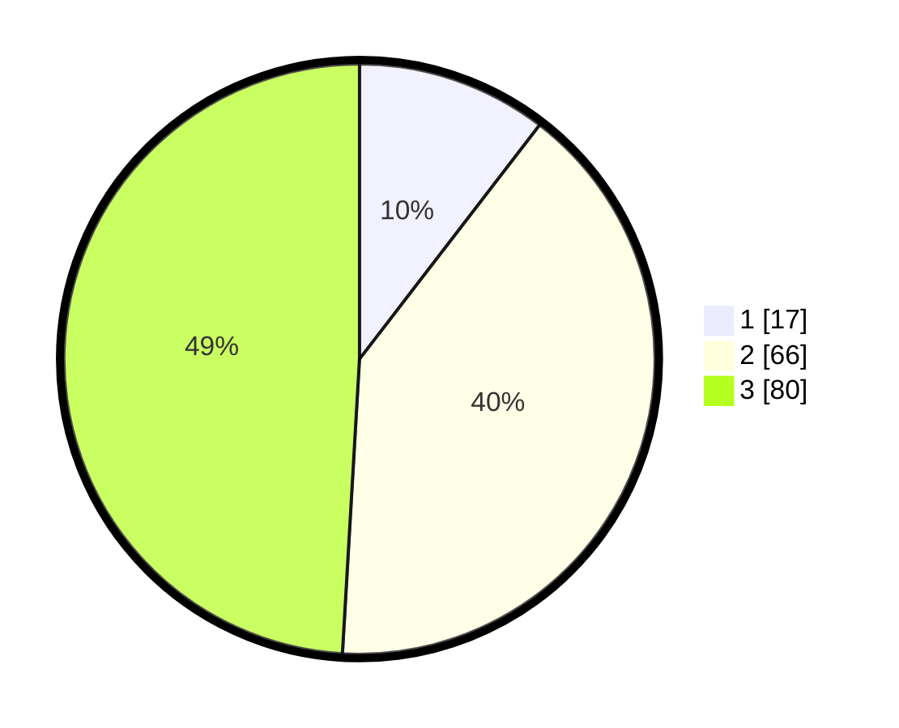

# Hasil

## Grafik

## Tabel

| No. | Nama Paslon    | Suara | Suara (raw) | Persentase |
|:--- |:-------------- | -----:| -----------:| ----------:|
| 1   | ANIES MUHAIMIN | 17    | [17][p-1]   | 10,43      |
| 2   | PRABOWO GIBRAN | 66    | [66][p-2]   | 40,49      |
| 3   | GANJAR MAHFUD  | 80    | [80][p-3]   | 49,08      |

[p-1]: https://github.com/gigit-pemilu/pemilu-2024/blob/main/pilpres/hitung-suara/sub/35-jawa-timur/sub/78-kota-surabaya/sub/05-tegalsari/sub/1002-dr-soetomo/sub/043-tps/sub/paslon-1.txt
[p-2]: https://github.com/gigit-pemilu/pemilu-2024/blob/main/pilpres/hitung-suara/sub/35-jawa-timur/sub/78-kota-surabaya/sub/05-tegalsari/sub/1002-dr-soetomo/sub/043-tps/sub/paslon-2.txt
[p-3]: https://github.com/gigit-pemilu/pemilu-2024/blob/main/pilpres/hitung-suara/sub/35-jawa-timur/sub/78-kota-surabaya/sub/05-tegalsari/sub/1002-dr-soetomo/sub/043-tps/sub/paslon-3.txt

## Foto C Plano

https://sirekap-obj-formc.kpu.go.id/4c06/pemilu/ppwp/35/78/05/10/02/3578051002043-20240214-233427--3e0a4285-e8a1-4c72-bf1f-59b486e91e58.jpg

https://sirekap-obj-formc.kpu.go.id/4c06/pemilu/ppwp/35/78/05/10/02/3578051002043-20240214-233555--96d1f655-9b3a-416c-9581-b8bc16646b57.jpg

https://sirekap-obj-formc.kpu.go.id/4c06/pemilu/ppwp/35/78/05/10/02/3578051002043-20240214-234321--858d64f1-4bae-4a45-b567-aa7bd7ea6873.jpg

## Metadata

| Key        | Value               |
| ---------- | ------------------- |
| Time Stamp | 2024-02-24 23:00:00 |

