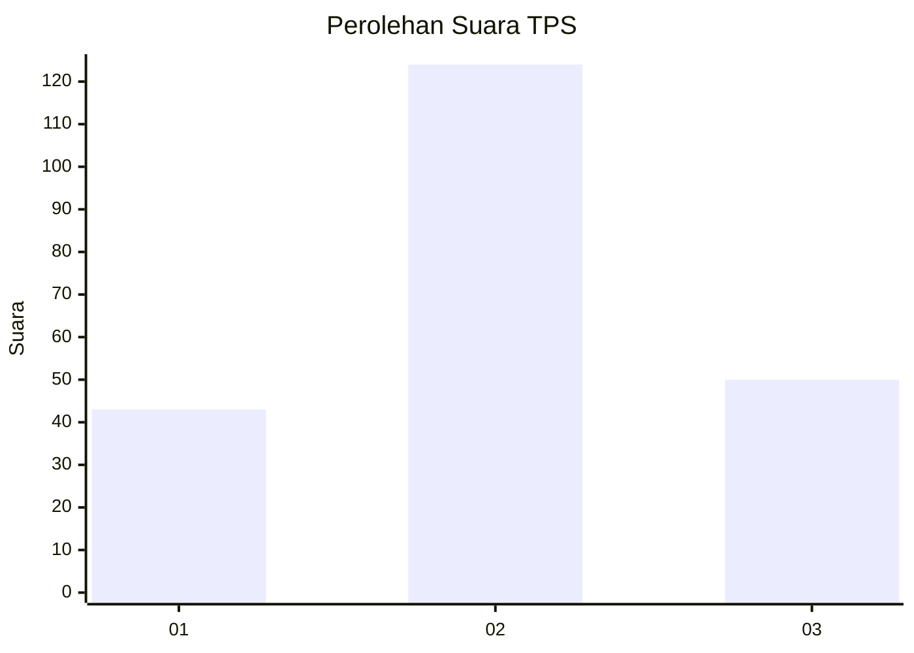
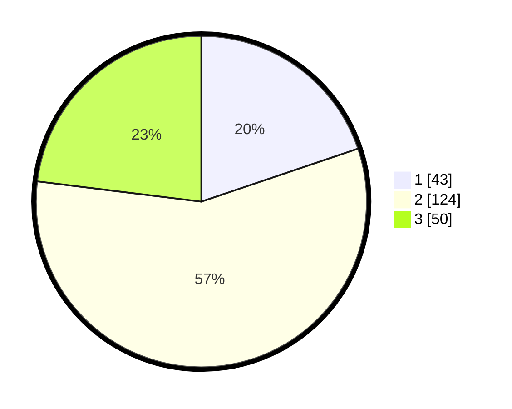

# Hasil

## Grafik

## Tabel

| No. | Nama Paslon    | Suara | Suara (raw) | Persentase |
|:--- |:-------------- | -----:| -----------:| ----------:|
| 1   | ANIES MUHAIMIN | 43    | [43][p-1]   | 19,82      |
| 2   | PRABOWO GIBRAN | 124   | [124][p-2]  | 57,14      |
| 3   | GANJAR MAHFUD  | 50    | [50][p-3]   | 23,04      |

[p-1]: https://github.com/gigit-pemilu/pemilu-2024/blob/main/pilpres/hitung-suara/sub/35-jawa-timur/sub/78-kota-surabaya/sub/05-tegalsari/sub/1003-kedungdoro/sub/002-tps/sub/paslon-1.txt
[p-2]: https://github.com/gigit-pemilu/pemilu-2024/blob/main/pilpres/hitung-suara/sub/35-jawa-timur/sub/78-kota-surabaya/sub/05-tegalsari/sub/1003-kedungdoro/sub/002-tps/sub/paslon-2.txt
[p-3]: https://github.com/gigit-pemilu/pemilu-2024/blob/main/pilpres/hitung-suara/sub/35-jawa-timur/sub/78-kota-surabaya/sub/05-tegalsari/sub/1003-kedungdoro/sub/002-tps/sub/paslon-3.txt

## Foto C Plano

https://sirekap-obj-formc.kpu.go.id/d081/pemilu/ppwp/35/78/05/10/03/3578051003002-20240215-021034--4c3de7bb-2658-4ce1-bfb9-a6f8dc7ad647.jpg

https://sirekap-obj-formc.kpu.go.id/d081/pemilu/ppwp/35/78/05/10/03/3578051003002-20240215-025101--63d8e6b1-95d8-47d7-a0fa-0c55b8a049c1.jpg

https://sirekap-obj-formc.kpu.go.id/d081/pemilu/ppwp/35/78/05/10/03/3578051003002-20240215-025322--7fefa3f7-63a9-4264-89f7-7ef00b45ce61.jpg

## Metadata

| Key        | Value               |
| ---------- | ------------------- |
| Time Stamp | 2024-02-16 21:01:00 |

