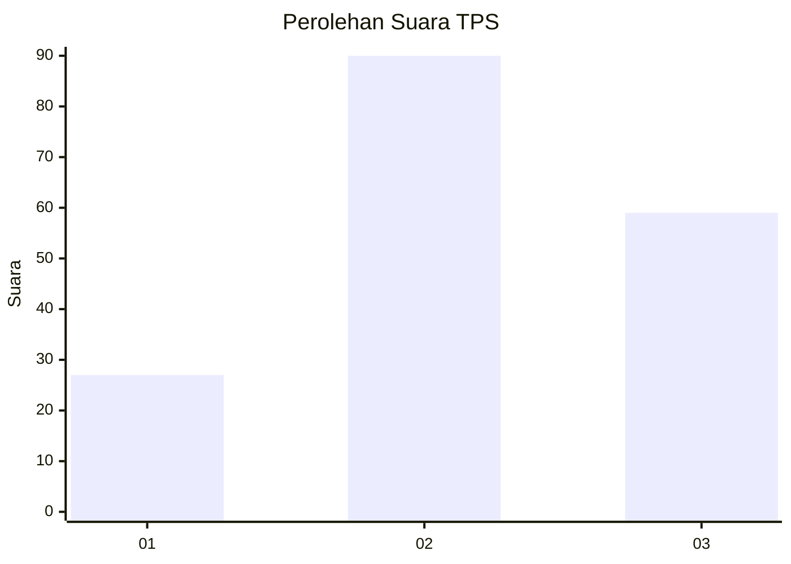
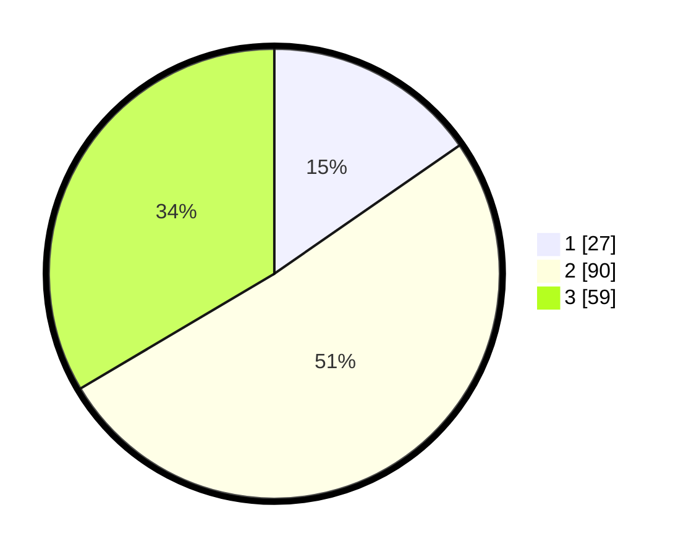

# Hasil

## Grafik

## Tabel

| No. | Nama Paslon    | Suara | Suara (raw) | Persentase |
|:--- |:-------------- | -----:| -----------:| ----------:|
| 1   | ANIES MUHAIMIN | 27    | [27][p-1]   | 15,34      |
| 2   | PRABOWO GIBRAN | 90    | [90][p-2]   | 51,14      |
| 3   | GANJAR MAHFUD  | 59    | [59][p-3]   | 33,52      |

[p-1]: https://github.com/gigit-pemilu/pemilu-2024/blob/main/pilpres/hitung-suara/sub/35-jawa-timur/sub/78-kota-surabaya/sub/05-tegalsari/sub/1003-kedungdoro/sub/005-tps/sub/paslon-1.txt
[p-2]: https://github.com/gigit-pemilu/pemilu-2024/blob/main/pilpres/hitung-suara/sub/35-jawa-timur/sub/78-kota-surabaya/sub/05-tegalsari/sub/1003-kedungdoro/sub/005-tps/sub/paslon-2.txt
[p-3]: https://github.com/gigit-pemilu/pemilu-2024/blob/main/pilpres/hitung-suara/sub/35-jawa-timur/sub/78-kota-surabaya/sub/05-tegalsari/sub/1003-kedungdoro/sub/005-tps/sub/paslon-3.txt

## Foto C Plano

https://sirekap-obj-formc.kpu.go.id/4c00/pemilu/ppwp/35/78/05/10/03/3578051003005-20240214-232807--298319f6-57f0-4e3f-86f3-1387bb785810.jpg

https://sirekap-obj-formc.kpu.go.id/4c00/pemilu/ppwp/35/78/05/10/03/3578051003005-20240214-232816--547f048e-9264-41af-b804-c084f5eb4990.jpg

https://sirekap-obj-formc.kpu.go.id/4c00/pemilu/ppwp/35/78/05/10/03/3578051003005-20240214-232855--7838f8a2-2b9a-4915-8aac-c26d87343bc9.jpg

## Metadata

| Key        | Value               |
| ---------- | ------------------- |
| Time Stamp | 2024-02-25 12:00:00 |

