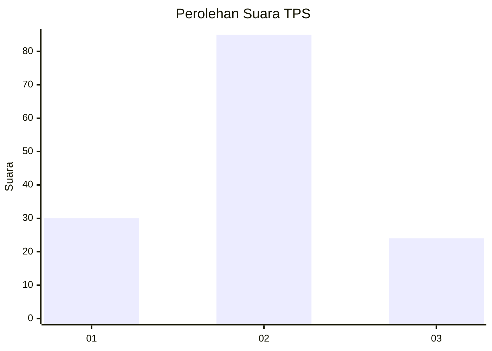
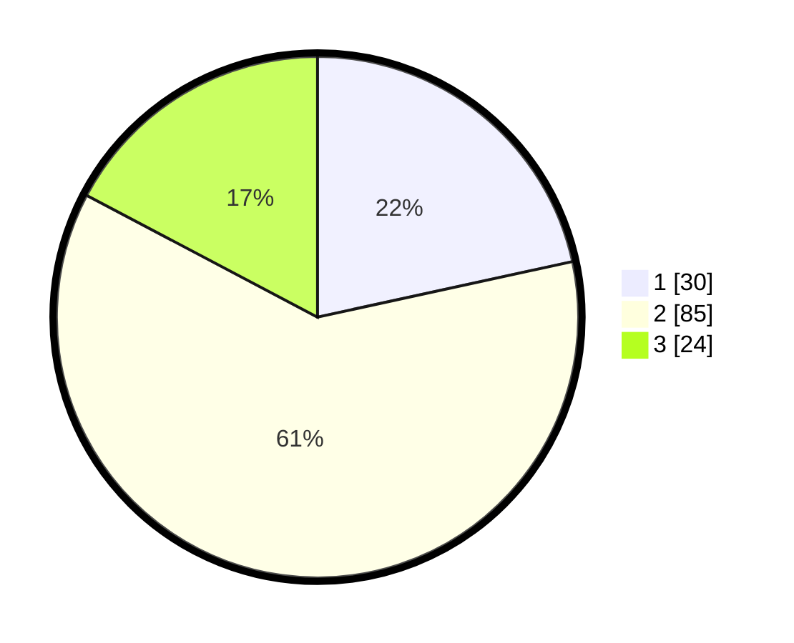

# Hasil

## Grafik

## Tabel

| No. | Nama Paslon    | Suara | Suara (raw) | Persentase |
|:--- |:-------------- | -----:| -----------:| ----------:|
| 1   | ANIES MUHAIMIN | 30    | [30][p-1]   | 21,58      |
| 2   | PRABOWO GIBRAN | 85    | [85][p-2]   | 61,15      |
| 3   | GANJAR MAHFUD  | 24    | [24][p-3]   | 17,27      |

[p-1]: https://github.com/gigit-pemilu/pemilu-2024-35-jawa-timur/blob/main/pilpres/hitung-suara/sub/35-jawa-timur/sub/78-kota-surabaya/sub/05-tegalsari/sub/1003-kedungdoro/sub/055-tps/sub/paslon-1.txt
[p-2]: https://github.com/gigit-pemilu/pemilu-2024-35-jawa-timur/blob/main/pilpres/hitung-suara/sub/35-jawa-timur/sub/78-kota-surabaya/sub/05-tegalsari/sub/1003-kedungdoro/sub/055-tps/sub/paslon-2.txt
[p-3]: https://github.com/gigit-pemilu/pemilu-2024-35-jawa-timur/blob/main/pilpres/hitung-suara/sub/35-jawa-timur/sub/78-kota-surabaya/sub/05-tegalsari/sub/1003-kedungdoro/sub/055-tps/sub/paslon-3.txt

## Foto C Plano

https://sirekap-obj-formc.kpu.go.id/2bf8/pemilu/ppwp/35/78/05/10/03/3578051003055-20240214-192340--874c868b-7b9c-4a51-8dca-95ed641c6697.jpg

https://sirekap-obj-formc.kpu.go.id/2bf8/pemilu/ppwp/35/78/05/10/03/3578051003055-20240214-192417--8c4fcc97-bf21-4689-855d-25a722da4c13.jpg

https://sirekap-obj-formc.kpu.go.id/2bf8/pemilu/ppwp/35/78/05/10/03/3578051003055-20240214-192451--5d79cd60-3551-4a49-a965-d564d7d3e42a.jpg

## Metadata

| Key        | Value               |
| ---------- | ------------------- |
| Time Stamp | 2024-02-16 21:01:00 |

