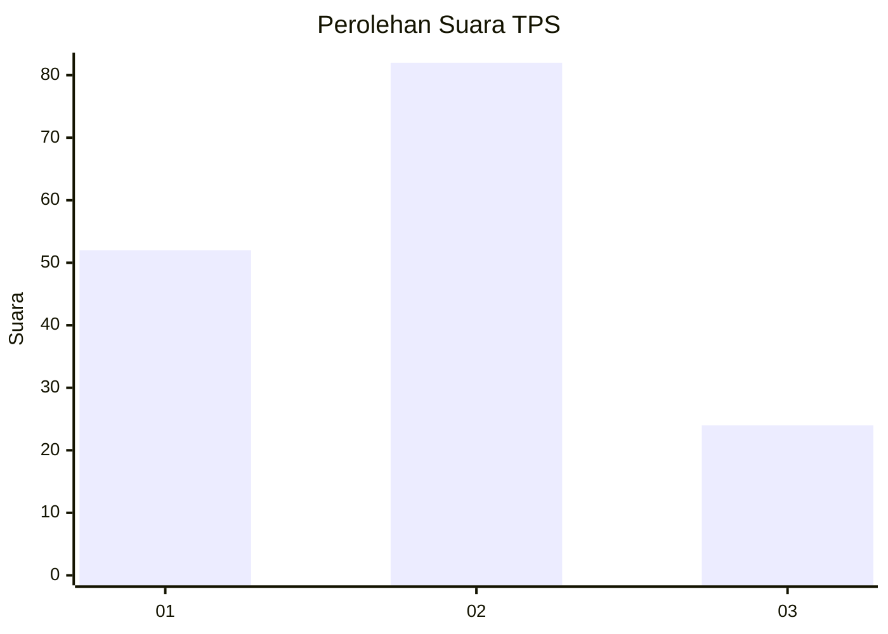
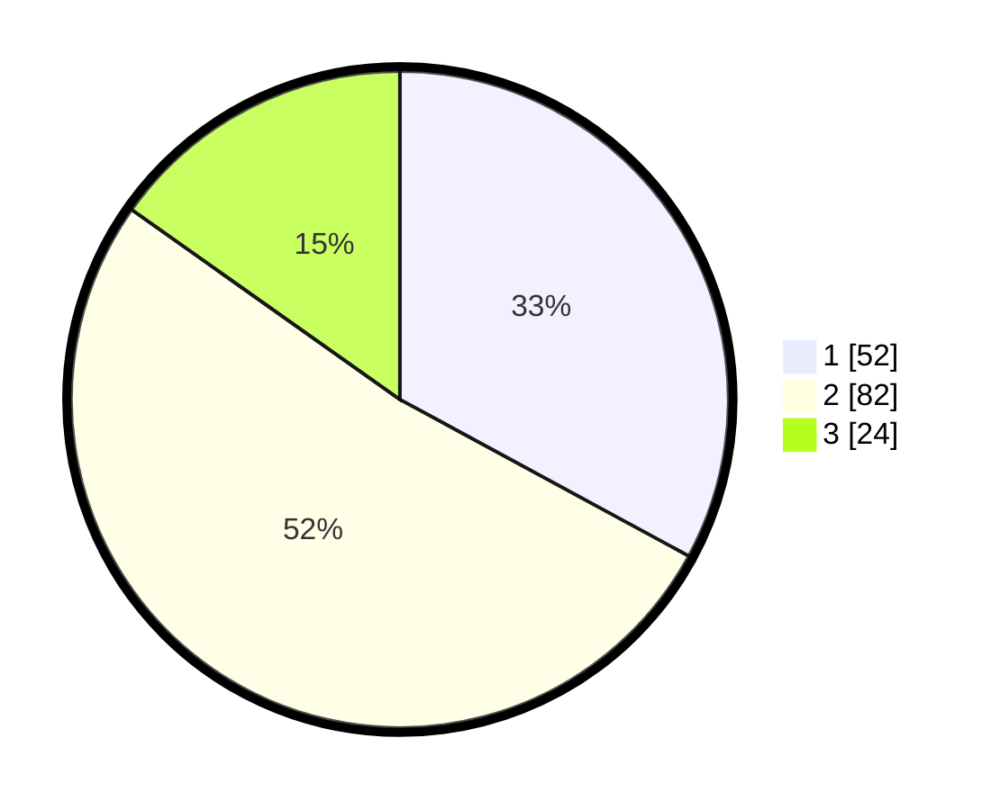

# Hasil

## Grafik

## Tabel

| No. | Nama Paslon    | Suara | Suara (raw) | Persentase |
|:--- |:-------------- | -----:| -----------:| ----------:|
| 1   | ANIES MUHAIMIN | 52    | [52][p-1]   | 32,91      |
| 2   | PRABOWO GIBRAN | 82    | [82][p-2]   | 51,90      |
| 3   | GANJAR MAHFUD  | 24    | [24][p-3]   | 15,19      |

[p-1]: https://github.com/gigit-pemilu/pemilu-2024-35-jawa-timur/blob/main/pilpres/hitung-suara/sub/35-jawa-timur/sub/78-kota-surabaya/sub/05-tegalsari/sub/1004-keputran/sub/002-tps/sub/paslon-1.txt
[p-2]: https://github.com/gigit-pemilu/pemilu-2024-35-jawa-timur/blob/main/pilpres/hitung-suara/sub/35-jawa-timur/sub/78-kota-surabaya/sub/05-tegalsari/sub/1004-keputran/sub/002-tps/sub/paslon-2.txt
[p-3]: https://github.com/gigit-pemilu/pemilu-2024-35-jawa-timur/blob/main/pilpres/hitung-suara/sub/35-jawa-timur/sub/78-kota-surabaya/sub/05-tegalsari/sub/1004-keputran/sub/002-tps/sub/paslon-3.txt

## Foto C Plano

https://sirekap-obj-formc.kpu.go.id/99c4/pemilu/ppwp/35/78/05/10/04/3578051004002-20240214-205502--5c9100d3-1008-4b3b-a54f-084d583191c1.jpg

https://sirekap-obj-formc.kpu.go.id/99c4/pemilu/ppwp/35/78/05/10/04/3578051004002-20240214-205154--f7114ab4-84a9-49a7-8839-b7207b107276.jpg

https://sirekap-obj-formc.kpu.go.id/99c4/pemilu/ppwp/35/78/05/10/04/3578051004002-20240214-205658--d857c173-64c0-4780-bd27-ec989527d43e.jpg

## Metadata

| Key        | Value               |
| ---------- | ------------------- |
| Time Stamp | 2024-02-24 22:31:28 |

