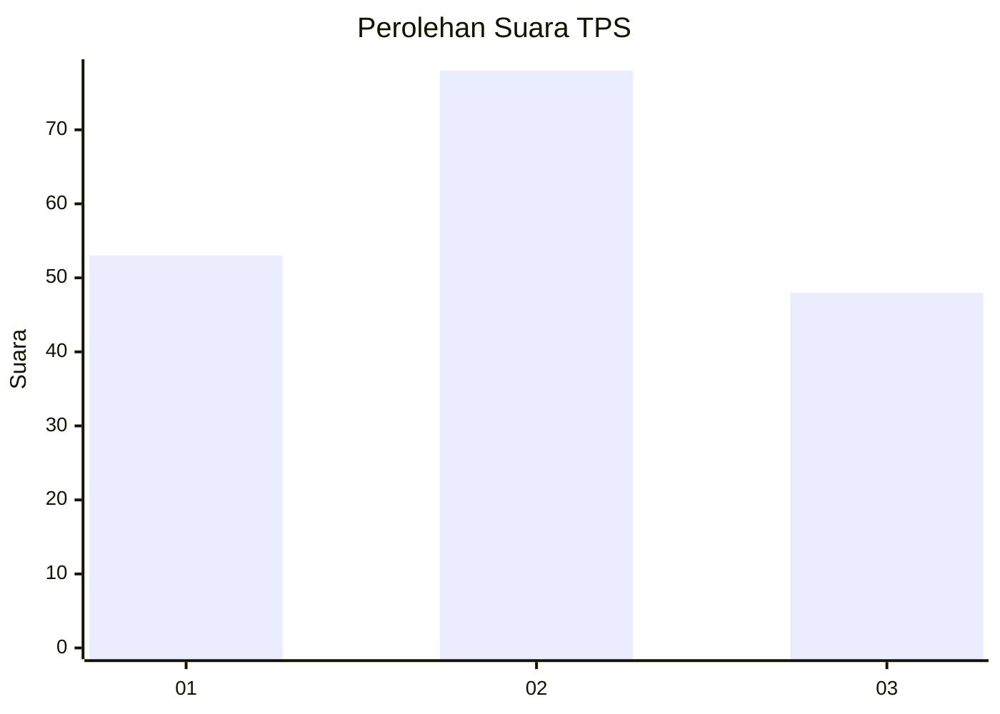
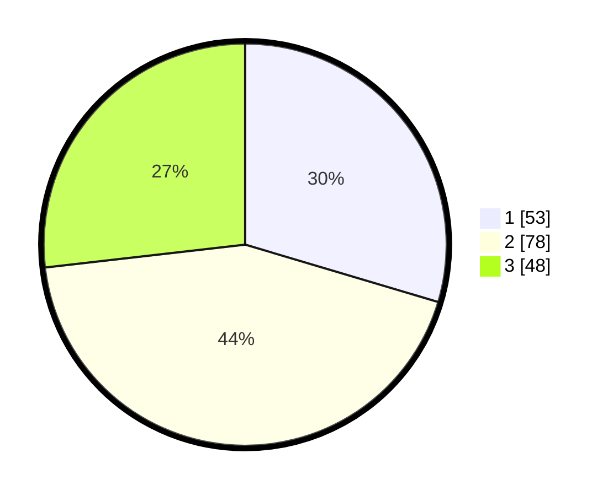

# Hasil

## Grafik

## Tabel

| No. | Nama Paslon    | Suara | Suara (raw) | Persentase |
|:--- |:-------------- | -----:| -----------:| ----------:|
| 1   | ANIES MUHAIMIN | 53    | [53][p-1]   | 29,61      |
| 2   | PRABOWO GIBRAN | 78    | [78][p-2]   | 43,58      |
| 3   | GANJAR MAHFUD  | 48    | [48][p-3]   | 26,82      |

[p-1]: https://github.com/gigit-pemilu/pemilu-2024/blob/main/pilpres/hitung-suara/sub/35-jawa-timur/sub/78-kota-surabaya/sub/05-tegalsari/sub/1004-keputran/sub/005-tps/sub/paslon-1.txt
[p-2]: https://github.com/gigit-pemilu/pemilu-2024/blob/main/pilpres/hitung-suara/sub/35-jawa-timur/sub/78-kota-surabaya/sub/05-tegalsari/sub/1004-keputran/sub/005-tps/sub/paslon-2.txt
[p-3]: https://github.com/gigit-pemilu/pemilu-2024/blob/main/pilpres/hitung-suara/sub/35-jawa-timur/sub/78-kota-surabaya/sub/05-tegalsari/sub/1004-keputran/sub/005-tps/sub/paslon-3.txt

## Foto C Plano

https://sirekap-obj-formc.kpu.go.id/76b8/pemilu/ppwp/35/78/05/10/04/3578051004005-20240214-230852--f76108f1-77f0-4670-80be-cafc68fda066.jpg

https://sirekap-obj-formc.kpu.go.id/76b8/pemilu/ppwp/35/78/05/10/04/3578051004005-20240214-230900--99f402a4-9772-4bce-a919-f02896c6b54a.jpg

https://sirekap-obj-formc.kpu.go.id/76b8/pemilu/ppwp/35/78/05/10/04/3578051004005-20240214-230908--58cec583-11ea-430d-9d4f-0114a8469b01.jpg

## Metadata

| Key        | Value               |
| ---------- | ------------------- |
| Time Stamp | 2024-02-25 21:00:00 |

