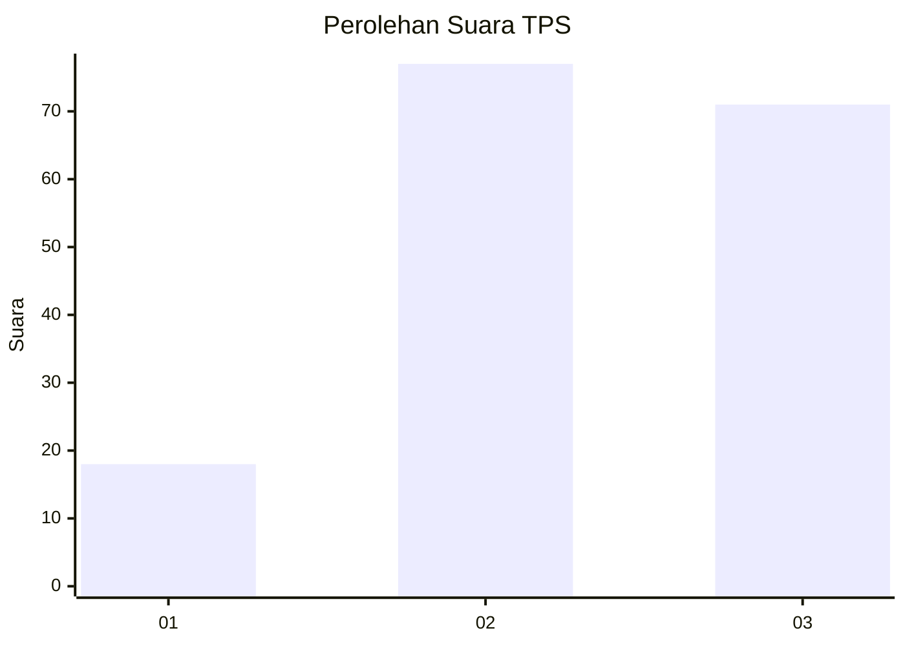
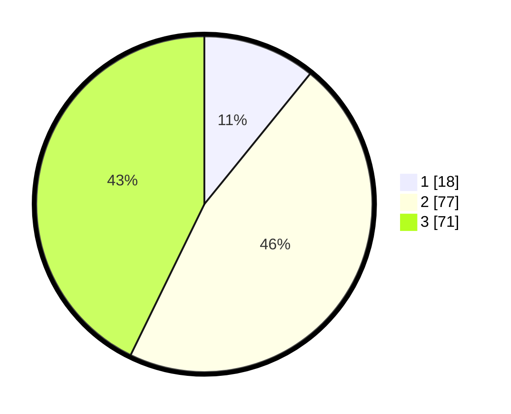

# Hasil

## Grafik

## Tabel

| No. | Nama Paslon    | Suara | Suara (raw) | Persentase |
|:--- |:-------------- | -----:| -----------:| ----------:|
| 1   | ANIES MUHAIMIN | 18    | [18][p-1]   | 10,84      |
| 2   | PRABOWO GIBRAN | 77    | [77][p-2]   | 46,39      |
| 3   | GANJAR MAHFUD  | 71    | [71][p-3]   | 42,77      |

[p-1]: https://github.com/gigit-pemilu/pemilu-2024/blob/main/pilpres/hitung-suara/sub/35-jawa-timur/sub/78-kota-surabaya/sub/05-tegalsari/sub/1004-keputran/sub/006-tps/sub/paslon-1.txt
[p-2]: https://github.com/gigit-pemilu/pemilu-2024/blob/main/pilpres/hitung-suara/sub/35-jawa-timur/sub/78-kota-surabaya/sub/05-tegalsari/sub/1004-keputran/sub/006-tps/sub/paslon-2.txt
[p-3]: https://github.com/gigit-pemilu/pemilu-2024/blob/main/pilpres/hitung-suara/sub/35-jawa-timur/sub/78-kota-surabaya/sub/05-tegalsari/sub/1004-keputran/sub/006-tps/sub/paslon-3.txt

## Foto C Plano

https://sirekap-obj-formc.kpu.go.id/3cdf/pemilu/ppwp/35/78/05/10/04/3578051004006-20240214-155453--269a979a-4544-45c1-aec4-5ac3fbab2591.jpg

https://sirekap-obj-formc.kpu.go.id/3cdf/pemilu/ppwp/35/78/05/10/04/3578051004006-20240214-155156--9a1ad0be-df39-47d5-8c7e-5806d427b6c7.jpg

https://sirekap-obj-formc.kpu.go.id/3cdf/pemilu/ppwp/35/78/05/10/04/3578051004006-20240214-155138--e3ef05b8-1f8e-42e5-833a-72a3b479a526.jpg

## Metadata

| Key        | Value               |
| ---------- | ------------------- |
| Time Stamp | 2024-02-24 22:31:28 |

