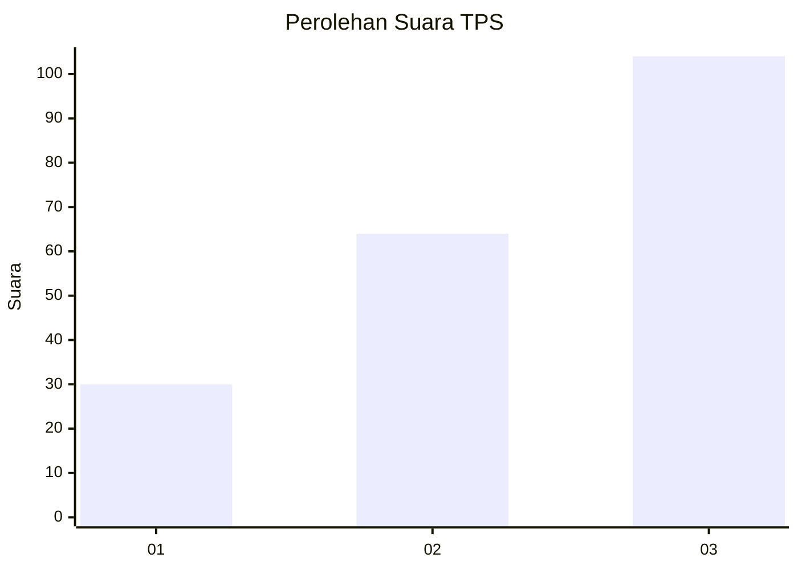
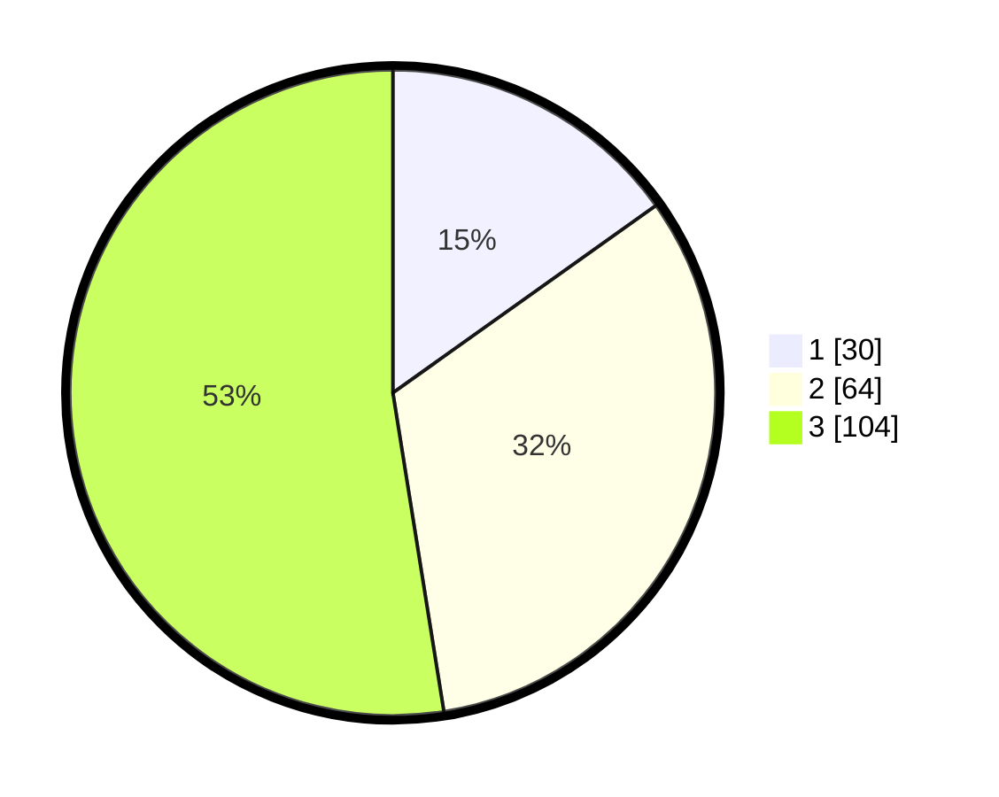

# Hasil

## Grafik

## Tabel

| No. | Nama Paslon    | Suara | Suara (raw) | Persentase |
|:--- |:-------------- | -----:| -----------:| ----------:|
| 1   | ANIES MUHAIMIN | 30    | [30][p-1]   | 15,15      |
| 2   | PRABOWO GIBRAN | 64    | [64][p-2]   | 32,32      |
| 3   | GANJAR MAHFUD  | 104   | [104][p-3]  | 52,53      |

[p-1]: https://github.com/gigit-pemilu/pemilu-2024-35-jawa-timur/blob/main/pilpres/hitung-suara/sub/35-jawa-timur/sub/78-kota-surabaya/sub/05-tegalsari/sub/1004-keputran/sub/043-tps/sub/paslon-1.txt
[p-2]: https://github.com/gigit-pemilu/pemilu-2024-35-jawa-timur/blob/main/pilpres/hitung-suara/sub/35-jawa-timur/sub/78-kota-surabaya/sub/05-tegalsari/sub/1004-keputran/sub/043-tps/sub/paslon-2.txt
[p-3]: https://github.com/gigit-pemilu/pemilu-2024-35-jawa-timur/blob/main/pilpres/hitung-suara/sub/35-jawa-timur/sub/78-kota-surabaya/sub/05-tegalsari/sub/1004-keputran/sub/043-tps/sub/paslon-3.txt

## Foto C Plano

https://sirekap-obj-formc.kpu.go.id/f17b/pemilu/ppwp/35/78/05/10/04/3578051004043-20240215-020949--6b1ca7d7-b775-4788-a756-2fa9c96966e9.jpg

https://sirekap-obj-formc.kpu.go.id/f17b/pemilu/ppwp/35/78/05/10/04/3578051004043-20240215-020801--e0d09c95-50d3-4278-8e9e-a67b6c78ac79.jpg

https://sirekap-obj-formc.kpu.go.id/f17b/pemilu/ppwp/35/78/05/10/04/3578051004043-20240215-021048--7080cfea-52aa-476c-8ea3-d5c26092f468.jpg

## Metadata

| Key        | Value               |
| ---------- | ------------------- |
| Time Stamp | 2024-02-25 11:00:00 |

