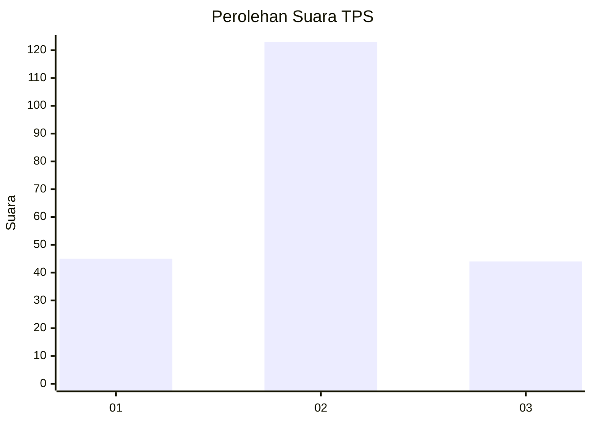
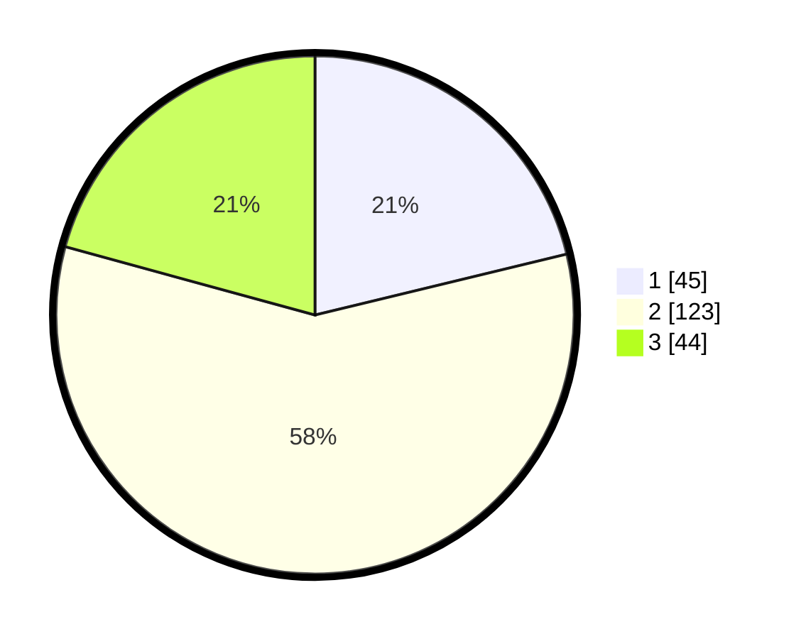

# Hasil

## Grafik

## Tabel

| No. | Nama Paslon    | Suara | Suara (raw) | Persentase |
|:--- |:-------------- | -----:| -----------:| ----------:|
| 1   | ANIES MUHAIMIN | 45    | [45][p-1]   | 21,23      |
| 2   | PRABOWO GIBRAN | 123   | [123][p-2]  | 58,02      |
| 3   | GANJAR MAHFUD  | 44    | [44][p-3]   | 20,75      |

[p-1]: https://github.com/gigit-pemilu/pemilu-2024/blob/main/pilpres/hitung-suara/sub/35-jawa-timur/sub/78-kota-surabaya/sub/06-sawahan/sub/1001-petemon/sub/003-tps/sub/paslon-1.txt
[p-2]: https://github.com/gigit-pemilu/pemilu-2024/blob/main/pilpres/hitung-suara/sub/35-jawa-timur/sub/78-kota-surabaya/sub/06-sawahan/sub/1001-petemon/sub/003-tps/sub/paslon-2.txt
[p-3]: https://github.com/gigit-pemilu/pemilu-2024/blob/main/pilpres/hitung-suara/sub/35-jawa-timur/sub/78-kota-surabaya/sub/06-sawahan/sub/1001-petemon/sub/003-tps/sub/paslon-3.txt

## Foto C Plano

https://sirekap-obj-formc.kpu.go.id/8b8b/pemilu/ppwp/35/78/06/10/01/3578061001003-20240227-145407--167ca15b-b34c-485e-9ae2-824f796b546b.jpg

https://sirekap-obj-formc.kpu.go.id/8b8b/pemilu/ppwp/35/78/06/10/01/3578061001003-20240215-030522--e33a90f7-0fca-4183-9d1f-3cea233a65d7.jpg

https://sirekap-obj-formc.kpu.go.id/8b8b/pemilu/ppwp/35/78/06/10/01/3578061001003-20240215-030607--5213f73b-a77e-44eb-b7f0-90c13ba2128e.jpg

## Metadata

| Key        | Value               |
| ---------- | ------------------- |
| Time Stamp | 2024-02-27 15:00:00 |

