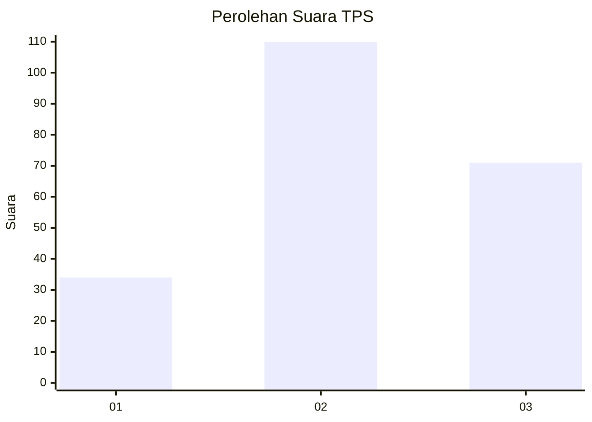
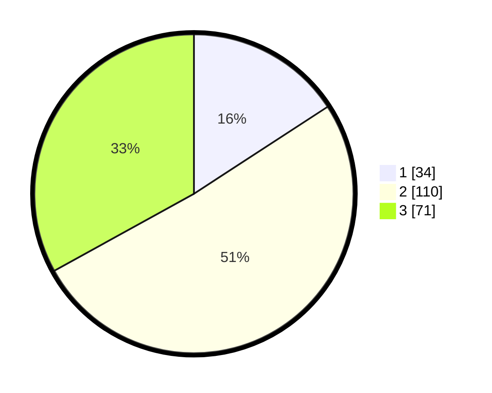

# Hasil

## Grafik

## Tabel

| No. | Nama Paslon    | Suara | Suara (raw) | Persentase |
|:--- |:-------------- | -----:| -----------:| ----------:|
| 1   | ANIES MUHAIMIN | 34    | [34][p-1]   | 15,81      |
| 2   | PRABOWO GIBRAN | 110   | [110][p-2]  | 51,16      |
| 3   | GANJAR MAHFUD  | 71    | [71][p-3]   | 33,02      |

[p-1]: https://github.com/gigit-pemilu/pemilu-2024/blob/main/pilpres/hitung-suara/sub/35-jawa-timur/sub/78-kota-surabaya/sub/06-sawahan/sub/1001-petemon/sub/005-tps/sub/paslon-1.txt
[p-2]: https://github.com/gigit-pemilu/pemilu-2024/blob/main/pilpres/hitung-suara/sub/35-jawa-timur/sub/78-kota-surabaya/sub/06-sawahan/sub/1001-petemon/sub/005-tps/sub/paslon-2.txt
[p-3]: https://github.com/gigit-pemilu/pemilu-2024/blob/main/pilpres/hitung-suara/sub/35-jawa-timur/sub/78-kota-surabaya/sub/06-sawahan/sub/1001-petemon/sub/005-tps/sub/paslon-3.txt

## Foto C Plano

https://sirekap-obj-formc.kpu.go.id/5808/pemilu/ppwp/35/78/06/10/01/3578061001005-20240214-204637--d3d8696e-9ce5-494f-93f5-59804e1dfa5a.jpg

https://sirekap-obj-formc.kpu.go.id/5808/pemilu/ppwp/35/78/06/10/01/3578061001005-20240215-025819--d3afd7ad-c526-470c-8ecd-8d31dd7f831e.jpg

https://sirekap-obj-formc.kpu.go.id/5808/pemilu/ppwp/35/78/06/10/01/3578061001005-20240214-203507--0574b3a5-2e72-47d0-8ed3-9ecd6585a0f0.jpg

## Metadata

| Key        | Value               |
| ---------- | ------------------- |
| Time Stamp | 2024-02-25 12:00:00 |

