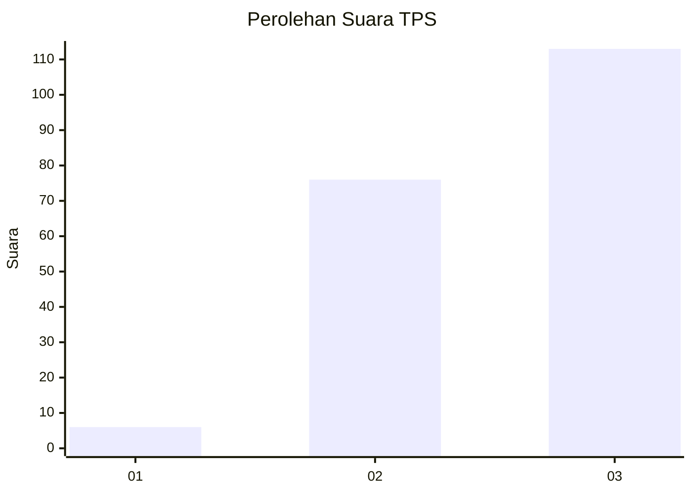
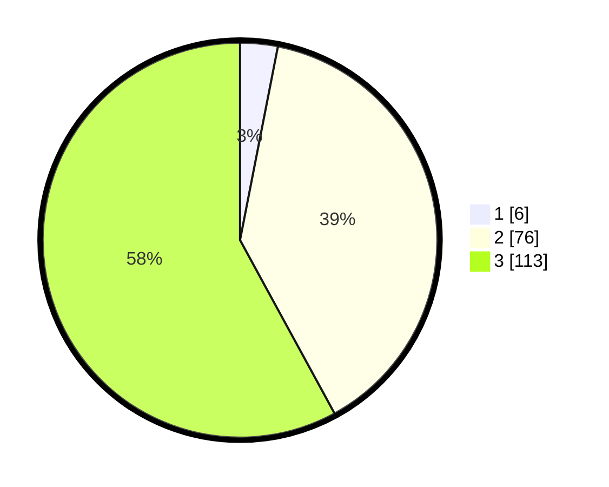

# Hasil

## Grafik

## Tabel

| No. | Nama Paslon    | Suara | Suara (raw) | Persentase |
|:--- |:-------------- | -----:| -----------:| ----------:|
| 1   | ANIES MUHAIMIN | 6     | [6][p-1]    | 3,08       |
| 2   | PRABOWO GIBRAN | 76    | [76][p-2]   | 38,97      |
| 3   | GANJAR MAHFUD  | 113   | [113][p-3]  | 57,95      |

[p-1]: https://github.com/gigit-pemilu/pemilu-2024/blob/main/pilpres/hitung-suara/sub/35-jawa-timur/sub/78-kota-surabaya/sub/06-sawahan/sub/1001-petemon/sub/012-tps/sub/paslon-1.txt
[p-2]: https://github.com/gigit-pemilu/pemilu-2024/blob/main/pilpres/hitung-suara/sub/35-jawa-timur/sub/78-kota-surabaya/sub/06-sawahan/sub/1001-petemon/sub/012-tps/sub/paslon-2.txt
[p-3]: https://github.com/gigit-pemilu/pemilu-2024/blob/main/pilpres/hitung-suara/sub/35-jawa-timur/sub/78-kota-surabaya/sub/06-sawahan/sub/1001-petemon/sub/012-tps/sub/paslon-3.txt

## Foto C Plano

https://sirekap-obj-formc.kpu.go.id/f361/pemilu/ppwp/35/78/06/10/01/3578061001012-20240216-085742--206efb6f-2c5a-473f-86d9-c31063401557.jpg

https://sirekap-obj-formc.kpu.go.id/f361/pemilu/ppwp/35/78/06/10/01/3578061001012-20240216-090345--ce42cb5d-f6c1-4681-a2c5-10a76b1d9f7d.jpg

https://sirekap-obj-formc.kpu.go.id/f361/pemilu/ppwp/35/78/06/10/01/3578061001012-20240216-090511--03522db0-0ac8-4df0-8966-75e2e810ca02.jpg

## Metadata

| Key        | Value               |
| ---------- | ------------------- |
| Time Stamp | 2024-02-21 16:00:00 |

