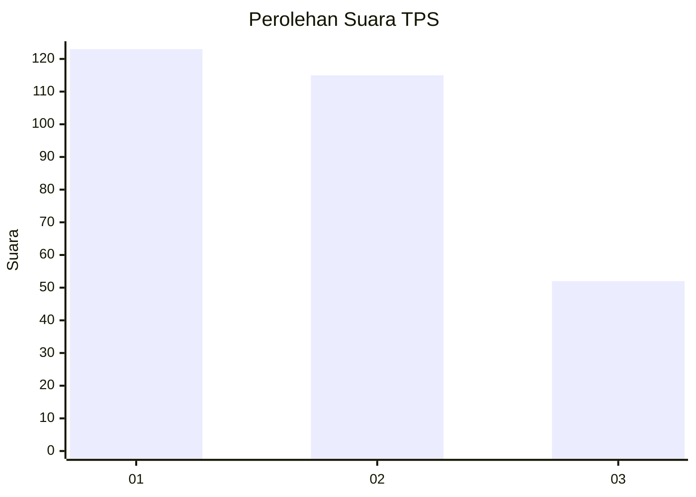
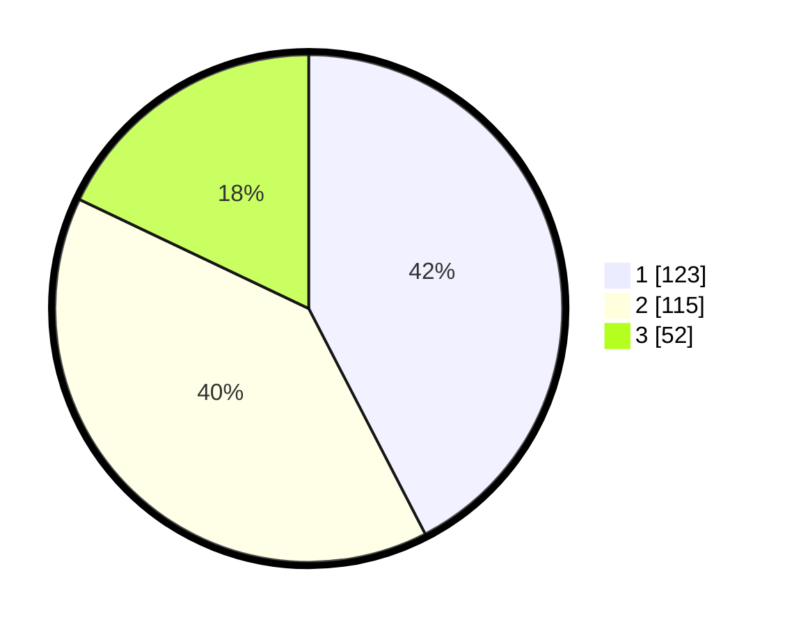

# Hasil

## Grafik

## Tabel

| No. | Nama Paslon    | Suara | Suara (raw) | Persentase |
|:--- |:-------------- | -----:| -----------:| ----------:|
| 1   | ANIES MUHAIMIN | 123   | [123][p-1]  | 42,41      |
| 2   | PRABOWO GIBRAN | 115   | [115][p-2]  | 39,66      |
| 3   | GANJAR MAHFUD  | 52    | [52][p-3]   | 17,93      |

[p-1]: https://github.com/gigit-pemilu/pemilu-2024-35-jawa-timur/blob/main/pilpres/hitung-suara/sub/35-jawa-timur/sub/78-kota-surabaya/sub/06-sawahan/sub/1001-petemon/sub/042-tps/sub/paslon-1.txt
[p-2]: https://github.com/gigit-pemilu/pemilu-2024-35-jawa-timur/blob/main/pilpres/hitung-suara/sub/35-jawa-timur/sub/78-kota-surabaya/sub/06-sawahan/sub/1001-petemon/sub/042-tps/sub/paslon-2.txt
[p-3]: https://github.com/gigit-pemilu/pemilu-2024-35-jawa-timur/blob/main/pilpres/hitung-suara/sub/35-jawa-timur/sub/78-kota-surabaya/sub/06-sawahan/sub/1001-petemon/sub/042-tps/sub/paslon-3.txt

## Foto C Plano

https://sirekap-obj-formc.kpu.go.id/426b/pemilu/ppwp/35/78/06/10/01/3578061001042-20240214-234725--f92dd4c2-0542-4ef4-93cc-6925526d4afa.jpg

https://sirekap-obj-formc.kpu.go.id/426b/pemilu/ppwp/35/78/06/10/01/3578061001042-20240214-235032--f900dbb5-c6ce-471d-ad1f-0df7f3c3b6d5.jpg

https://sirekap-obj-formc.kpu.go.id/426b/pemilu/ppwp/35/78/06/10/01/3578061001042-20240214-235256--b36c7c95-8527-48d3-976e-76ff90c72640.jpg

## Metadata

| Key        | Value               |
| ---------- | ------------------- |
| Time Stamp | 2024-02-25 12:00:00 |

