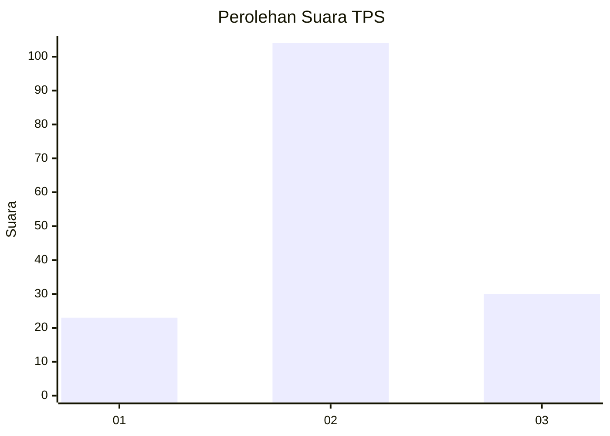
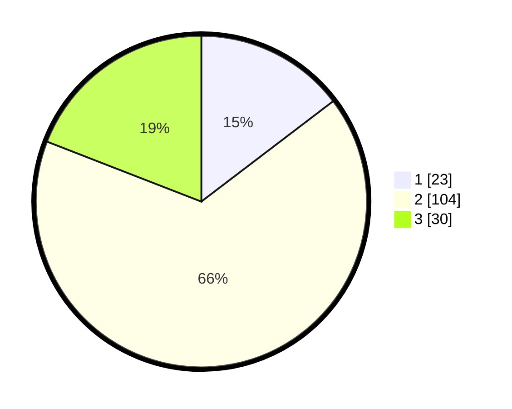

# Hasil

## Grafik

## Tabel

| No. | Nama Paslon    | Suara | Suara (raw) | Persentase |
|:--- |:-------------- | -----:| -----------:| ----------:|
| 1   | ANIES MUHAIMIN | 23    | [23][p-1]   | 14,65      |
| 2   | PRABOWO GIBRAN | 104   | [104][p-2]  | 66,24      |
| 3   | GANJAR MAHFUD  | 30    | [30][p-3]   | 19,11      |

[p-1]: https://github.com/gigit-pemilu/pemilu-2024-35-jawa-timur/blob/main/pilpres/hitung-suara/sub/35-jawa-timur/sub/78-kota-surabaya/sub/06-sawahan/sub/1001-petemon/sub/043-tps/sub/paslon-1.txt
[p-2]: https://github.com/gigit-pemilu/pemilu-2024-35-jawa-timur/blob/main/pilpres/hitung-suara/sub/35-jawa-timur/sub/78-kota-surabaya/sub/06-sawahan/sub/1001-petemon/sub/043-tps/sub/paslon-2.txt
[p-3]: https://github.com/gigit-pemilu/pemilu-2024-35-jawa-timur/blob/main/pilpres/hitung-suara/sub/35-jawa-timur/sub/78-kota-surabaya/sub/06-sawahan/sub/1001-petemon/sub/043-tps/sub/paslon-3.txt

## Foto C Plano

https://sirekap-obj-formc.kpu.go.id/0275/pemilu/ppwp/35/78/06/10/01/3578061001043-20240215-123553--9cc1bf82-c20f-4b7c-a975-f2eede84f6ef.jpg

https://sirekap-obj-formc.kpu.go.id/0275/pemilu/ppwp/35/78/06/10/01/3578061001043-20240214-235131--5cd0d807-7953-47db-bbbc-62e557c27c8b.jpg

https://sirekap-obj-formc.kpu.go.id/0275/pemilu/ppwp/35/78/06/10/01/3578061001043-20240214-235211--a9bc6215-a336-43f6-8cdb-39d770b9696f.jpg

## Metadata

| Key        | Value               |
| ---------- | ------------------- |
| Time Stamp | 2024-02-24 22:31:28 |

