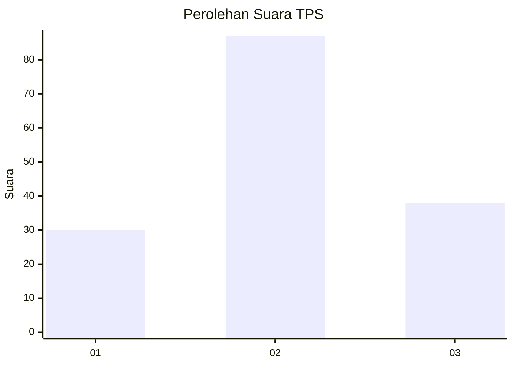
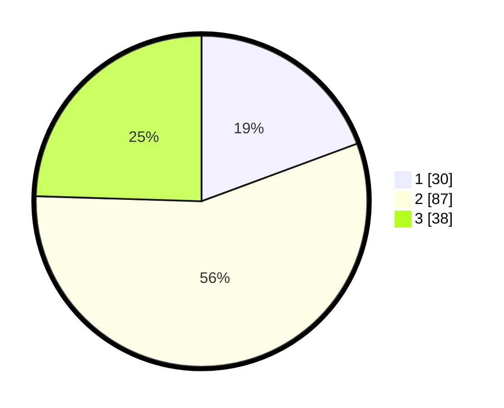

# Hasil

## Grafik

## Tabel

| No. | Nama Paslon    | Suara | Suara (raw) | Persentase |
|:--- |:-------------- | -----:| -----------:| ----------:|
| 1   | ANIES MUHAIMIN | 30    | [30][p-1]   | 19,35      |
| 2   | PRABOWO GIBRAN | 87    | [87][p-2]   | 56,13      |
| 3   | GANJAR MAHFUD  | 38    | [38][p-3]   | 24,52      |

[p-1]: https://github.com/gigit-pemilu/pemilu-2024-35-jawa-timur/blob/main/pilpres/hitung-suara/sub/35-jawa-timur/sub/78-kota-surabaya/sub/06-sawahan/sub/1001-petemon/sub/069-tps/sub/paslon-1.txt
[p-2]: https://github.com/gigit-pemilu/pemilu-2024-35-jawa-timur/blob/main/pilpres/hitung-suara/sub/35-jawa-timur/sub/78-kota-surabaya/sub/06-sawahan/sub/1001-petemon/sub/069-tps/sub/paslon-2.txt
[p-3]: https://github.com/gigit-pemilu/pemilu-2024-35-jawa-timur/blob/main/pilpres/hitung-suara/sub/35-jawa-timur/sub/78-kota-surabaya/sub/06-sawahan/sub/1001-petemon/sub/069-tps/sub/paslon-3.txt

## Foto C Plano

https://sirekap-obj-formc.kpu.go.id/e8f8/pemilu/ppwp/35/78/06/10/01/3578061001069-20240215-030735--9db6e9c6-caa8-440e-a300-9286402536a5.jpg

https://sirekap-obj-formc.kpu.go.id/e8f8/pemilu/ppwp/35/78/06/10/01/3578061001069-20240215-061552--78deb3d8-7b13-4782-a370-2397345fff1e.jpg

https://sirekap-obj-formc.kpu.go.id/e8f8/pemilu/ppwp/35/78/06/10/01/3578061001069-20240215-031116--c81b7d27-9afc-4d13-a046-56a9cbe7ee53.jpg

## Metadata

| Key        | Value               |
| ---------- | ------------------- |
| Time Stamp | 2024-02-21 16:00:00 |

