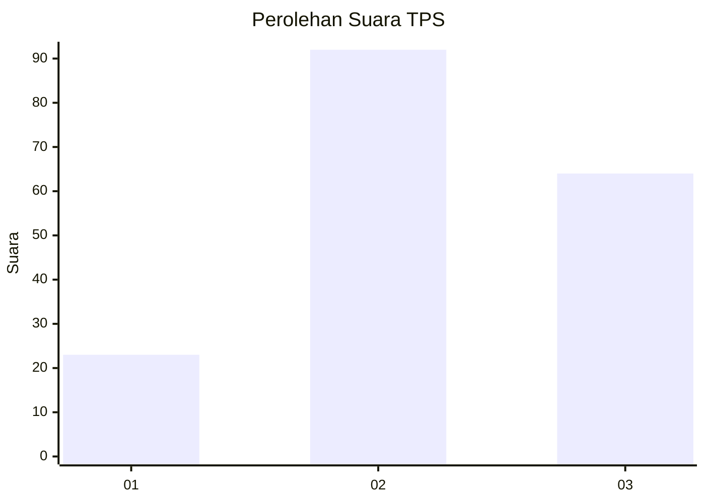
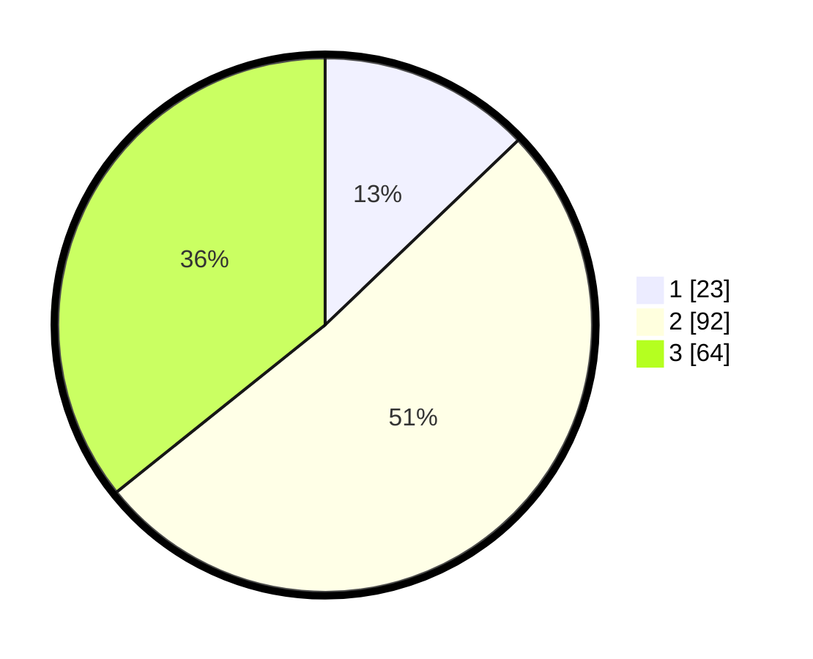

# Hasil

## Grafik

## Tabel

| No. | Nama Paslon    | Suara | Suara (raw) | Persentase |
|:--- |:-------------- | -----:| -----------:| ----------:|
| 1   | ANIES MUHAIMIN | 23    | [23][p-1]   | 12,85      |
| 2   | PRABOWO GIBRAN | 92    | [92][p-2]   | 51,40      |
| 3   | GANJAR MAHFUD  | 64    | [64][p-3]   | 35,75      |

[p-1]: https://github.com/gigit-pemilu/pemilu-2024/blob/main/pilpres/hitung-suara/sub/35-jawa-timur/sub/78-kota-surabaya/sub/06-sawahan/sub/1001-petemon/sub/097-tps/sub/paslon-1.txt
[p-2]: https://github.com/gigit-pemilu/pemilu-2024/blob/main/pilpres/hitung-suara/sub/35-jawa-timur/sub/78-kota-surabaya/sub/06-sawahan/sub/1001-petemon/sub/097-tps/sub/paslon-2.txt
[p-3]: https://github.com/gigit-pemilu/pemilu-2024/blob/main/pilpres/hitung-suara/sub/35-jawa-timur/sub/78-kota-surabaya/sub/06-sawahan/sub/1001-petemon/sub/097-tps/sub/paslon-3.txt

## Foto C Plano

https://sirekap-obj-formc.kpu.go.id/4154/pemilu/ppwp/35/78/06/10/01/3578061001097-20240215-013559--1d323b56-d5c7-43ad-81b7-33027fd5da0d.jpg

https://sirekap-obj-formc.kpu.go.id/4154/pemilu/ppwp/35/78/06/10/01/3578061001097-20240215-013655--1858c7e1-226e-4a7e-acf4-e6bc566d69cb.jpg

https://sirekap-obj-formc.kpu.go.id/4154/pemilu/ppwp/35/78/06/10/01/3578061001097-20240215-013742--3a731844-579d-48a8-8813-f87f0c72a036.jpg

## Metadata

| Key        | Value               |
| ---------- | ------------------- |
| Time Stamp | 2024-02-24 22:31:28 |

