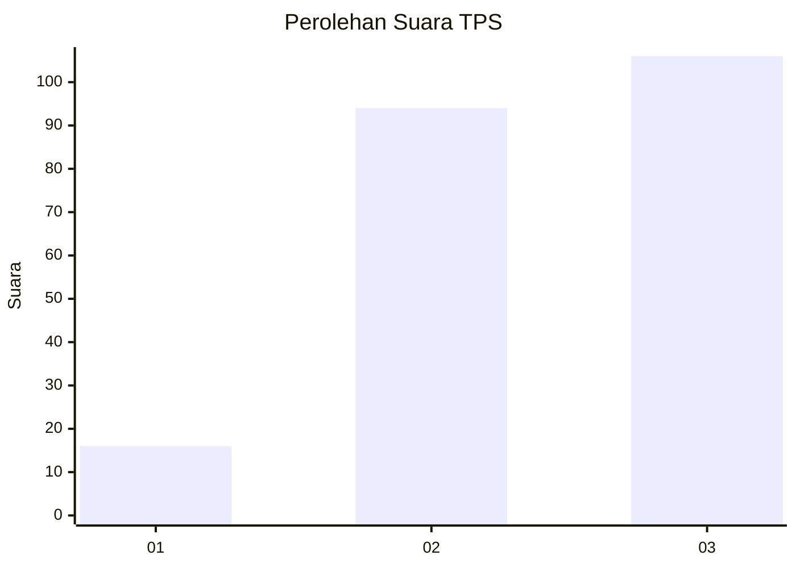
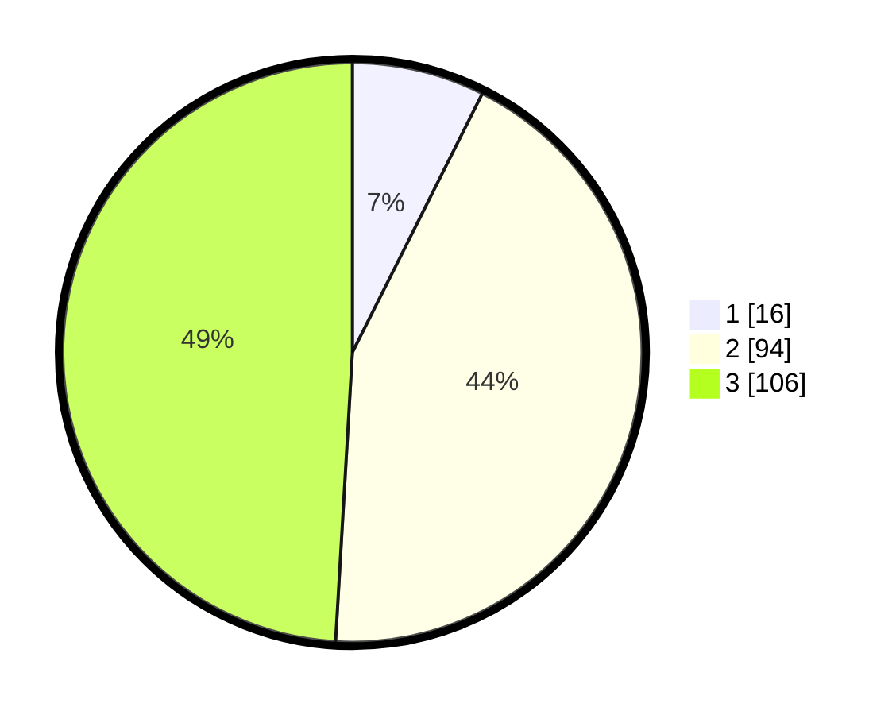

# Hasil

## Grafik

## Tabel

| No. | Nama Paslon    | Suara | Suara (raw) | Persentase |
|:--- |:-------------- | -----:| -----------:| ----------:|
| 1   | ANIES MUHAIMIN | 16    | [16][p-1]   | 7,41       |
| 2   | PRABOWO GIBRAN | 94    | [94][p-2]   | 43,52      |
| 3   | GANJAR MAHFUD  | 106   | [106][p-3]  | 49,07      |

[p-1]: https://github.com/gigit-pemilu/pemilu-2024-35-jawa-timur/blob/main/pilpres/hitung-suara/sub/35-jawa-timur/sub/78-kota-surabaya/sub/06-sawahan/sub/1002-sawahan/sub/022-tps/sub/paslon-1.txt
[p-2]: https://github.com/gigit-pemilu/pemilu-2024-35-jawa-timur/blob/main/pilpres/hitung-suara/sub/35-jawa-timur/sub/78-kota-surabaya/sub/06-sawahan/sub/1002-sawahan/sub/022-tps/sub/paslon-2.txt
[p-3]: https://github.com/gigit-pemilu/pemilu-2024-35-jawa-timur/blob/main/pilpres/hitung-suara/sub/35-jawa-timur/sub/78-kota-surabaya/sub/06-sawahan/sub/1002-sawahan/sub/022-tps/sub/paslon-3.txt

## Foto C Plano

https://sirekap-obj-formc.kpu.go.id/88ae/pemilu/ppwp/35/78/06/10/02/3578061002022-20240214-224635--a381cf70-7665-4d5f-90ee-d60d1464cb72.jpg

https://sirekap-obj-formc.kpu.go.id/88ae/pemilu/ppwp/35/78/06/10/02/3578061002022-20240214-225214--67fe1f29-cbe2-433a-a980-819a6f2f8b15.jpg

https://sirekap-obj-formc.kpu.go.id/88ae/pemilu/ppwp/35/78/06/10/02/3578061002022-20240214-225313--7a1a95a8-5c76-4241-ab0e-ac83915cec8c.jpg

## Metadata

| Key        | Value               |
| ---------- | ------------------- |
| Time Stamp | 2024-02-25 21:00:00 |

