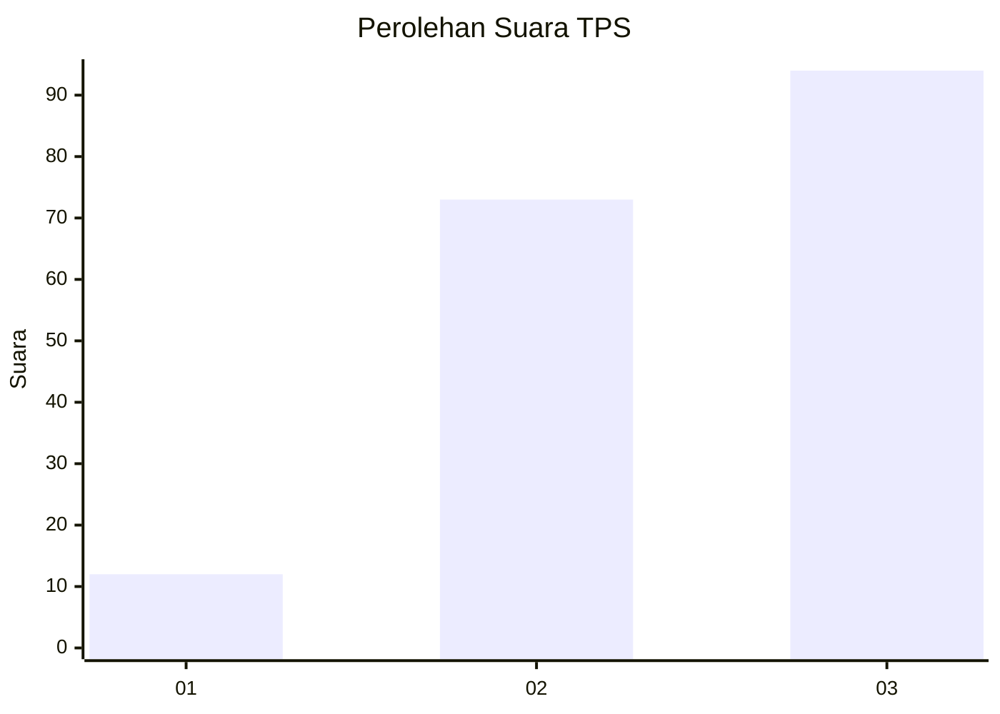
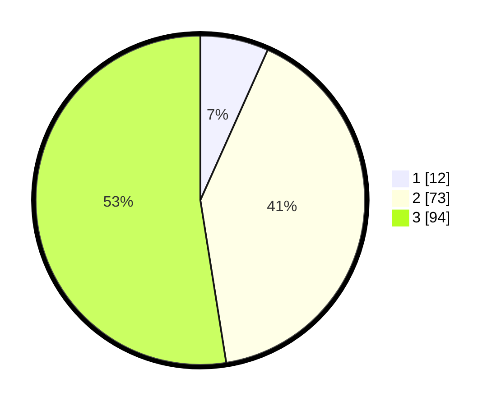

# Hasil

## Grafik

## Tabel

| No. | Nama Paslon    | Suara | Suara (raw) | Persentase |
|:--- |:-------------- | -----:| -----------:| ----------:|
| 1   | ANIES MUHAIMIN | 12    | [12][p-1]   | 6,70       |
| 2   | PRABOWO GIBRAN | 73    | [73][p-2]   | 40,78      |
| 3   | GANJAR MAHFUD  | 94    | [94][p-3]   | 52,51      |

[p-1]: https://github.com/gigit-pemilu/pemilu-2024/blob/main/pilpres/hitung-suara/sub/35-jawa-timur/sub/78-kota-surabaya/sub/06-sawahan/sub/1002-sawahan/sub/023-tps/sub/paslon-1.txt
[p-2]: https://github.com/gigit-pemilu/pemilu-2024/blob/main/pilpres/hitung-suara/sub/35-jawa-timur/sub/78-kota-surabaya/sub/06-sawahan/sub/1002-sawahan/sub/023-tps/sub/paslon-2.txt
[p-3]: https://github.com/gigit-pemilu/pemilu-2024/blob/main/pilpres/hitung-suara/sub/35-jawa-timur/sub/78-kota-surabaya/sub/06-sawahan/sub/1002-sawahan/sub/023-tps/sub/paslon-3.txt

## Foto C Plano

https://sirekap-obj-formc.kpu.go.id/02ed/pemilu/ppwp/35/78/06/10/02/3578061002023-20240221-114924--10f29f6d-9c2c-401f-bd8a-6b2d8347d0c4.jpg

https://sirekap-obj-formc.kpu.go.id/02ed/pemilu/ppwp/35/78/06/10/02/3578061002023-20240221-115021--9c2ee187-fbc9-424b-8f0f-165aae2e055c.jpg

https://sirekap-obj-formc.kpu.go.id/02ed/pemilu/ppwp/35/78/06/10/02/3578061002023-20240221-115059--3bbd7a04-baa7-47ba-ad5c-52adc8babe22.jpg

## Metadata

| Key        | Value               |
| ---------- | ------------------- |
| Time Stamp | 2024-02-24 22:31:28 |

## DATA PEMILIH TETAP

Jumlah pemilih dalam DPT: **0**.
 * L: **0**.
 * P: **0**.

## DATA PENGGUNA HAK PILIH

Jumlah pengguna hak pilih dalam DPT: **0**.
 * L: **0**.
 * P: **0**.

Jumlah pengguna hak pilih dalam DPTb: **777**.
 * L: **88**.
 * P: **89**.

Jumlah pengguna hak pilih dalam DPK: **2**.
 * L: **42**.
 * P: **1**.

Jumlah pengguna hak pilih: **3**.
 * L: **1**.
 * P: **2**.

## JUMLAH SUARA SAH DAN TIDAK SAH

JUMLAH SELURUH SUARA SAH: **179**.

JUMLAH SUARA TIDAK SAH: **3**.

JUMLAH SELURUH SUARA SAH DAN SUARA TIDAK SAH: **182**.

