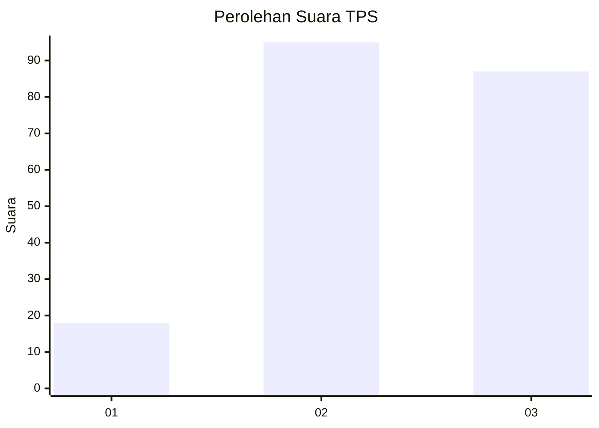
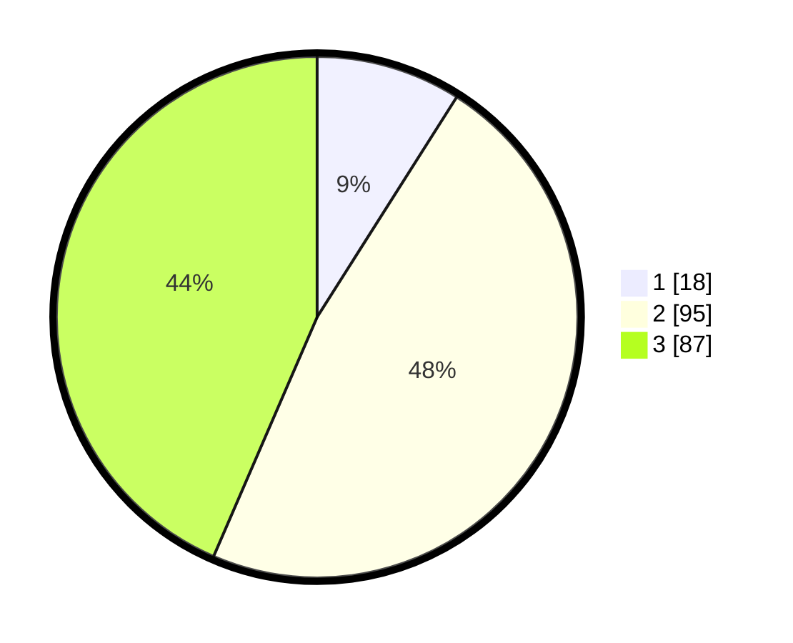

# Hasil

## Grafik

## Tabel

| No. | Nama Paslon    | Suara | Suara (raw) | Persentase |
|:--- |:-------------- | -----:| -----------:| ----------:|
| 1   | ANIES MUHAIMIN | 18    | [18][p-1]   | 9,00       |
| 2   | PRABOWO GIBRAN | 95    | [95][p-2]   | 47,50      |
| 3   | GANJAR MAHFUD  | 87    | [87][p-3]   | 43,50      |

[p-1]: https://github.com/gigit-pemilu/pemilu-2024/blob/main/pilpres/hitung-suara/sub/35-jawa-timur/sub/78-kota-surabaya/sub/06-sawahan/sub/1002-sawahan/sub/025-tps/sub/paslon-1.txt
[p-2]: https://github.com/gigit-pemilu/pemilu-2024/blob/main/pilpres/hitung-suara/sub/35-jawa-timur/sub/78-kota-surabaya/sub/06-sawahan/sub/1002-sawahan/sub/025-tps/sub/paslon-2.txt
[p-3]: https://github.com/gigit-pemilu/pemilu-2024/blob/main/pilpres/hitung-suara/sub/35-jawa-timur/sub/78-kota-surabaya/sub/06-sawahan/sub/1002-sawahan/sub/025-tps/sub/paslon-3.txt

## Foto C Plano

https://sirekap-obj-formc.kpu.go.id/6037/pemilu/ppwp/35/78/06/10/02/3578061002025-20240215-003725--bffc152c-be89-4ca2-999d-b77b7d792cc9.jpg

https://sirekap-obj-formc.kpu.go.id/6037/pemilu/ppwp/35/78/06/10/02/3578061002025-20240215-004227--cc40ca78-fca4-4e43-9af6-fb801e829d07.jpg

https://sirekap-obj-formc.kpu.go.id/6037/pemilu/ppwp/35/78/06/10/02/3578061002025-20240215-004110--a77cddab-bd52-4ff7-b778-165a44ac837f.jpg

## Metadata

| Key        | Value               |
| ---------- | ------------------- |
| Time Stamp | 2024-02-25 14:00:00 |

