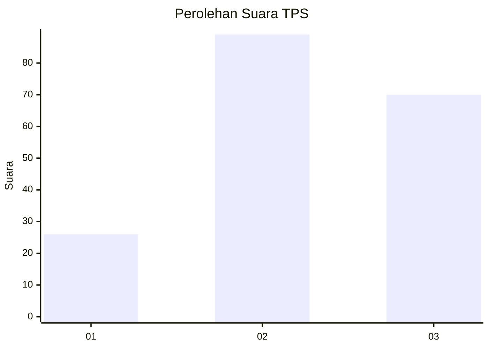
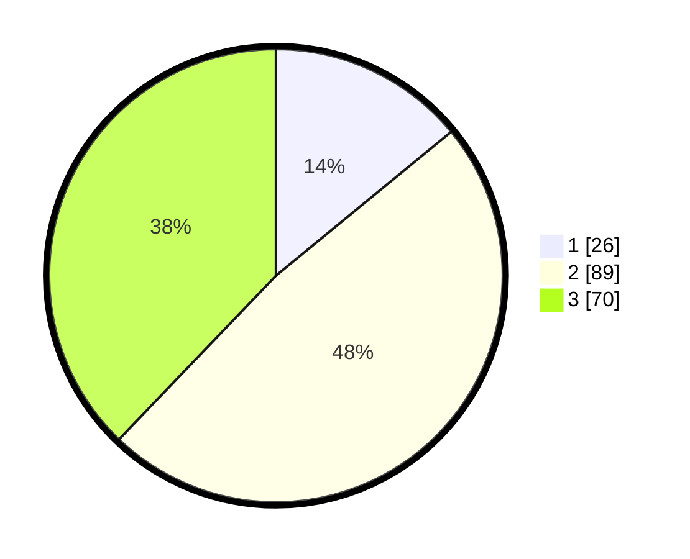

# Hasil

## Grafik

## Tabel

| No. | Nama Paslon    | Suara | Suara (raw) | Persentase |
|:--- |:-------------- | -----:| -----------:| ----------:|
| 1   | ANIES MUHAIMIN | 26    | [26][p-1]   | 14,05      |
| 2   | PRABOWO GIBRAN | 89    | [89][p-2]   | 48,11      |
| 3   | GANJAR MAHFUD  | 70    | [70][p-3]   | 37,84      |

[p-1]: https://github.com/gigit-pemilu/pemilu-2024-35-jawa-timur/blob/main/pilpres/hitung-suara/sub/35-jawa-timur/sub/78-kota-surabaya/sub/06-sawahan/sub/1002-sawahan/sub/027-tps/sub/paslon-1.txt
[p-2]: https://github.com/gigit-pemilu/pemilu-2024-35-jawa-timur/blob/main/pilpres/hitung-suara/sub/35-jawa-timur/sub/78-kota-surabaya/sub/06-sawahan/sub/1002-sawahan/sub/027-tps/sub/paslon-2.txt
[p-3]: https://github.com/gigit-pemilu/pemilu-2024-35-jawa-timur/blob/main/pilpres/hitung-suara/sub/35-jawa-timur/sub/78-kota-surabaya/sub/06-sawahan/sub/1002-sawahan/sub/027-tps/sub/paslon-3.txt

## Foto C Plano

https://sirekap-obj-formc.kpu.go.id/87df/pemilu/ppwp/35/78/06/10/02/3578061002027-20240225-124230--a1d09910-2edd-4700-bea0-162ea648d8d0.jpg

https://sirekap-obj-formc.kpu.go.id/87df/pemilu/ppwp/35/78/06/10/02/3578061002027-20240220-215605--b728ee57-90b3-42ef-9b64-b3c225830d5b.jpg

https://sirekap-obj-formc.kpu.go.id/87df/pemilu/ppwp/35/78/06/10/02/3578061002027-20240220-215636--c3d08e4e-0eae-42cb-937e-170950f28e46.jpg

## Metadata

| Key        | Value               |
| ---------- | ------------------- |
| Time Stamp | 2024-02-25 13:00:00 |

