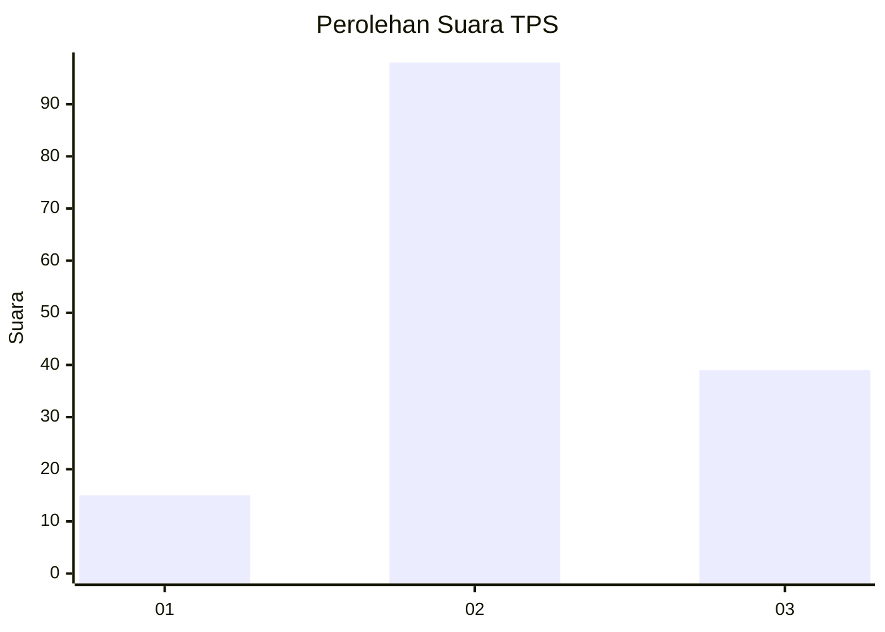
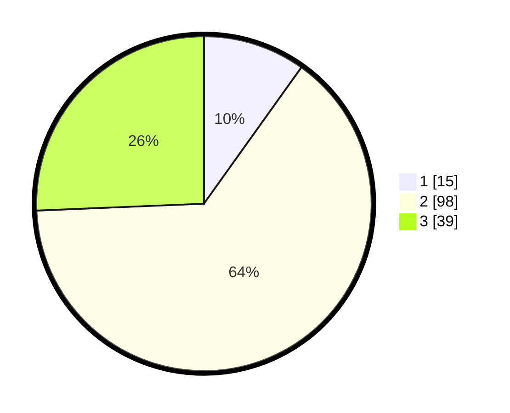

# Hasil

## Grafik

## Tabel

| No. | Nama Paslon    | Suara | Suara (raw) | Persentase |
|:--- |:-------------- | -----:| -----------:| ----------:|
| 1   | ANIES MUHAIMIN | 15    | [15][p-1]   | 9,87       |
| 2   | PRABOWO GIBRAN | 98    | [98][p-2]   | 64,47      |
| 3   | GANJAR MAHFUD  | 39    | [39][p-3]   | 25,66      |

[p-1]: https://github.com/gigit-pemilu/pemilu-2024-35-jawa-timur/blob/main/pilpres/hitung-suara/sub/35-jawa-timur/sub/78-kota-surabaya/sub/06-sawahan/sub/1003-banyu-urip/sub/019-tps/sub/paslon-1.txt
[p-2]: https://github.com/gigit-pemilu/pemilu-2024-35-jawa-timur/blob/main/pilpres/hitung-suara/sub/35-jawa-timur/sub/78-kota-surabaya/sub/06-sawahan/sub/1003-banyu-urip/sub/019-tps/sub/paslon-2.txt
[p-3]: https://github.com/gigit-pemilu/pemilu-2024-35-jawa-timur/blob/main/pilpres/hitung-suara/sub/35-jawa-timur/sub/78-kota-surabaya/sub/06-sawahan/sub/1003-banyu-urip/sub/019-tps/sub/paslon-3.txt

## Foto C Plano

https://sirekap-obj-formc.kpu.go.id/6de6/pemilu/ppwp/35/78/06/10/03/3578061003019-20240218-190835--5b458dce-d3fc-4bf1-af29-e3ca125707fe.jpg

https://sirekap-obj-formc.kpu.go.id/6de6/pemilu/ppwp/35/78/06/10/03/3578061003019-20240214-195547--976b385a-676f-48f2-8adc-5e890b4a40e0.jpg

https://sirekap-obj-formc.kpu.go.id/6de6/pemilu/ppwp/35/78/06/10/03/3578061003019-20240214-222421--17ce558d-ba7b-4725-a7e7-2b645de841df.jpg

## Metadata

| Key        | Value               |
| ---------- | ------------------- |
| Time Stamp | 2024-02-24 22:31:28 |

