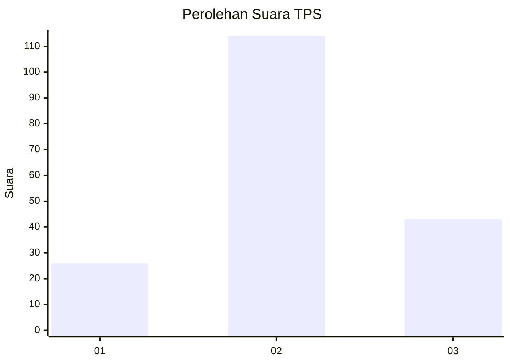
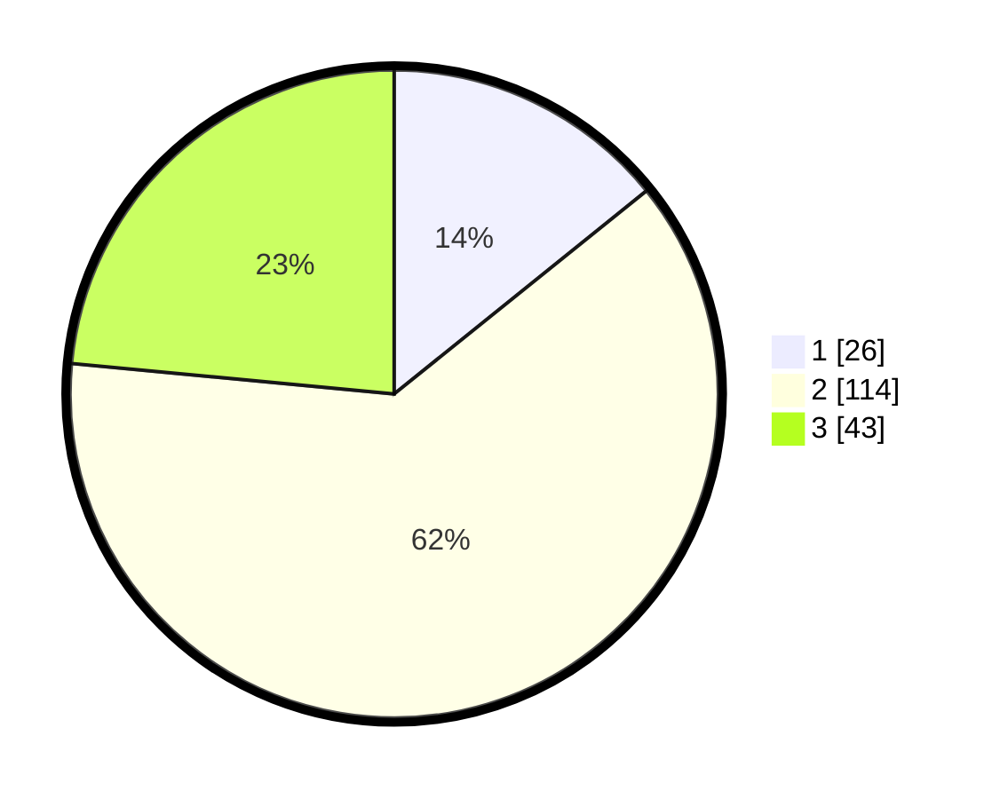

# Hasil

## Grafik

## Tabel

| No. | Nama Paslon    | Suara | Suara (raw) | Persentase |
|:--- |:-------------- | -----:| -----------:| ----------:|
| 1   | ANIES MUHAIMIN | 26    | [26][p-1]   | 14,21      |
| 2   | PRABOWO GIBRAN | 114   | [114][p-2]  | 62,30      |
| 3   | GANJAR MAHFUD  | 43    | [43][p-3]   | 23,50      |

[p-1]: https://github.com/gigit-pemilu/pemilu-2024-35-jawa-timur/blob/main/pilpres/hitung-suara/sub/35-jawa-timur/sub/78-kota-surabaya/sub/06-sawahan/sub/1003-banyu-urip/sub/033-tps/sub/paslon-1.txt
[p-2]: https://github.com/gigit-pemilu/pemilu-2024-35-jawa-timur/blob/main/pilpres/hitung-suara/sub/35-jawa-timur/sub/78-kota-surabaya/sub/06-sawahan/sub/1003-banyu-urip/sub/033-tps/sub/paslon-2.txt
[p-3]: https://github.com/gigit-pemilu/pemilu-2024-35-jawa-timur/blob/main/pilpres/hitung-suara/sub/35-jawa-timur/sub/78-kota-surabaya/sub/06-sawahan/sub/1003-banyu-urip/sub/033-tps/sub/paslon-3.txt

## Foto C Plano

https://sirekap-obj-formc.kpu.go.id/97c0/pemilu/ppwp/35/78/06/10/03/3578061003033-20240226-095101--bbbcf421-d68f-4298-a056-c9d07409dfc1.jpg

https://sirekap-obj-formc.kpu.go.id/97c0/pemilu/ppwp/35/78/06/10/03/3578061003033-20240226-101759--dce206e6-bda4-421a-8112-9bdb7701037b.jpg

https://sirekap-obj-formc.kpu.go.id/97c0/pemilu/ppwp/35/78/06/10/03/3578061003033-20240226-102046--e05ef871-8fdb-40fa-8388-78dc482e4521.jpg

## Metadata

| Key        | Value               |
| ---------- | ------------------- |
| Time Stamp | 2024-02-26 23:00:00 |

## DATA PEMILIH TETAP

Jumlah pemilih dalam DPT: **55**.
 * L: **520**.
 * P: **200**.

## DATA PENGGUNA HAK PILIH

Jumlah pengguna hak pilih dalam DPT: **252**.
 * L: **727**.
 * P: **20**.

Jumlah pengguna hak pilih dalam DPTb: **827**.
 * L: **676**.
 * P: **262**.

Jumlah pengguna hak pilih dalam DPK: **702**.
 * L: **205**.
 * P: **225**.

Jumlah pengguna hak pilih: **772**.
 * L: **767**.
 * P: **526**.

## JUMLAH SUARA SAH DAN TIDAK SAH

JUMLAH SELURUH SUARA SAH: **183**.

JUMLAH SUARA TIDAK SAH: **3**.

JUMLAH SELURUH SUARA SAH DAN SUARA TIDAK SAH: **186**.

